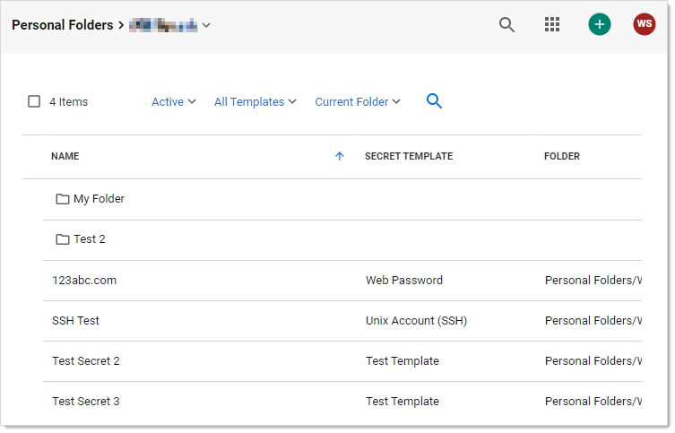
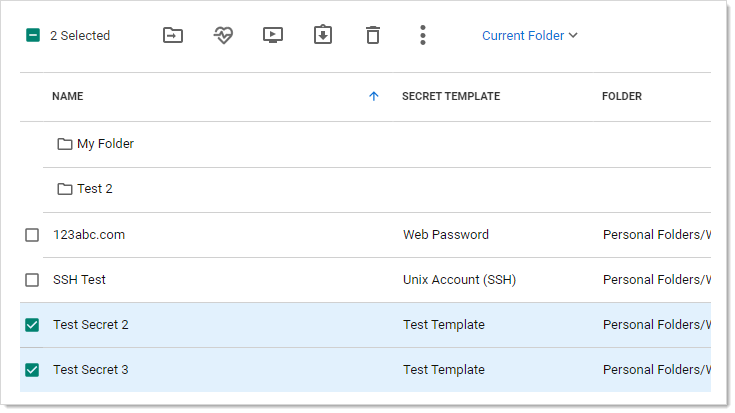
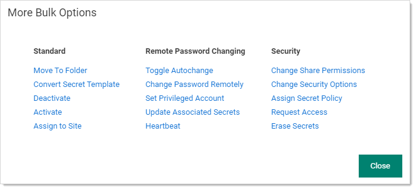

[title]: # "Running Dashboard Bulk Operations"
[tags]: # "Bulk Operations, Dashboard"
[priority]: # "1000"

# Running Dashboard Bulk Operations

You can perform bulk operations from the Dashboard on multiple secrets:

1. Navigate to the folder containing the secrets you wish to perform a bulk operation on:

   

   > **Note:** You can also run a bulk operation on the All Secrets page.

1. Click the **Current Folder** link if you want to display the secrets in subfolders too. If so, the link changes to Include Subfolders. 

1. Click to select the secrets you wish to include. To check them all, check the check box in the column header row. The bulk operations toolbar appears at the top:

   

   The most common operations have icons. Hover over each to to see a text label. The sideway ellipsis (three stacked dots) icon opens a text menu of all the bulk operations:

   

   > **Note:** Many of the available operations (below) are accessed via menus that appear when you click the links. For example, to disable check out, you click Change Security Options.

1. Click to select the bulk operation via either an icon or the **More Bulk Operations** menu . Available bulk operations include:

   - Add share
   - Assign secret policy
   - Assign to site
   - Change password remotely
   - Change to inherit permissions
   - Convert secret template
   - Deactivate (was "Delete" in earlier versions)
   - Disable autochange
   - Disable check out
   - Disable comment on view
   - Disable heartbeat
   - Edit share
   - Enable autochange
   - Enable check out
   - Enable comment on view
   - Enable heartbeat
   - Erase secrets
   - Hide launcher password
   - Move to folder
   - Run heartbeat
   - Set privileged account
   - Undelete
   - Unhide launcher password

> **Note:** Bulk operations differ by SS version.
