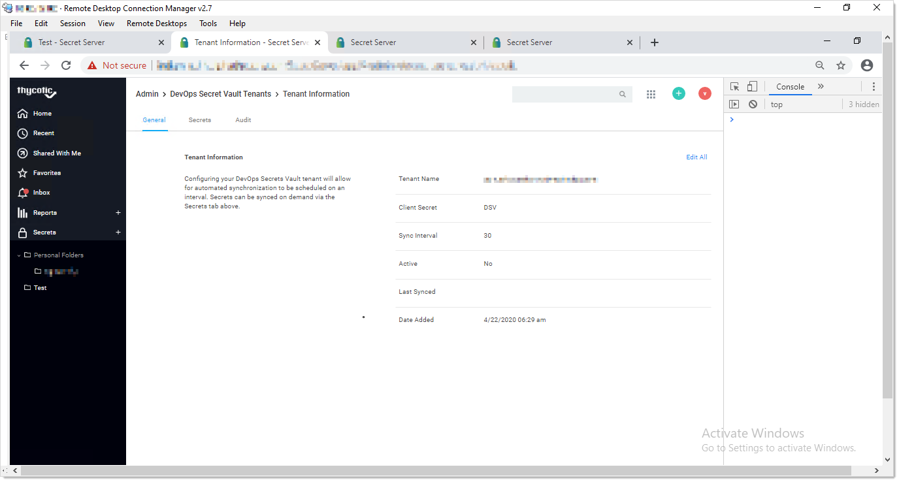

[title]: # (Syncing with DevOps Secret Vault)
[tags]: # (dsv, DevOps Secret Vault)
[priority]: # (1000)
[display]: # (all)


# Syncing with DevOps Secret Vault

## Overview

Secret Server (SS) can push its secrets to DevOps Secret Vault by creating a secret based on the "DevOps Secret Vault Client Credentials" template, which holds the client credentials for a DevOps Secret Vault tenant. Using the REST API, you can then register a DevOps Secret Vault tenant in SS. That tenant references that secret to push secrets to DevOps Secret Vault at a set sync interval.

## Behavior

You can manually push secrets to the DSV tenant, in addition to SS checking for secrets to push to tenants on a timer. SS will check for if a tenant needs updating every 30 minutes on the cloud or 10 minutes for an on-premises installation. Users are prevented from setting a tenant’s sync interval to less than SS’s timed iteration because there would be no benefit to doing so. When SS checks for secrets to be pushed to DSV, it only pushes secrets that have been changed since the last time they were updated in DSV. When a secret is pushed to DSV, its sync time is updated.

## Setup in Secret Server

To configure pushing secrets to DSV:

Go to **Admin \> DevOps Secrets Vault Tenants** to specify the DSV tenant for integration with SS:




## API Examples

### DevOps Secret Vault Client Credentials Template


Using the DSV Client Template, you provide the client ID, secret, the tenant URL, and the client’s role (the role field might be removed).

### Creating a DevOps Secret Vault Tenant

Use a POST to `/api/v1/devops-secrets-vault/tenant` using the body below to create a tenant in SS. 


```json
{
  "Data": {
    "secretId": { "value": 79, "dirty": true },
    "tenantName": { "value": "LJDevTenant", "dirty": true },
    "syncInterval": { "value": 60, "dirty": true },
    "active": { "value": true, "dirty": true }
  }
}
```

The secret ID is the ID of the DSV Client Credentials secret. The Sync Interval is how often SS checks if secrets needs to be pushed to DSV. Only secrets associated with active tenants are pushed to DSV. You are returned the tenant ID if the POST is successful.

### Creating a Sync Map

Use a POST to `/api/v1/devops-secrets-vault/add-sync` using this body to map a secret to a DSV tenant:

```json
{
"data": {
  "secretId": {
    "dirty": true,
    "value": 60
  },

  "dsvTenantId": {
    "dirty": true,
    "value": 1
  },

  "active": {
    "dirty": true,
    "value": true
  },

  "fieldNamesPath":{
    "dirty": true,
    "value": [
      "Demo","\$domain","qagreentest"
      ]
    }
  }
}
```

When the secret is mapped to a tenant, an initial sync immediately occurs. Following the initial sync, the secret is checked to determine if updates have been made when the sync Interval expires for the mapped tenant. If no changes have been made to the secret, then the secret is not pushed to DSV. You can reference fields from the secret to create the path in DSV. Secret Server will look for a `$`, then search for the following string as one of the "slugified" field names for the secret’s template.

### Manually Syncing a Secret

Use a POST to `/api/v1/devops-secrets-vault/sync` to manually trigger a push to DSV for existing sync maps. The list of integers contains the SyncMapIds of the secret to tenant mapping, so you can control which secret is pushed to which tenant.

```json
{
"data": [
  3, 4, 5
  ]
}
```

### Listing DevOps Secret Vault Tenants

List DSV tenants registered to SS by running a GET to `/api/v1/devops-secrets-vault/tenant`. Query parameters accepted:

- `filter.nameSearch=`

- `filter.includeInactive=`

### Getting a DevOps Secret Vault Tenant’s Details

View the details of a single tenant by specifying a tenant ID in a GET to `/api/v1/devops-secrets-vault/tenant/{tenantId}`.

### Getting the Status of a Secret’s Synchronization

View a secret’s sync status by running a GET to `/api/v1/devops-secrets-vault/sync/status/{syncMapdId}`.

### Getting a List of Secret Synchronization Statuses

View a list of secret sync statuses by running a GET to
`/api/v1/devops-secrets-vault/sync/status`. Query parameters accepted:

- `filter.secretId=`
- `filter.includeInactive=`
- `filter.tenantId=`
