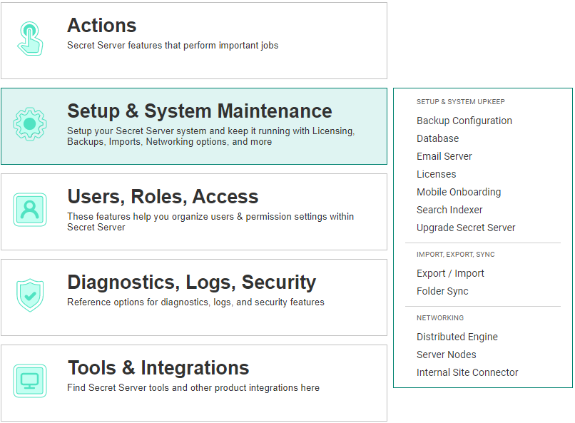

[title]: # (Enabling and Disabling Maintenance Mode)
[tags]: # (Administration, Enable, Disable)
[priority]: # (1000)
[display]: # (all)

# Enabling and Disabling Maintenance Mode

Turning on maintenance mode allows you to temporarily prevent users from changing roles, secrets, or secret-related data such as dependencies, templates, and password requirements. For example, you would want to enable Maintenance Mode while migrating the Secret Server application to a new server with a different domain.

To turn on Maintenance Mode, click **Administration \> Show All**.

1. In the Server Nodes window, click **Setup & System Maintenance**.

1. Click **Server Nodes**.  

   

1. In the **Maintenance Mode** column, click the edit icon next to Disabled.

   

1. Check the box that appears and click the Save icon.
If you change your mind, you can click the **X** next to the Save icon.

   

    A notice appears stating, "Enabling Maintenance Mode will take 5 minutes. Are you sure you want to proceed?"

1. Click **OK**.

    While Maintenance Mode is setting up, a spinner appears.

   

    When Maintenance Mode is enabled, "Enabled" appears in the Maintenance Mode column.

    

    >**Note**:  When Secret Server is in Maintenance Mode; a notification bar is displayed to alert users.

To return Secret Server from Maintenance Mode to normal operation, return to the Server Nodes window, then follow these steps:

1. In the Maintenance Mode column, click the edit icon next to Enabled.

    

1. Uncheck the box that appears and click the Save icon.
If you change your mind, you can click the **X** next to the Save icon.

   

>**Note**: When Secret Server is in its normal running mode, the Maintenance Mode notification bar is no longer displayed to users.
