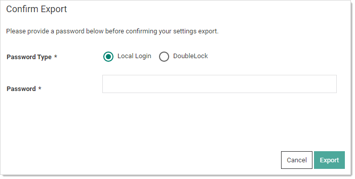
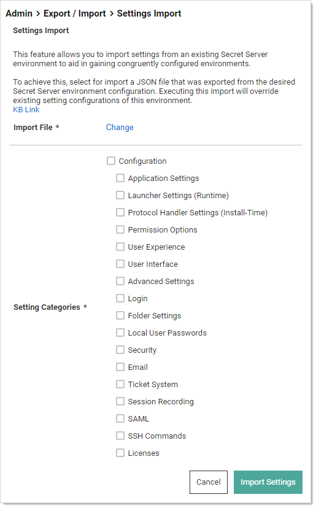
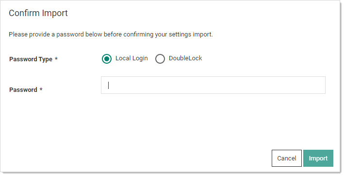
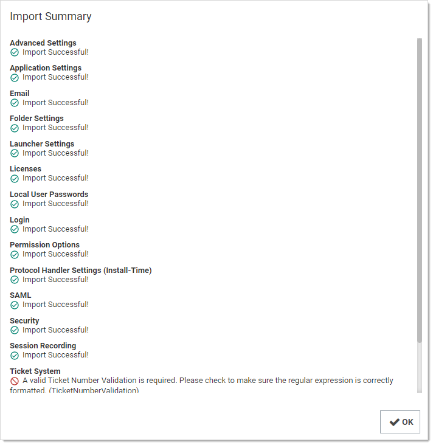
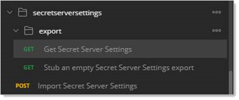
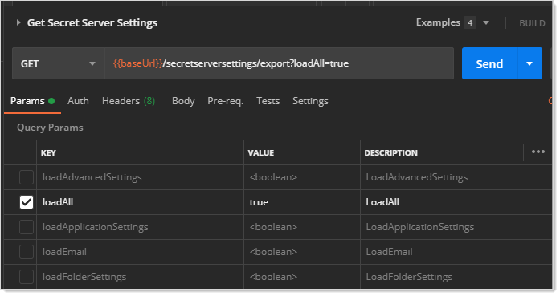
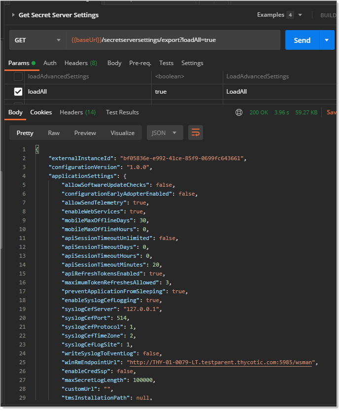
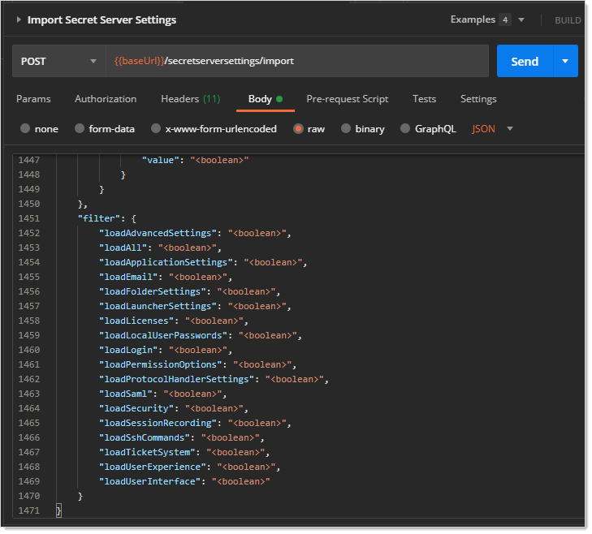
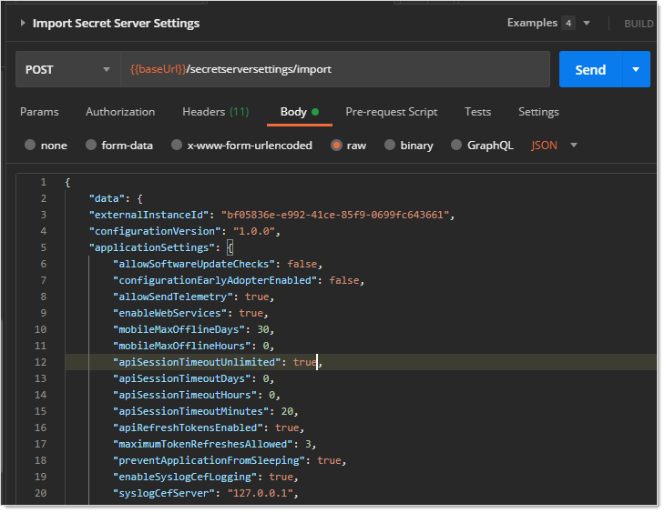
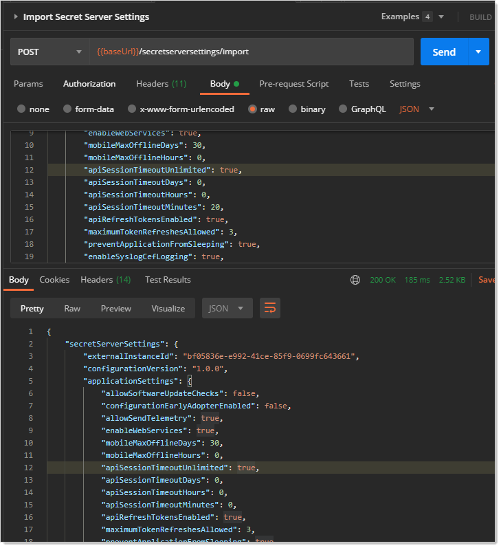

[title]: # (Exporting and Importing Settings)
[tags]: # (Administration, settings, importing, exporting, JSON)
[priority]: # (1000)

# Exporting and Importing Secret Server Settings

>**Important:** This feature is part of the early release of Secret Server 10.11. The general release is not till April 13, 2021 for the on-premises version and between April 3rd and May 15th 2021, depending on region, for the cloud version.

## Overview

Secret Server (SS) can now export and import SS settings as a JavaScript Object Notation (JSON) file. With this, you can more easily move settings from an existing SS environment to another. 

## Prerequisites

### Required General Permissions

There are the permissions required to access and perform the process. These are:

To view the Export/Import page or menu link:

- Administer Export or View Export
- Administer Import

To view audits (at least one is required):

- Administer Users
- Own User
- View Users

Exporting to a JSON file:

- Administer Configuration
- Administer Export

Importing from a JSON file:

- Administer Configuration
- Advanced Import

### Required Additional Permissions

Some of the settings require additional permissions to export or import:

**Table:** Required Additional Permissions

| Setting | Permission |
|--|--|
| OpenID Log on | Administer Thycotic One |
| SAML | Administer Configuration SAML |
| Security | Administer Configuration Security |
| Session Recording | Administer Configuration Session Recording |
| SSH Commands | Administer SSH Menus |
| Thycotic One Log on | Administer Thycotic One |
| Two Factor Log on | Administer Configuration Two Factor |
[]()

### Required Licenses

Additional licenses may be required to import or export some settings.

#### Advanced Auditing License 

This license is required for these settings in the Application Settings category:

- SyslogCefLogSite
- SyslogCefPort
- SyslogCefProtocol
- SyslogCefServer
- SyslogCefTimeZone

#### Enterprise Edition

> **Note:** this settings are also available with the Professional Edition and Approval Workflow Add-on licenses.

The Enterprise Edition license is required for these settings in the Launcher Settings category:

- CheckInSecretOnLastLauncherClose
- CloseLauncherOnCheckInSecret

It is required for these settings in the Permission Options category:

- EnableApprovalFromEmail
- ForceSecretApproval

It is required for the TicketSystems category.

#### Pro Edition

The Pro Edition license is required for these setting categories:

- SAML
- Session Recording

#### Platinum Edition 

The Platinum Edition license (or Pro Edition and Unix SUPM licenses) is required for the SSH Commands setting category.

## Procedures

### Exporting Settings

To export SS settings:

1. Go to **Admin \> All**.  The Admin page appears:

   

1. Click the **Setup & System Maintenance** button. A menu appears alongside the button:

   

1. Click the **Export / Import** menu item. The Secrets tab of the Export / Import page appears:

   

1. Click the **Secret Server Settings** tab:

   

1. Click the **Export** button. The Settings Export page appears:

   

1. Click to select the check boxes for the settings categories you wish to include. Clicking the **Configuration** check box selects all available categories.
   
   > **Note:** See the [Setting Category Reference](#setting-category-reference) section for details on the settings in each category.
   
1. Click the **Export** Settings button. A Confirm Export popup appears:

   

1. Click the **Passport** selection button to choose **Local Login** or **DoubleLock** if that applies.

1. Type your password in the **Password** text box.

1. Click the **Export** button. The JSON file appears in your browser's downloads:

   

> **Note:** This example is for the Vivaldi Chrome browser—yours will likely look different.

### Importing Settings

To Import SS settings:

1. Go to **Admin \> All**.  The Admin page appears:

   

1. Click the **Setup & System Maintenance** button. A menu appears alongside the button:

   

1. Click the **Export / Import** menu item. The Secrets tab of the Export / Import page appears:

   

1. Click the **Secret Server Settings** tab:

   

1. Click the **Import** button. The Settings Import page appears:

   

1. Click the **Change** link, and navigate to and select the JSON file you want to import. The name of the file you chose appears above the Change link:

   

1. Click to select the check boxes for the settings categories you wish to include. Clicking the **Configuration** check box selects all available categories.

   > **Note:** Some settings may not allow you to select them, based on your permissions and licenses. Another possibility is the category was not included in the original export. Hover the mouse pointer over any of these settings to view a hint of what is likely causing it.
   > **Note:** See the [Setting Category Reference](#setting-category-reference) section for details on the settings in each category.

1. Click the **Import Settings** button. A Confirm Import popup appears:

   

1. Click the **Passport** selection button to choose **Local Login** or **DoubleLock** if that applies.

1. Type your password in the **Password** text box.

1. Click the **Import** button. An Import Summary popup appears:

   

1. Click the **OK** button. The importation appears in the log that you saw earlier on the Export / Import page.

## Setting Category Reference

This section details what setting are contained in the following settings categories:

Note: Some settings are unavailable in certain environments or if requiring a license or permission. 

### Application Settings

These settings correspond to the Application Settings section on the Configuration General page.

This setting is unavailable in an on-premise environment:

- DisplayDowntimeMessageToAdminsOnly 

These settings are unavailable in a cloud environment:

- AllowSoftwareUpdateChecks
- CustomURL
- EnableKeepAliveThread
- TmsRootUrl
- WriteSyslogToEventLog

This setting is unavailable in an IBM environment:

- AllowSendTelemetry

### Advanced Settings 

These settings correspond to the Advanced Settings section on the Configuration Advanced page.

### Launcher Settings (Runtime)

These settings correspond to the Launcher Settings (Runtime) section on the Configuration General page.

Launcher Deployment Type setting can be one of the following:

- 0: Click Once
- 1: Protocol Handler

This setting is unavailable in a cloud environment:

- LauncherDeploymentType

### Email

These settings correspond to the Email tab on the Configuration Email page.

These settings are unavailable in a cloud environment:

- SmtpDomain
- SmtpPassword
- SmtpPort
- SmtpServer
- SmtpUseCredentials
- SmtpUseImplicitSSL
- SmtpUserName
- SmtpUseSSL

### Folder Settings

These settings correspond to the Folders tab on the Configuration Folders page.

### Licenses

These settings correspond to the licenses listed on the Licenses page.

### Local User Passwords

These settings correspond to the Local User Passwords tab on the Configuration Local User Passwords page.

### Login

These settings correspond to the Login tab on the Configuration Login page.

These settings unavailable in a cloud environment:

- CacheAdCredentials
- TwoFactor.Radius.ClientPortRange

### Permission Options

These settings correspond to the Permission Options section on the Configuration General page.

The Default Secret Permissions setting can be one of the following:

- 0: Secrets inherit permissions from folder
- 1: New Secrets copy permissions from folder
- 2: Only creator has permissions to new Secrets

### Protocol Handler Settings (Install-Time) 

These settings correspond to the Launcher Settings (Runtime) section on the Configuration General page.

### SAML 

These settings correspond to the SAML tab on the Configuration SAML page. To insert a new identity provider, in the same instance the export file came from, the IdentityProviderId setting must be set to 0. Otherwise, it will treat it as an update (see External Instance Id). The identity provider name cannot match another already in the database.

### Security

These settings correspond to the Security tab on the Configuration Security page.

These settings are unavailable in a cloud environment:

- DatabaseIntegrityMonitoringSymmetricKey
- EnableDatabaseIntegrityMonitoring
- EnableHSTS
- FipsEnabled
- ForceHttps
- HSTSMaxAge

### Session Recording

These settings correspond to the Session Recording tab on the Configuration Session Record page.  The launcher must be enabled, and a valid license for Session Monitoring is required to export and import this feature.

These settings are unavailable in a cloud environment:

- ArchiveLocationBySite
- ArchivePath
- DaysUntilArchive
- EnableArchive
- EnableHardwareAcceleration
- StoreInDatabase
- VideoCodecId

To update SSHProxyRecordVideo or SSHProxyRecordKeyStrokes, SSH Proxy must be enabled.

To update RDPProxyRecordVideo or RDPProxyRecordKeyStrokes, RDP Proxy must be enabled.

### SSH Commands

These settings correspond to the SSH command restrictions, the SSH commands, allowed command menus, and blocked command lists.

### Ticket System 

These settings correspond to the Ticket System tab on the Configuration Ticket System page. To insert a new ticket system in the same instance the export file came from, TicketSystemId must be set to 0. Otherwise, it will treat it as an update (see External Instance Id). The ticket system name cannot match another already in the database.

### User Experience

These settings correspond to the User Experience section on the Configuration General page.

- Application Language 
- Default Date Formats can be found in the tbDateOptions table.
- Default Time Formats can be found in the tbTimeOptions table.
- Default New User Roles can be found in the tbRoles table
- Server Time Zones can be found in the server registry: `Computer\HKEY_LOCAL_MACHINE\SOFTWARE\Microsoft\Windows NT\CurrentVersion\Time Zones`

### User Interface 

These settings correspond to the User Interface section on the Configuration General page.

These settings are unavailable in an IBM environment:

- AllowUserToSelectTheme
- CustomLogoCollapsed
- CustomLogoFullSize

## JSON Export File

In addition to the setting categories, here are a few components of the JSON export file that you should be aware of.

### External Instance ID

`"externalInstanceId": "95931fb9-02b0-47a5-a59d-69d6543a192d",`

The external instance ID is an identifier for the SS instance the settings were exported from. If you change this ID, SS will assume the export came from another database and will insert new records for the ticket system (TicketSystemId)  or SAML (Identity Providers—IdentityProviderId) categories. To add a new record in the same instance, set the ID to 0 and it will be treated as a new item.

### Configuration Version

` "configurationVersion": "1.0.0",`

This is the configuration version the settings were exported from. In there future when other settings are added, it will help SS determine which settings are available and which are not in the database.

## JSON Import File

In the UI, the exported JSON file can be easily modified and used as the import JSON file. For the API, the exported JSON must be added to the data object. Then manually update the desired filter category load to true to import.

## API Calls Filter

Secret Server has settings import/export endpoints for the API to manipulate. Opening Postman and going to **secretserversettings \> export \> GET Get Secret Server Settings**, you would see:



Looking at the query parameters for that endpoint, we see:



The keys are equivalent to those on the user interface or those in the JSON file.

The `loadAll` key tells SS to update all the available settings. These include application settings, launcher settings, protocol handler settings, permission options, user experience settings, and user interface settings.

If you click the **Body** tab below, you can see what JSON code represents the key you chose for the export:



When using the POST Import Secret Server Settings command, you will see a filter object at the bottom of the code stipulating what to update:



For example, if you set `loadApplicationSettings` to `true`, only the application settings are updated, assuming the objects stipulated were sent with the request. Similarly, included objects that are disallowed by the filter are ignored.

To make a GET call to update a single setting:

1. Import the category it belongs to. For example, if you want to update `apiSessionTimeoutUnlimited` to `true`, you would copy the entire `applicationSettings` result (the category and all of its settings).

1. For the POST Import Secret Server Settings call, remove the settings in the data section, leaving the filter section as is:

   

1. Paste the settings you copied earlier in its place.

1. Change the `apiSessionTimeoutUnlimited` setting to `true`:

   

1. Scroll down to the filter section and remove the filters you do not want to update. Alternatively, you can replace all the `<boolean>` settings with `false` for the filters you do not want.

1. If you want to set a nullable field back to null, set the dirty flag and the value to null. For example:

   ```json
   "siteId": {
   
     "dirty": "true",
   
     "value": null
   
   }
   ```

1. Click the **Send** button. If all goes well, Postman will return the updated category object:

   

   > **Note:** In this example, we copied the whole data object, but you do not have to. For a quick update, you can Import with just the settings you want to update. Anything not sent is ignored. This is the reason a nullable setting has to be explicitly set to null, along with setting the dirty flag—everything set to null is ignored, the same as if you did not send the setting at all.

1. If something went wrong, you will see an error section at the bottom of the results:

   

## Audits

An audit is recorded for each setting category that was exported or imported by user. The individual setting audits can be viewed on the Configuration Audit page.

**Figure:**  Audits on the Export / Import page:


If there are errors, a system log entry will also be saved with details:

- Email
- Login
- Security
- Ticket System
- SAML - Completed with errors

## Events

When SS settings are exported or imported, an SECRETSERVERSETTINGS event is logged.

## Logs

When Secret Server settings are exported or imported or validation errors occur, a new log entry will appear in the `SS.log` file.

> **Note:** `<USERName>` and `<USERID>` are replaced with your values. The items in the parentheses are the errant category settings.

### System Logs or CEF Example

`<USERNAME> (<USERID>) - Secret Server Settings Import - Failed to import SAML for the following reason(s): TicketSystem=Only one ticket system can be default. (IsDefault);SAML=Identity Provider Id was not found in the database. Check that it was not modified after export. (IdentityProviderId)`

### SS.log Examples

- `ERROR Thycotic.Logging.ILogWriter - <USERNAME> (<USERID>) - Secret Server Settings Import - Failed to import SAML for the following reason(s): TicketSystem=Only one ticket system can be default. (IsDefault);SAML=Identity Provider Id was not found in the database. Check that it was not modified after export. (IdentityProviderId)`
- `ERROR Thycotic.Logging.ILogWriter - <USERNAME> (<USERID>) - Secret Server Settings Import - Failed to import some settings due to the following reason(s): Security=Access Denied;Login=Insufficient permissions to edit Radius settings. (Radius),Insufficient permissions to edit Thycotic One or OpenId settings. (OpenIdConnect),Insufficient permissions to edit Duo settings. (Duo);TicketSystem=Only one ticket system can be default. (IsDefault);SAML=Access Denied`

## Errors and Resolutions

| **Sample Error**                                             | **Resolution**                                               |
| :-- | :-- |
| SAML=Access Denied                                           | Need Administer Configuration SAML permission to update SAML settings. |
| SAML=Identity Provider Id was not found in the database. Check that it was not modified after export. (IdentityProviderId) | For SAML, the IdentityProviderId provided in the import file was not found in the database. If intending to add a new one, set this to 0. |
| TicketSystem=Only one ticket system can be default. (IsDefault) | For TicketSystem, IsDefault is set to true when there is already one set to true in the database. If intending to set it to true, set the other one to false. |
| Insufficient permissions to edit Radius settings. (Radius) Insufficient permissions to edit Duo settings. (Duo) | Need Administer Configuration Two Factor permission to update Radius or Duo settings. |
| Insufficient permissions to edit Thycotic One or OpenId settings. (OpenIdConnect) | Need Administer OpenID Connect permission to update Open ID Connect settings. |
