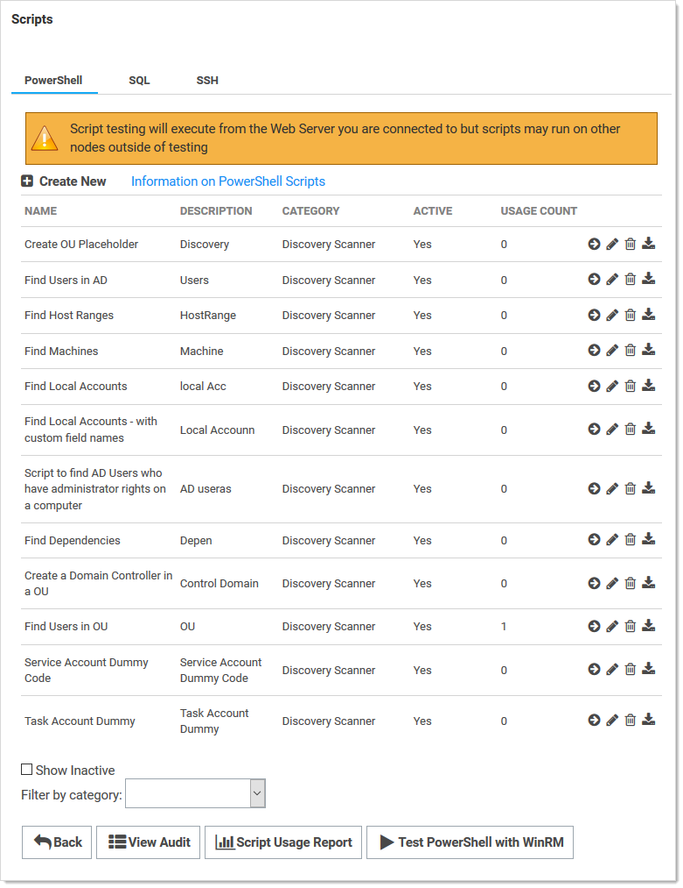
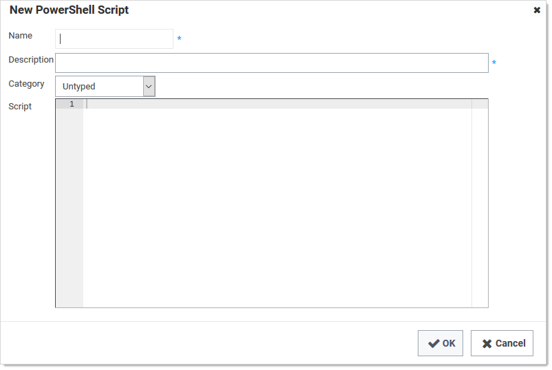

[title]: # (Creating and Using PowerShell Scripts)
[tags]: # (API,scripting,powershell)
[priority]: # (1000)

# Creating and Using PowerShell Scripts

## Overview

You can use PowerShell scripts in Secret Server to automate specific tasks. These scripts are useful in several places in SS, such as in creating custom remote password changers, custom dependency changers, discovery scanners, and custom ticket system integration.

## Creating a PowerShell Script

1. Develop your script. See:

   - [REST API PowerShell Script Examples](../rest-api-powershell-examples/index.md)
   - [Using Secret Fields in Scripts](../using-secret-fields-scripts/index.md)

   - [Dependency Token List](../dependency-tokens/index.md)

   >**Important:** Do not edit the script with Windows Notepad. Instead, use Notepad++, Visual Studio Code, or Atom. Windows Notepad can add invisible characters that can cause issues.

   >**Note:** Using PowerShell in SS involves passing a parameter string to the script. This string can contain literal values as well as tokens that represent values on the object in SS that the script is attached to. For example, when creating a custom password changer, you pass in values such as the user name, old password, and new password using tokens that represent these values for whichever secret is running the password change script. Similarly, dependencies have a set of tokens that represent values on the dependency and its associated secret.

1. Go to **Admin \> Scripts**.

   

   > **Note:** In some older versions of Secret Server, you can find the **Scripts** option under **Remote Password Changing** on the **Administration** menu bar.

1. On the **PowerShell** tab, click **+Create New**. The New PowerShell Script popup appears:

   

1. Type the script name in the **Name** text box.

1. Type a description in the **Description** text box.

1. Click the **Category** dropdown list to select the type of script. This will determine where the script resides in SS and more. For instance, the Dependency choice ensures that Remote Password Changing is turned on by enabling it on the Remote Password Changing page.

1. Paste your script into the **Script** text box.

1. Click the **OK** button. The new script appears in the table on the Scripts page.

## Best Practices

### Debugging

Scripts may contain debug lines to help you test the script. Debug statements use the `Write-Debug` command. For example:
`Write-Debug "The users name is $Username"`

### Script Arguments

There are input boxes for specifying arguments in places where the PowerShell scripts are used. Argument values are specified on a single line separated by a space. Values containing spaces should be enclosed in quotes.  Parameters to PowerShell scripts are referenced through the zero-based `Args` array.  It is often beneficial to assign `Args` variables to other more-meaningful named variables. For example:

Arguments:  "Welcome back"  and “Joe”

Script:

```powershell
$greeting = $Args[0]
$name = $Args[1]
Write-Debug "$greeting $name"
```
Output:  “Welcome back Joe”

### Exceptions

In situations where the script should fail, given a specific set of conditions, an exception should be explicitly thrown.  When an exception is thrown, the script stops running and the failure is logged in the system log. The script is considered to have successfully run if no errors or exceptions occur while processing. For example:

```powershell
if ($meetsCondition -eq $false)
{
  throw "Did not meet condition"
}
```
