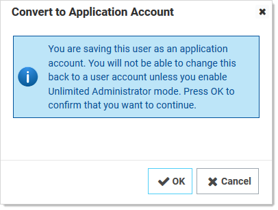
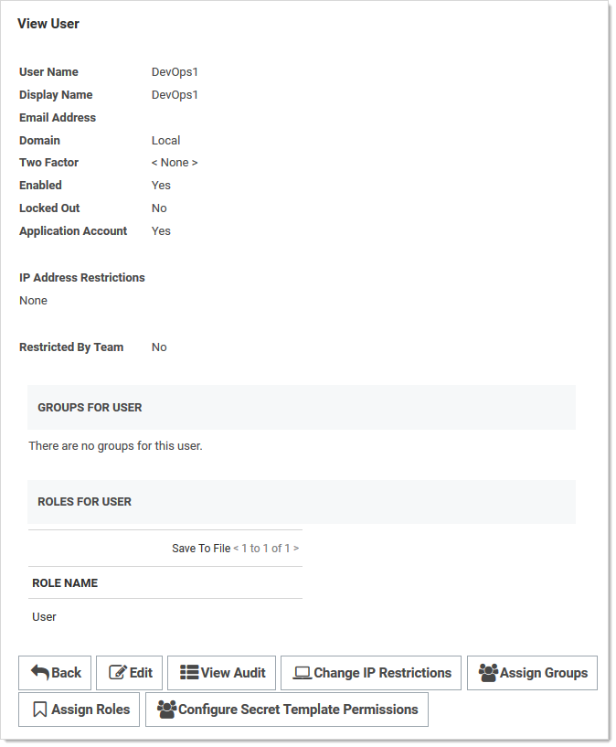
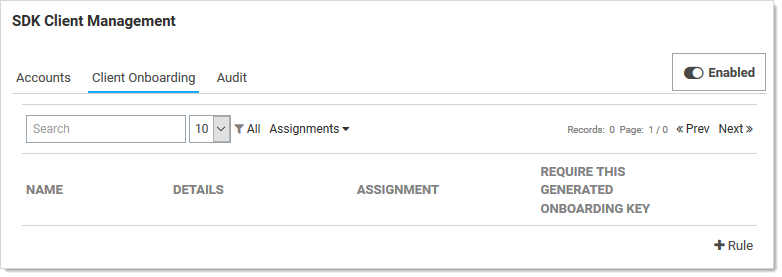
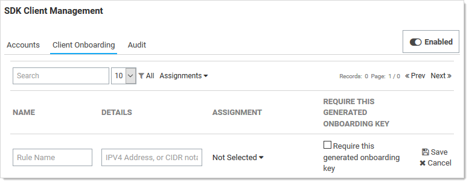

[title]: # (Secret Server Software Development Kit for DevOps)
[tags]: # (API,Scripting,DevOps,SDK)
[priority]: # (1000)

# Secret Server Software Development Kit for DevOps

## Overview

This Secret Server Software Development Kit (SDK) for DevOps tool, or simply SDK, was created for securing and streamlining DevOps processes with regard to SS. The SDK for DevOps tool allows you to more efficiently engage SS via a Command Line Interface (CLI) without compromising security. It allows you to securely retrieve credentials from and track access to a secure vault.

The SDK uses the [SS REST API](../rest-api-reference-download/index.md). The SDK is a .NET library (available via a NuGet package), which you can use in a custom application. The SDK .NET library exposes a limited subset of the REST API.

> **Note:** See the [Thycotic SDK Integration Doc](https://github.com/thycotic/sdk-documentation) on GitHub for more information.

There is also a .NET Core CLI SDK Client that uses the SDK .NET library. The SDK Client was created to allow customers to write automation scripts to access secrets without having to write code to directly access the REST API.

The .NET SDK library and the .NET Core CLI client both:

- Automatically store the credentials and remote server in an encrypted file used to acquire an OAUTH token. The token is then used to make subsequent API calls. OAUTH tokens have an expiration time, which is configurable in the UI on the configuration page via the "Session Timeout for Webservices" value.
- Get the contents of a secret.
- Provide client-side caching (SDK client caching)

Secret Server has user and application accounts. Both types can access SS via the REST API. Application accounts are not counted for licensing purposes. Application account can *only* access SS via the REST API. Both account types never expire.

Secret Server provides security for automated clients. SDK rules manage permissions. Client IDs are created when `SecretServerClient.Configure()` or `tss init` is called. The client ID is used to reference SDK client instances.

> **Note:** For REST API Client Generation (Advanced), please see [REST API Client Generation with OpenAPI Swagger ](https://docs.thycotic.com/ss/10.8.0/api-scripting/rest-api-client-generation/index.md#rest_api_client_generation_with_openapi_swagger)

> **Note:** We have a [Python SDK](https://github.com/thycotic/python-tss-sdk) that is independent of the SDK .NET library. It allows a Python script to access secrets without requiring REST knowledge. It has access to a small subset of the REST API.

## How It Works

The SDK is a console application written in .NET Core that wires up its own credentials based on the machine it is installed on. Those credentials, called "DevOps Users", do not have any rights in SS but can be assigned to other SS users or application user accounts, mimicking permissions to access secrets.

This removes the widespread DevOps issues with hard coding credentials into scripts and configuration files. Instead, the target system is registered via IP address that is white listed, which provides REST authentication without entering user credentials. You can use the SDK to retrieve a REST user token for our REST API, or you can use the SDK to perform direct queries on SS.

In summary, the SDK establishes secure access points so that power users can employ the SS API directly from the CLI, without wasting time entering privileged account passwords.

## Configuration Overview

Secret Server exposes a REST API interface the is used by the SDK client. When the SDK sends a REST request, SS determines where the request came from (via IP address) and what permissions it should be granted (via a rule set in SS). Thus, once the client is initialized with the SS and the rule name, that configuration is stored and encrypted on the client, ready for subsequent calls.

 Out of the box, the SDK offers:

- token retrieval
- secret retrieval
- secret field retrieval

> **Note:** We expect to expand the SDK's capabilities over time to allow even greater access to the REST API.

The SDK requires setup in two areas: SS configuration and SDK installation on the DevOps system.

## Required Roles and Permissions

- **Administer Configuration:** Allows a user to enable SDK functionality in SS, that is, to enable webservices and enable the SDK itself.
- **Administer Users:** Allows a user to use the SDK to retrieve account credentials on client machines. Alternatively, you can be the owner of the application account used by the SDK.
- **Administer Create Users:** Allows a user to access the **Admin > SDK Client Management** page in SS.

## Setup Procedure

### Task 1: Configuring Secret Server

Configure SS for communication with the SDK:
1. Navigate to **Admin \> Configuration**.

2. Click the **General** tab.

3. Click the **Edit** button.

4. Click to select the **Enable Webservices** check box in the **Application Settings** section.

5. Click the **Save** button.

6. Select and setup any application accounts that you want for use by SDK clients. Make sure these application accounts have appropriate permissions to access any secrets or execute any operations the client host needs to perform. To create a new account with the needed permissions:
   1. Go to **Admin \> Users**.
   1. Click the **Create New** button. The Edit User page appears:

      

   1. Type the account name in the **User Name** and **Display Name** text boxes.
   1. Type a password in the **Password** and **Confirm** text boxes. Record the password for future use.
   1. Click the **Advanced** link. The Advance section appears:

      

   1.  Click to select the **Application Account** check box.
   1. Click the **Save** button. A confirmation popup appears.

      
   1. Click the **OK** button. The View User page appears:

      

7. Create a new role:

   1. Go to **Admin > Roles**.

   1. Click the **Create New** button. The Role Edit page appears:

      

   3. Type the new role name in the **Role Name** text box.

   4. Assign the **View Secret** permission to that role. The permission appears in the Permissions Assigned text box. You can add additional permissions later as needed.
   5. Click the **Save** button. The new role appears in the Roles table.
1.  Enable SDK management:

   1.  Go **Admin > See All**. The admin panel appears.

   2.  Type SDK in the **Search** text box and select **SDK Client Management**. The SDK Client Management page appears:

   

   3.  Click the **Disabled** toggle button to change it to **Enabled**.

9.  Set up a SDK client rule:

   1. Click the **Client Onboarding** tab.

      

   1. Click the **+ Rule** link. A new rule appears:

      

   1. Type a short, unique name in the **Rule Name** text box. Clients must provide a valid rule name when connecting. For example: `ProductionWebApp`.

   1. Type an IPV 4 address or address range (in CIDR notation) in the **Details** text box. SS will only allow clients to use this rule if they connect from a valid IP address. If not provided, SS will not enforce IP address restrictions on this rule. We strongly recommend using this feature.

      > **Note:** There is a 250-character limit, so you can only add a few dozen IP addresses unless you use CIDR notation.

   1. Click to select the application account you created earlier in the **Assignment** dropdown list. Clients are granted the same permissions as this account within SS. If not provided, an account will be automatically created for clients, but will have no default permissions. You must use an application account (the one you created) for a rule. Application accounts are restricted from logging into the system through the normal user interface and do not count towards your license quota.

   1. Click to select the **Require this generated onboarding key** check box. Clients must provide a generated additional key string when authenticating. If not provided, SS allow any client to use the rule if its IP address is within the specified range. We strongly recommend using this feature.

   1. Click the **Save** button. The Show Key link appears.
 
   1. Click the **Show Key** link to save the generated onboarding key (something like `TFyORLL1teQmD8OAMstqKGWkJGksFRtaelY0b2NnhsM=`) for future use. It will not be visible again.

  > **Note:** If you cannot copy the key text after selecting it, you probably need to add the Secret Server Utilities extension for your browser. For now, just manually copy it.

### Task 2: Installing the SDK Client

>  **Note:** This requires Secret Server version 10.4+ or Secret Server Cloud

> **Note:** IWA is not supported by the SDK.

> **Note:** You can use any any operating system supported by .NET Core 2.1. See [.NET Core 2.1 - Supported OS Versions](https://github.com/dotnet/core/blob/master/release-notes/2.1/2.1-supported-os.md) on GitHub.

1. [Download the SDK](../sdk-downloads/index.md) for your platform.

1. Unzip the SDK zip file you downloaded.

1. To get the SDK Nuget packages, see our [documentation on GitHub](https://github.com/thycotic/sdk-documentation).

1. On non-Windows systems, you must make the tss program executable by running `chmod u+x tss`.

1. On Linux systems, you must install libunwind as follows:

   - On Red Hat or Centos, run `sudo yum install libunwind libicu`
   - On Ubuntu, run `sudo apt-get install libunwind-dev`

1. To confirm the SDK client tool is installed and working, run the help:
   - On Windows, run `tss --help`
   - On non-Windows systems, run `./tss --help`

### Task 3: Connecting to Secret Server

Before the client can retrieve data from SS, it must be initialized to connect to the SS instance. This is a one-time operation on the client machine:

Run `tss init --url <url> -r <rule> -k <key>` using the parameters you recorded earlier for your SS instance.

For example, if your parameters are:

- SS is hosted at `https://myserver/SecretServer/`
- You created a rule named ProductionWebApp
- Your onboarding key is CNrQwRBscnq4qAZ6v3EIAcE27vQuLlz6KSpfRJHryyA=

Then you would run:

`tss init --url https://myserver/SecretServer/ -r ProductionWebApp -k CNrQwRBscnq4qAZ6v3EIAcE27vQuLlz6KSpfRJHryyA=`

> **Note:** You can also start the SDK client in interactive mode (`tss -i`) and follow the prompts to run the `init` command.

Secret Server will validate that the client-provided information is correct and that the IP address matches the configured restrictions. If successful, the client and server have established the connection, and the client can now be used to retrieve SS data.

## Usage Examples

- Retrieving a secret by ID (returns a JSON structure describing the entire secret record): `tss secret -s 4`
- Retrieving all secret field values for a secret by ID: `tss secret -s 4 -ad`
- Retrieving only the value of a particular secret field by secret ID: `tss secret -s 4 -f password`
- Writing a secret field value to a file: `tss secret -s 4 -f password -o passwordfile.txt`
- Retrieving an access token for use in other REST API requests: `tss token`

The SDK client also includes an interactive mode (`tss -i`) that allows you to input multiple commands into a series of prompts. To exit interactive mode, run the `exit` command.

## SDK Client Management

To view and manage a list of connected SDK clients from within SS:

1. Go **Admin > See All**. The admin panel appears.

1. Type SDK in the **Search** text box and select **SDK Client Management**. The SDK Client Management page appears.

1. Click the **Accounts** tab. A list of connected SDK clients SDK appears. You can remove or rename them. You can use the **Enable/Disable** button at the top of the page to disable and re-enable all SDK client activity.

1. Click the **Client Onboarding** tab to manage the onboarding rules.

1. Click the **Audit** tab. A list of SDK client activity appears.

   > **Note:** If you remove a connected client, it may be able to reconnect unless you alter or remove the rule that it used. You can use the button above the grid to disable and re-enable all SDK client activity.

1. To remove the SS connection from a client machine, run the `tss remove` command. This deletes the connection, and the client can no longer retrieve SS data without being re-initialized.

## SDK Client Caching

### Overview

To increase performance and reliability, you can configure the SDK client to cache values retrieved from SS on the client machine. Cached values are stored encrypted on disk. You can configure client caching in one of four ways:

- **Never** (0): With this default setting, the client never caches SS data. All data requests result in a query directly against the SSS instance. If the instance is unavailable, the requests fail.
- **Server Then Cache** (1): With this setting, the client first attempts to retrieve the value from the server. If the server is unavailable, it checks to see if the same value has been previously fetched within a given period, and if so, it will returns the cached value. Use this setting to guard against losing the connection to SS.
- **Cache Then Server** (2): With this setting, the client first checks to see if the same value has been previously fetched within a given period. If so, it returns the value without consulting the server. If not, it fetches, caches, and returns the value from the server. Use this setting for increased performance by reducing requests sent to SS.
- **Cache Then Server Fallback on Expired Cache** (3): This strategy operates similarly to "Cache Then Server," but if the server is unavailable and an expired value exists in the cache, the client returns that value as a last resort. Use this strategy for increased performance and reliability.

All these cache strategies have a configurable age, in minutes, after which the value is considered expired and not used (except in "Cache Then Server Fallback" mode). Cache settings are set using the client application. See the examples below.

### Examples

- Turn off caching: `tss cache --strategy 0`
- Turn on "Cache Then Server" setting with a cache age of five minutes: `tss cache --strategy 2 --age 5`
- Immediately clear all cached values: `tss cache --bust`
- Show the current cache settings: `tss cache --current`

> **Important:** Anytime you use a cached value, recent changes made to SS may not be applied, including changes to the value itself, permissions, or other access control settings. Examine your organization's security policies and application requirements to determine the best cache settings to use.
