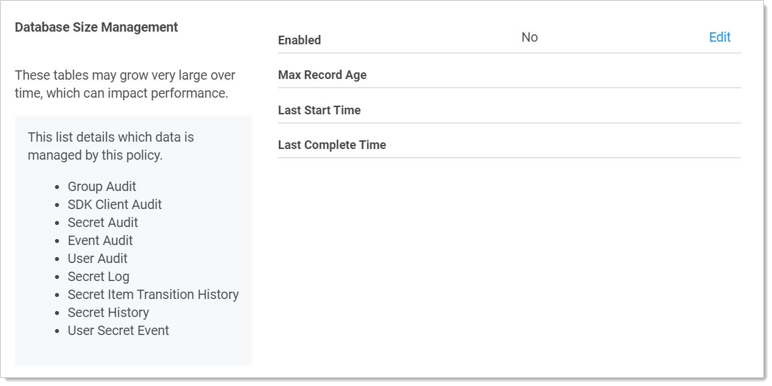
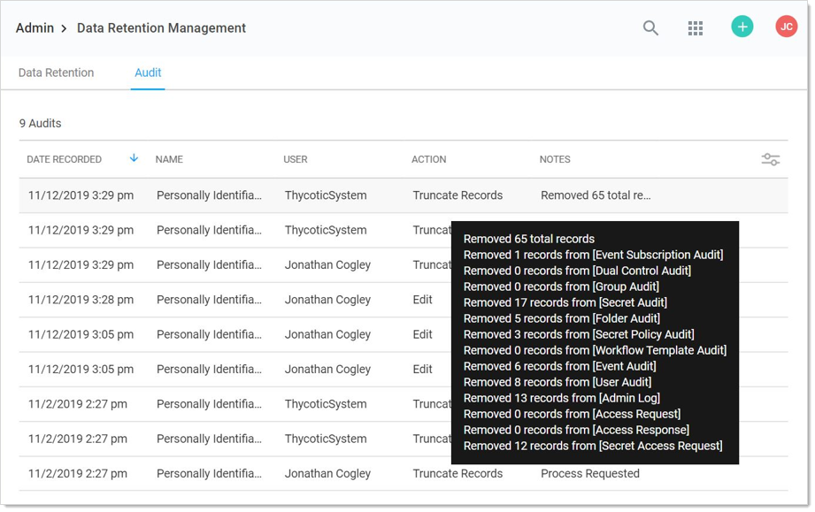

[title]: # (Audit Data Retention)
[tags]: # (Audit Data Retention)
[priority]: # (40)

# Audit Data Retention

## Overview

Secret Server can automatically delete older audit and audit-like information (both are called "audit data” here). By default, Secret Server does not delete any audit data.

> **Important:** Do not configure automatic record deletion for compliance or other important data.

If enabled, old data deletion occurs automatically at 0200 EST every Sunday. Data deletion can be run immediately by clicking the "Run Now" button. The maximum record age for each audit-data retention policy is configurable to any value greater than or equal to 30 days.

## Data Retention Policies

The audit data retention offers two data retention policies:

- Personally Identifiable Information (PII): Tables containing identifiable user or organization data.
- Database Size Management: Tables that are prone to grow large, which may affect SS performance.

Each policy has a title and description, which are displayed to users, as well as a defined set of SS audit tables it manages. There is some overlap between the two policies’ table sets as some tables fall under both PII and size management.

When an audit-data retention policy runs, all records in each table for that policy that are older than the set maximum record age in days are deleted from the database. This also includes all dependent records in other tables that would otherwise prevent deletion.

## Permissions

Access to the audit-data detention management pages in SS is limited to users with the roles “View Data Retention” and “Administer Data Retention.” As the names imply, only the latter role can manage audit data retention, such as editing and running now.

> **Note:** The “Unlimited Admin” role does not include audit data retention management at this time.

By default, these two audit-data retention roles are not assigned to users. An admin must first assign the roles to users requiring access.

## Procedures

### Viewing the Status and History of Audit-Data Retention Policies

1. Go to **Admin \> Data Retention Management**:

   
   The PII policy is displayed on the Data Retention tab. If you scroll down, you will see the Database Size policy:

   

1. Notice that each policy lists:

   - The enabled status (editable)
   - The maximum age audits are allowed to remain (editable)
   - The last time the policy ran
   - The last time the policy finished running
   - All the audit data tables that the policy covers

1. To view a list of previous "runs,” click the **Audit** tab. You can also hover the mouse pointer over individual records to view details:

   

### Editing Audit Data Policies

1. Go to **Admin \> Data Retention Management**:

   

1. Click the **Edit** link on the **Enabled** row on the policy that you wish to edit. A popup appears (not shown).

1. Click to select the **Enabled** check box.

1. Click the **Save** button. The policy becomes enabled.

1. Click the **Edit** link on the **Max Record Age** row on the policy that you wish to edit. A popup appears (not shown).

1. Type the number of days you want to retain the data (at least 30) in the **Max Record Age** text box.

1. Click the **Save** button. The maximum record age changes.

### Running an Old Audit-Data Purge Right Now

1. Go to **Admin \> Data Retention Management**:

   

1. Click the **Run Now** link on the **Enabled** row on the policy that you wish to edit. A popup appears (not shown).

1. Click the **Run Now** button. The popup disappears and the policy is run now.

   > **Note:** If a policy is currently running and you click the Run Now button. It will not work, and a popup will tell you so. There is a built-in five-minute wait after a policy finishes before you can run it again.

1. The **Last Start Time** row changes to the current time, and a progress indicator appears.

1. When the run is complete, the **Last Complete Time** row changes to the current time.
