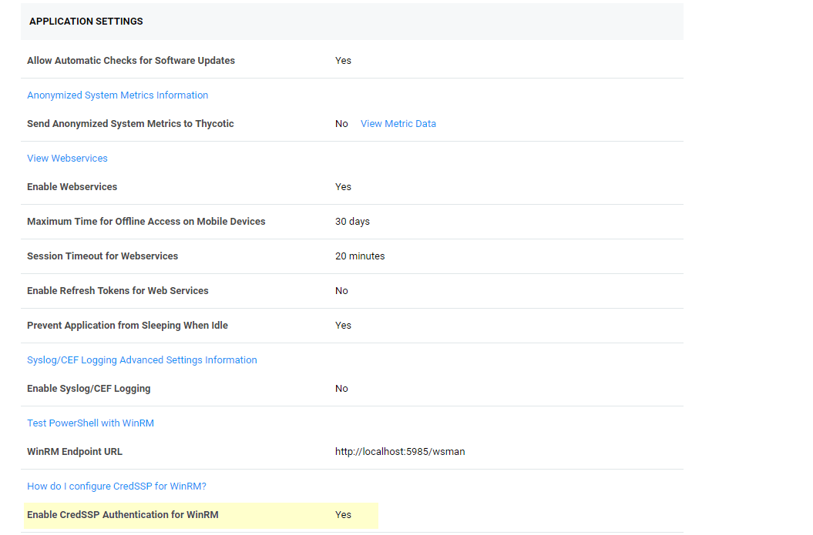
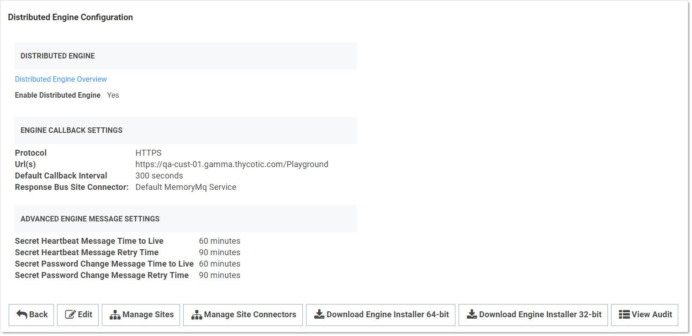
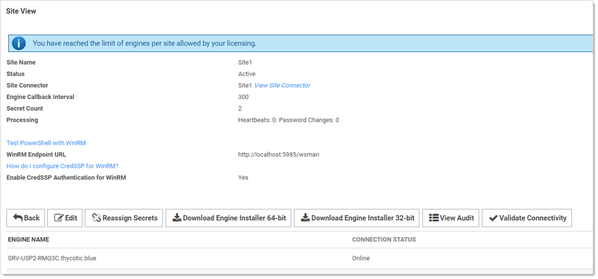
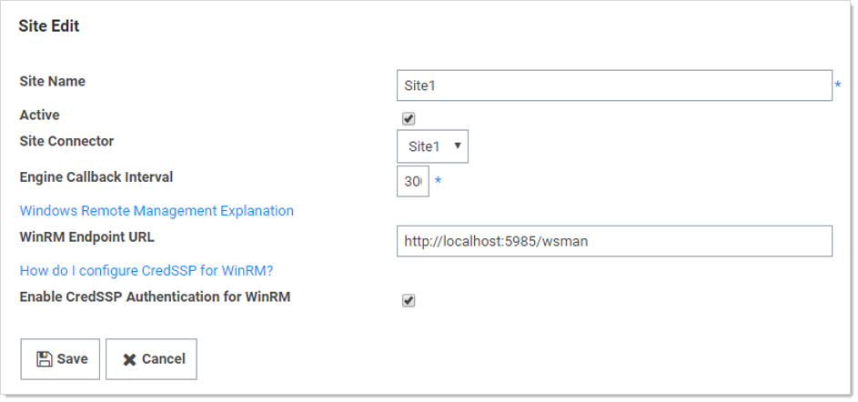

[title]: # (Configuring CredSSP for WinRM with PowerShell)
[tags]: # (CredSSP, WinRM, PowerShell)
[priority]: #

# Configuring CredSSP for WinRM with PowerShell

## Introduction

In some cases, a PowerShell script may need to access resources outside of a Secret Server (SS) machine. This requires that any credentials are delegated to the target machine. SS runs PowerShell scripts using Windows Remote Management (WinRM), which does not allow credential delegation by default. To allow credential delegation, the SS machine must have Credential Security Support Provider (CredSSP) enabled. CredSSP is a security support provider that allows a client to delegate credentials to a target server.

Some scenarios requiring CredSSP:

- The script needs to query or update a value in Active Directory.

- The script needs to query or update a value in a SQL Server instance.

- The script is used as part of extensible discovery for locating accounts or machines on a different domain or non-domain joined environment.

## Enabling CredSSP for WinRM in Secret Server

1. Go to **Administration \> Configuration**. The General tab of the Configuration page appears:

   

1. Click **Edit** button at the bottom of the page.

1. Click to select the **Enable CredSSP Authentication for WinRM** checkbox.

1. Click the **Save** button.

> **Note:** This is the global CredSSP settings and by default will configure CredSSP and connections to come *from* the Web server. This is used when **not using distributed engines.**

> **Note:** If you are using distributed engines and you enable CredSSP at the site-specific level, these settings take precedence over this global CredSSP setting. Secrets will prioritize these site-specific settings. Therefore, if you plan on using CredSSP through a distributed engine, you should consider disabling the global setting seen below and only configure it at the site-specific level.

## Configuring CredSSP for WinRM on the Secret Server Machine

1. Log on to the machine running SS.

1. Run Windows PowerShell as an administrator.

1. Enable client-side CredSSP by running:

   `Enable-WSManCredSSP -Role Client -DelegateComputer <Secret Server fully qualified machine name>`

   For example:

   `Enable-WSManCredSSP -Role Client -DelegateComputer <localhost>`

   > **Note:** localhost is the actual string that SS uses to generate the PowerShell run space. Sometimes customers need both localhost and FQDN entries. *In theory*, those entries should be the same, thus not needing a second one.

1. Enable server-side CredSSP by running:

   `Enable-WSManCredSSP -Role Server`

1. The Web server always uses a specified account to run the PowerShell scripts. Considerations:

   - Ensure that account is added to the “Remote Management Users” local group on each Web server.

   - For RPCs with custom password changers, this would be “Change Password Using,” and then select “Privileged Account.”
   - For PowerShell password changers in the classic UI, this would be “Run PowerShell Using” and can alternatively be configured as the “Default Privileged Account” at the template level.

   - For custom dependencies using PowerShell scripts, this would be the “Run As” secret.
   - If you use any form of extensible discovery, this account needs to be the first secret that is linked to the scanner. Any additional secrets linked to the scanner are typically associated with authentication to the destination system.

## Configuring CredSSP for WinRM on a Distributed Engine

You can alternatively configure CredSSP and the credential delegation to occur from your distributed engines by changing this setting at the site level:

1. Go to **Admin \> Distributed Engines**. The Distribute Engine Configuration page appears:

   

1. Click the **Manage Sites** button. The Manage Sites page appears:

   

1. Click the **Site Name** link of the desired site. The Site View page for that site appears:

   

1. Click the **Edit** button. The Site Edit page appears:

   

1. Click to select the **Enable CredSSP Authentication for WinRM** check box.

1. Click the **Save** button.

1. Log on to each of your distributed engines where CredSSP is enabled.

1. Run Windows PowerShell as an administrator.

1. Enable client-side CredSSP by running:

   `Enable-WSManCredSSP -Role Client -DelegateComputer <distributed engine fully qualified machine name>`

   `Enable-WSManCredSSP -Role Client -DelegateComputer <localhost>`

   > **Note:** localhost is the actual string that the Distributed Engine is using to generate the run space. Some customers need to have both the localhost and FQDN entry. *In theory*, both entries above should be the same, thus not needing a second entry.

1. Enable server-side CredSSP by running:

   `Enable-WSManCredSSP -Role Server`

1. The distribute engine will always use a specified account to run the PowerShell scripts. Considerations:

   - Ensure that account is added to the “Remote Management Users” local group on each engine where CredSSP is enabled.

   - For RPCs with custom password changers, this would be “Change Password Using,” and then select “Privileged Account”.
   - For PowerShell password changers in the classic UI, this would be “Run PowerShell Using” and can alternatively be configured as the “Default Privileged Account” at the template level.

   - For custom dependencies using PowerShell scripts, this would be the “Run As” secret.
   - If you use any form of extensible discovery, this account needs to be the first secret that is linked to the scanner. Any additional secrets linked to the scanner are typically associated with authentication to the destination system.

1. Ensure that the "Allow Delegating Fresh Credentials" group policy setting is enabled and is not disabled by a domain policy.

   1. Open the gpedit.msc file on your SS machine or distributed engine, depending on where CredSSP is enabled

   1. Navigate to **Computer Settings \> Administrative Templates \> System \> Credentials Delegation**.

   1. Edit the "Allow Delegating Fresh Credentials" setting.

   1. Verify that it is Enabled.

   1. Click "Show..."

   1. Verify that the list contains an entry that begins with "wsman/" and ends with the fully qualified machine name of the SS machine or distributed engine.

   1. If destination systems are non-domain joined or on another domain without a trust, it may be required for you to add in an entry for **each** destination system you wish to run the script or do discovery on (as examples). Consider collecting a list of all destination FQDNs for your specific use case and adding them all in one go.

1. Depending on where CredSSP is configured (Web server or distributed engine), run the following commands:

   - View existing entries:
     `Get-Item WSMan:\localhost\Client\TrustedHosts`

   - Adding computers if your TrustedHosts list is empty:
     `Set-Item WSMan:\localhost\Client\TrustedHosts *-Value* <ComputerName>,[<ComputerName>]`

   - Adding computers to your existing TrustedHosts list:
     `$curList = (Get-Item WSMan:\localhost\Client\TrustedHosts).value`
     `Set-Item WSMan:\localhost\Client\TrustedHosts -Value "$curList, Server01"`

1. On the destination system, if it is on a separate domain without a trust or non-domain joined, add the reverse WSman entries so the destination system trusts either SS or your engines. Run one of the following commands:

   Web server:

   `Set-Item WSMan:\localhost\Client\TrustedHosts *-Value* <Web Server 1 FQDN>,[<Web Server 2 FQDN>]`

   Engine:

   `Set-Item WSMan:\localhost\Client\TrustedHosts *-Value* <Distributed Engine 1 FQDN>, [<Distributed Engine 2 FQDN>]`

1. Restart either SS or the engine you just trusted.

## Enabling CredSSP on Secret Server Agents for PowerShell Script Dependencies

> **Note:** Remote agents were upgraded to distributed engines in SS version 8.9. This section only applies to SS versions 8.8.000020 and earlier.

>**Note:** Remote Agents are only needed for networks that are not directly connected to
>the network that SS is installed on. If you are not using remote agents, disregard this section.

By default, SS agents inherit the "Enable CredSSP Authentication for WinRM" setting from SS; however, you can override this in the agent configuration file as follows:

1. On the machine running the agent, locate the the agent program files. By default, they are at `C:\Program Files (x86)\Thycotic Software Ltd\Secret Server Agent`.

1. Edit the `SecretServerAgentService.exe.Config` file in a text editor.

1. Locate the “UnencryptedSettings” section.

1. Add a new key to that section for EnableCredSSPForWinRM and set it to true. For example:

   `<add key="EnableCredSSPForWinRM" value="true" />`

1. Restart the “Secret Server Agent” service to apply the setting.

