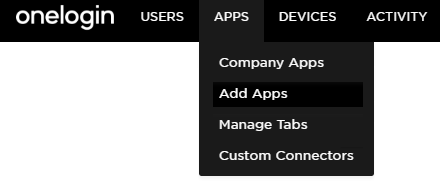
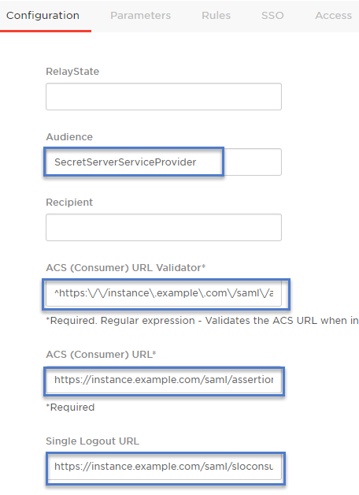
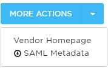
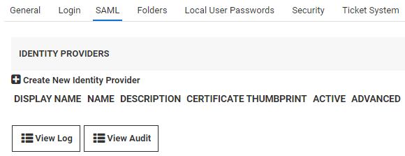
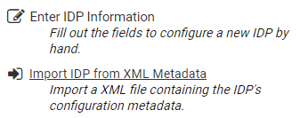
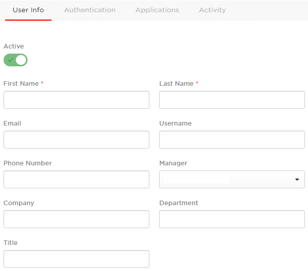
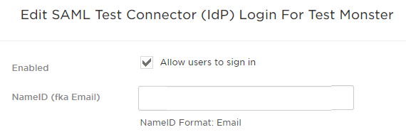
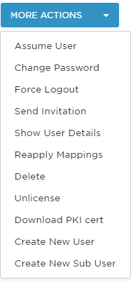

[title]: # (Configuring SAML OneLogin)
[tags]: # (authentication,SAML,SSO, OneLogin)
[priority]: # (1000)
[display]: # (all)

# Configuring SAML OneLogin

## To access Secret Server using OneLogin for SAML, follow the steps below

Step 1:  Navigate to your OneLogin instance and log in as an administrator, then select **Administration** > **Apps** > **Add Apps**.

   

Step 2:  Search for **SAML Test Connector (IdP)** and select it, then click **Save**.

   

Step 3:  Click on the **Configuration** tab and fill out the details as described below:

   

**RelayState** can be left blank.

**Audience** is the name of the Service Provider configured in Secret Server (e.g. "SecretServerServiceProvider").

**Recipient** can be left blank.

**ACS (Consumer) URL Validator** a required field that needs to be a valid RegEx of the ACS (Consumer) URL.

Modify the text in the example below according to the URL string of your Secret Server instance:

`https:\/\/instance\.example\.com\/saml\/assertionconsumerservice\.aspx$`

**ACS (Consumer) URL** like the step above, but no longer RegEx format.

Modify the text in the example below according to the URL of your Secret Server:

​​`https://instance.example.com/saml/assertionconsumerservice.aspx`

**Single Logout URL** the Secret Server URL for SLO (Single Logout):

​​`https://instance.example.com/saml/sloservice.aspx`

Click **Save** when done.

Step 4: Click **More Actions** and **SAML Metadata** to download the metadata for OneLogin.

   

Step 5: Log into your Secret Server instance, then go to **Admin** > **Configuration** > **SAML** tab and click **Create New Identity Provider**.

   

Step 6: Click **Import IDP from XML Metadata** and select the OneLogin metadata you saved previously. If you don't see the file, you may need to change the metadata filetype to .xml

   

Step 7: To add users to OneLogin, navigate to OneLogin and log in as an administrator once more, then click **Administration** > **Users** > **New User**.

   

Step 8: Fill out the required information and click **Save** when finished.

>**Note:** If you are using a Secret Server local account or Secret Server Cloud, the username will be in email format and it must be identical on OneLogin and Secret Server. For an Active Directory account, it should be the samAccountName.

Step 9: Click on the **Applications** tab, then click the plus sign (+).

   

Step 10: Select **SAML Test Connector (IdP)**, then click **Continue**.

   

Step 11: Enter the user's Secret Server username (email format) then click **Save**.

   

Step 12: Mouse over **More Actions** and click **Change Password** to give the user a login password.

   

Step 13: In another browser or in incognito mode, log into your OneLogin instance as the user you just created. If prompted to add OneLogin to your browser, click **Skip**.

Step 14: You should see the **SAML Test Connector (IdP)**. Click on it to authenticate into Secret Server using the SAML workflow.

   
