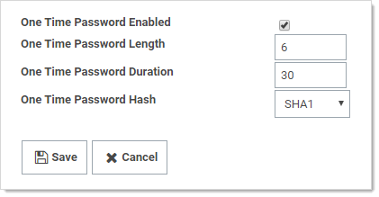
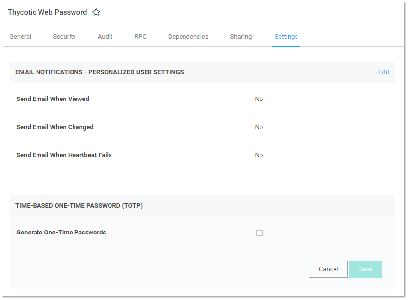
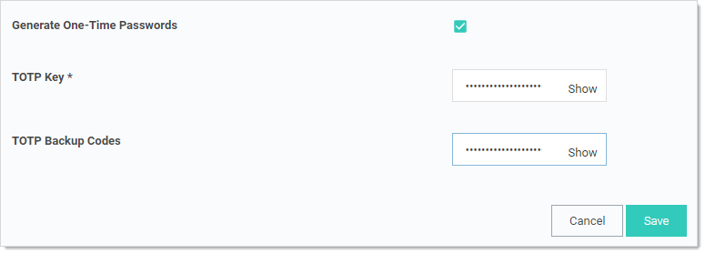

[title]: # (Enabling TOTPs for Launchers)
[tags]: # (Authentication, Credentials, TOTP)
[priority]: #

# Enabling TOTPs for Launchers

Most commonly, time-sensitive one-time passwords (TOTPs) are generated by a mobile application, such as Google Authenticator or Microsoft Authenticator. Additionally, SS can be used as the TOTP generator for RPC or launchers (for web password secrets only at this time). Both the secret and the secret template require configuration for this use.

## Secret Template Setup

To enable TOTP on a SS template:
$1
$2$1
$2$1
$2$1
$2
   Length: 6
   Duration: 30
   Hash: SHA1

   

   > **Note:** These are the values that most one-time password instances, such as Google and Microsoft Authenticator, use today. If you use these settings with another OTP provider and are unable to successfully use generated codes to authenticate, please review their documentation and adjust these settings as required.
$1
$2
## TOTP Secret Setup

Once a secret template is set up for TOTP, each secret based on that template also needs to be set up:
$1
$2$1
$2$1
$2
   
$1
$2
   
$1
$2
   > **Important:** Treat the TOTP key and backup codes like you would any other password! If anyone obtains the key, it can be used to set up a valid TOTP generator for that account on any device, allowing that person to bypass the protection. Similarly, the backup codes allow users to temporarily bypass protection.

   > **Note:** If you have an account that has been TOTP protected and you did not save the TOTP key upon creation, you must deactivate TOTP on that account and then reactivate it to retrieve the TOTP key to set up SS.
$1
$2