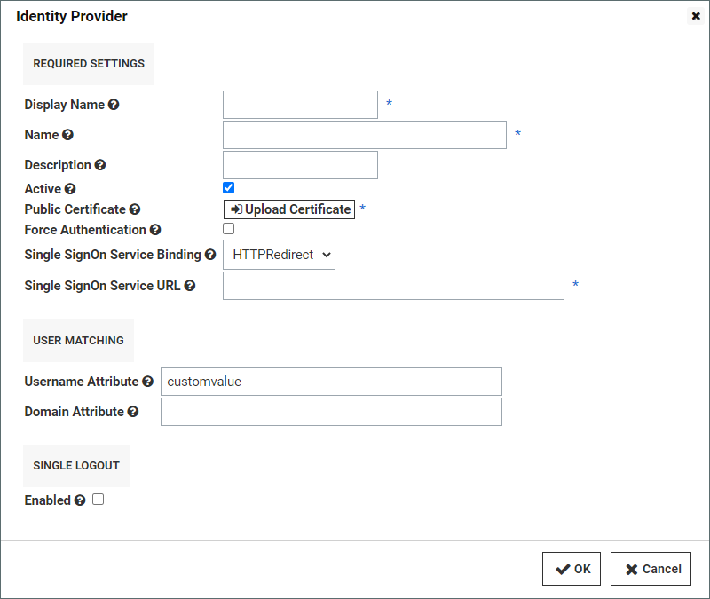

[title]: # "ADFS Custom Rules"
[tags]: # "directory services,active directory,adfs,sAMAccountName,UPN"
[priority]: # "1000"
[display]: # "all"

# ADFS Custom Rules

## Overview

In Active Directory, when a user's sAMAccountNam and userPrincipalName (UPN) differ, you must take some steps to accommodate those differences in Secret Server. For example, suppose a user's sAMAccountName is `jsmith` and the user's userPrincipalName is `john.smith@somedomain.com`. When Secret Server syncs with Active Directory, it obtains `jsmith` as the Secret Server login user name. However, with its standard ADFS rule passing in the UPN, Secret Server will receive `john.smith@somedomain.com` and it will not find the user.

To rectify this situation you must configure the SAML Username Attribute in Secret Server to be `customvalue`, and use three custom claim rules described below.

## Change the SAML Username Attribute

To change the SAML Username Attribute in Secret Server, perform the following steps:

1. Click **Admin \> Configuration**.

1. Click the **SAML** tab and scroll to the bottom of the window.

1. Click **Create New Identity Provider**.

   

1. In the Identity Provider dialog, click **Enter IDP Information**.

   

1. In the next Identity Provider dialog under **User Matching**, type `customvalue` in the box next to **Username Attribute** and click **OK**.

   

## Create Three Rules

To create the three rules you need, open the Active Directory application and follow these steps:

1. In the **Edit Claim Rules** window, select **Add Rule**.
1. Choose **Send Claims Using a Custom Rule** as the rule template.
1. Create each rule using the information below, in the order presented.

> **Note:** If you copy code directly from the webpage for pasting, please ensure that you have copied everything you need, or correct the text after pasting it.

### Rule 1: Query AD for UPN and sAMaccountname Attributes

````
c:[Type == http://schemas.microsoft.com/ws/2008/06/identity/claims/windowsaccountname, Issuer == "AD AUTHORITY"]
 => add(store = "Active Directory", types = ("ssupn", "sswindowsaccountname"), query = ";userPrincipalName,sAMAccountName;{0}", param = c.Value);
````

### Rule 2: Obtain the Domain from the UPN

````
c:[Type == "ssupn"]
 => add(Type = "ssnewupn", Value = RegExReplace(c.Value, "^(.*?)@", ""));
````

### Rule 3: Combine the sAMaccountname with the Domain

````
c1:[Type == "ssnewupn"]
 && c2:[Type == "sswindowsaccountname"]
 => issue(Type = "customvalue", Value = c2.Value + "@" + c1.Value);
````