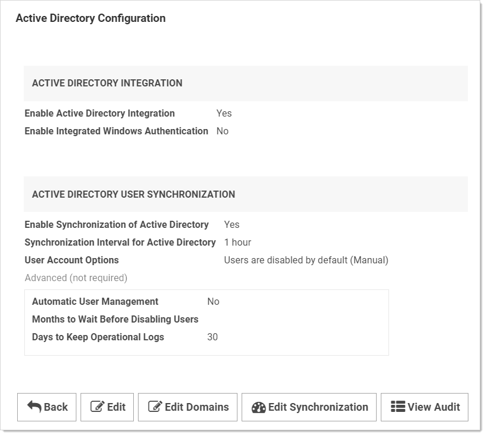
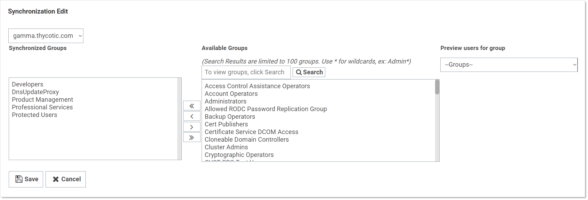

[title]: # (Configuring Active Directory)
[tags]: # (Active Directory)
[priority]: # (1000)

# Configuring Active Directory

To allow users to log in with their Active Directory (AD) credentials, you can configure your AD domain settings in SS and then add users either individually or by group.

## Step 1: Enabling Active Directory Integration
$1
$2$1
$2$1
$2$1
$2
## Step 2: Adding a Domain
$1
$2$1
$2$1
$2$1
$2$1
$2$1
$2$1
$2
Now you are ready to add individual users or groups of users for access to SS with AD credentials. See the relevant section below for instructions.

## Step 3: Setting Up Synchronization Groups

Once a domain has been added, the **Synchronization Groups** needs to be set by clicking the **Edit Synchronization** button on the **Active Directory Configuration** page. The Available groups represent all accessible groups on the specified Active Directory domain. The user membership can be previewed with the **Group Preview** control. Select the desired group from the available groups that contains the Active Directory accounts for users you would like to create in SS. If the specific group does not exist, one can be created by your Active Directory administrator. If you create domain users manually or converting local users to domain users, then see the corresponding sections below before setting the synchronization group.
$1
$2
## Step 4: Adding Groups

SS can sync with security groups from AD to automatically add, enable, and disable users. This can streamline the process of managing which users are enabled.

> **Note:** Enabled users count towards your SS user licensing.

## Step 5: Enabling Active Directory Synchronization
$1
$21. Click to select the **Enable Synchronization of Active Directory** check box. Additional settings appear.
$1
$21. Click the **User Account Options** Dropdown list to select a default status for users. See below for a description of each option. We recommend selecting **Users are disabled by default (Manual)** for initial testing. The options are:
   - **Users are enabled by default (Manual)**: SS users are automatically enabled when they are synced as new users from AD. If they were disabled explicitly in SS, they are not automatically re-enabled. If creating a new user will cause the user count to exceed your license limit, the user created disabled.
   - **Users are disabled by default (Manual)**: SS users are automatically disabled when they are pulled in as new users from AD. If they were enabled explicitly in SS, they are not automatically re-disabled.
   - **User status mirrors Active Directory (Automatic)**: When new users are pulled in from AD, they are automatically enabled if active on the domain. The exception is when this will cause you to exceed your license count. For existing users, they are automatically be disabled if they are removed from all synchronization groups, deleted in AD, or disabled in AD. They are automatically re-enabled when they are part of a synchronization group and are active in AD. See [Understanding Active Directory Automatic User Management](../../directory-services/active-directory/understanding-ad-automatic-user-management/index.md).
$1
$21. Click the **Save** button.

## Step 6: Choosing Synchronization Groups

Choose the security groups from AD you want to sync with SS:
$1
$2
    
$1
$2
   
$1
$2
   
$1
$2
   
$1
$2$1
$2
## Step 7: Running Active Directory Synchronization

From the **Active Directory** page, click the **Synchronize Now** button to run a sync. As the sync progresses, you can click the **Refresh** button to monitor the logs until you see the message **Completed Domain synchronization for all domains**.
