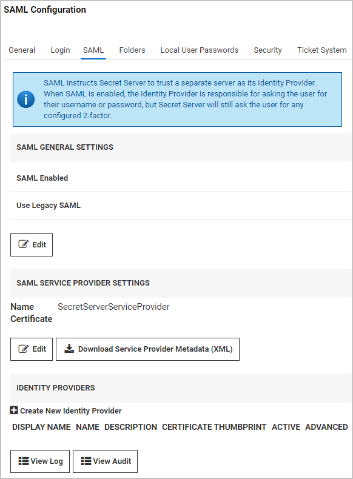

[title]: # (Setting Up ADFS for SAML)
[tags]: # (directory services,active directory,sAMAccountName,UPN)
[priority]: # (1000)
[display]: # (all)

# Setting Up ADFS for SAML

How to set up Single Sign-On (SSO) for users synced between an Active Directory domain server and a Secret Server user list.

 >**Note**: The interface and workflows for Active Directory Federation Services (ADFS) Server are subject to change. For more current workflow and interface references, please refer to the [Microsoft ADFS Server documentation](https://docs.microsoft.com/en-us/windows-server/identity/active-directory-federation-services).

## ADFS Server

1. On your AFDS server, browse to your Secret Server instance and sign in.

1. Download the `SecretServerSAMLMetadata.xml` file from `[YourSecretServerInstance.Name]/samlmetadata`.

1. Open **Active Directory Federation Services Management**.

1. Under **Trust Relationships**, click **Add Relying Party Trust** to add your service provider information.

1. In the **Add Relying Party Trust** wizard, click **Start**.

1. Click **Import data about the relying party from a file**.

1. Browse to select the metadata XML file you downloaded earlier and click **Next**.

1. Enter a display name of your choice and click **Next**.

1. Decide whether to configure multi-factor authentication and click **Next**.

1. Choose **Issuance Authorization Rules** and click **Next**.

1. On the **Ready to Add Trust** page, make sure the box next to **Open the Edit Claim Rules dialog** is checked.

1. Click **Next** and then click **Close**. The **Edit Claim Rules for Secret Server** window should open automatically.

1. Click **Add Rule**.

1. Select **Send LDAP Attributes as Claims** as the Claim Rule Template and click **Next**.

1. Fill out the fields below as indicated:
   * **Claim rule name**: Optional
   * **Attribute Store**: Active Directory
   * Add an **LDAP Attribute** of User-Principal-Name with an **Outgoing Claim Type** of Name ID.
1. Click **Finish**.
1. Click **Apply** and then click **OK**.

1. Run the following PowerShell command:

   `Set-ADFSRelyingPartyTrust -TargetName name of the relying party trust created in adfs -SamlResponseSignature "MessageAndAssertion"`

1. Download the metadata for your ADFS IDP from `https://[YOURSERVERNAME]/FederationMetadata/2007-06/FederationMetadata.xml`.

## Secret Server

1. In Secret Server, click **Admin \> Configuration \> SAML** tab.

1. On the **SAML Configuration** tab, click **Create New Identity Provider**.

   

1. Click **Import IDP from XML Metadata** and select the ADFS metadata you downloaded. If you don't see the file, you might need to change the metadata filetype to xml.

   

## Adding Users to ADFS

For users to be authenticated by the SSO workflow you are setting up, Secret Server usernames must match domain AD usernames. If you manually add usernames to Secret Server or AD, you must inspect them carefully to ensure that they match. You can also use Secret Server Discovery to sync Secret Server usernames in bulk with AD usernames.

Once a username matches in both systems, the user can log into their desktop computer using their AD credentials and then browse to Secret Server without being prompted again for authentication.

 >**Note**: If you have accounts in which the sAMAccountName differs from the UPN name, you can create custom rules to accommodate the differences. See the Directory Services section of the Secret Server documentation.

## Common Errors

If you encounter any of the errors below, check that the **RelyingPartyTrust Rule** on the ADFS server has both the message and assertion signed. By default, only the assertion is signed.

"Attempt to login via SAML from identity provider had no signd responses or asseretions"

"Attempt to login via SAML with unsigned request"

"Attempt to login via SAML with unsigned assertion"

If you encounter the error, "SAML Response signature message from IDP failed verification," it means that Secret Server cannot decrypt the assertion message from the IDP (ADFS) because the public certificate thumbprint is incorrect. To fix this issue, follow the steps below.

1. Download the ADFS certificate, upload it to Secret Server (**Admin \> Configuration \> SAML** tab) and edit the IDP configuration.

1. Check the token-decrypting in ADFS to verify the certificate.

1. Use the [Get-AdfsCertificate](https://docs.microsoft.com/en-us/powershell/module/adfs/get-adfscertificate?view=windowsserver2019-ps&viewFallbackFrom=win10-ps) cmdlet to retrieve the certificates listed below that ADFS uses, and check that they are appropriately identified as primary (**IsPrimary** is set to **True**):

   * A primary token-signing certificate is used to digitally sign outgoing claims.

   * A primary token-encrypting certificate is published in federation metadata for use by trusted claims providers.

   * Information card signing and service communications certificates are always primary.
