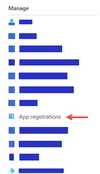
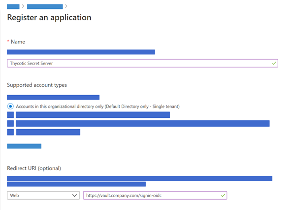
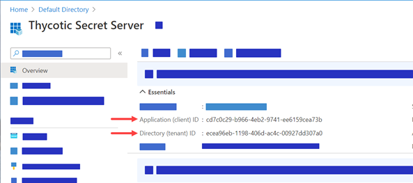
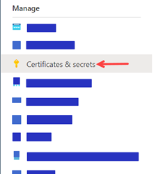
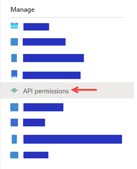
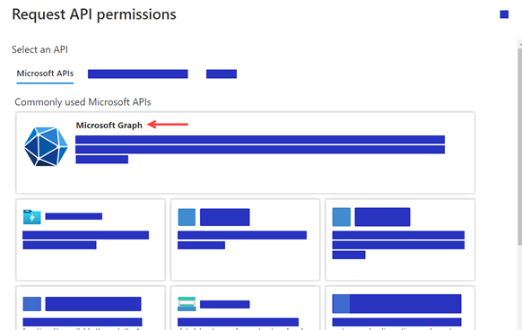
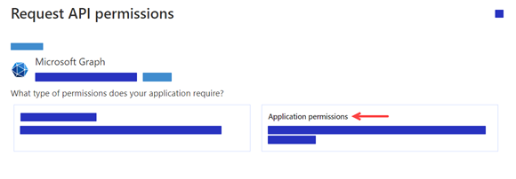
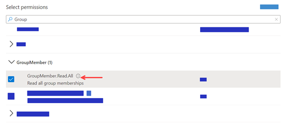
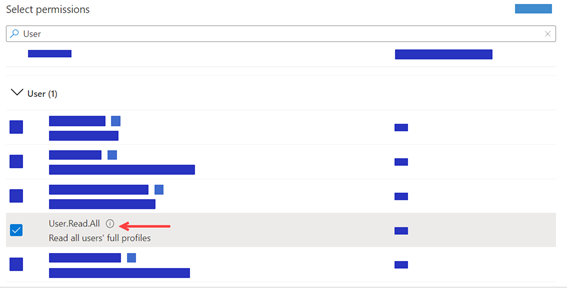

[title]: # (Create an Azure App Registration)
[tags]: # (Azure, Azure Active Directory)
[priority]: # (1000)

# Create Azure App Registration

The steps provided can be used to create the App Registration required for configuring Azure Active Directory integration.

# Azure Portal

### Create the App Registration

1. Log in to the Azure Portal
1. Switch to the intended Directory (_if needed_)
1. Navigate to the **Azure Active Directory** blade
1. Click **App registrations** on the left pane, under the Manage section

   

1. Click **New registration**
1. In the **Register an application** blade enter the following:

   | Field | Value |
   | -------------- | ------------------- |
   | Name | `Thycotic Secret Server` |
   | Supported account types | Single Tenant (`Accounts in this organizational directory only`) |
   | Redirect URI | (**Web**) `https://{Secret Server URL}/signin-oidc` |

   An example:

   

1. Click the **Register** button

   > **Note**: Once the App Registration is created, the Azure Portal should open the blade to this object.

1. In the blade for this App Registration, take note of the **Application (client) ID** and **Directory (tenant) ID**. These will be needed for Secret Server configuration.

   

1. Navigate to the **Authentication** on the left panel under the Manage section

   

1. Under the **Implicit grant** section, **check both** boxes for `Access tokens` and `ID tokens.`

   

1. Click **Save** (_ensure you receive the portal notification that the application Authentication was updated_)

### Add Client Secret to the App Registration

1. Navigate to the **Certificates & secrets** on the left panel under the Manage section

   

1. Under the **Client secrets** click **New client secret**

   

1. Add a description: `Secret Server`
1. Set the Expires option desired
   > **Note**: If the Client secret is set to expire, that Secret Server will have to be updated upon or before expiration for this integration to function correctly.

1. Click **Add**
1. Save the value displayed for the Secret Server configuration

### Add API Permissions to the App Registration

1. Navigate to **API permissions** on the left panel under the Manage section

   

1. Remove any default permissions that may exist (_click the `...` and select `Remove permission`_)

1. Click **Add a permission** under **Configured permissions** section

   

1. In the **Request API permissions** panel, select **Microsoft Graph**

   

1. Click **Application permissions** when asked, `What type of permissions does your application require?`

   

1. A **Select permissions** section will show up below.

1. Search for **Group**
1. Expand **Group** and **check** `Group.Read.All`
1. Expand **GroupMember** and **check** `GroupMember.Read.All`

   

1. Search for **Member**
1. Expand **Member** and **check** `Member.Read.Hidden`

   

1. Search for **User**
1. Expand **User** and **check** `User.Read.All`

   

1. Click t **Add permissions** button to add the permissions

   

1. Click **Yes** to the prompt to grant consent to _all accounts_ in the Directory

   

1. Once you receive the notification for _Grant consent_ you should **see the Status** change to green checks

   

# Script Method

> **Note:** The below script is provided as-is, and future use may require adjusting based on Microsoft's changes with the AzureAD PowerShell module.

The full script can be found [here](azuread_sample.ps1).

> **Note:** At the time of writing, there is no programmatical way to grant admin consent to the app. That step has to be performed via the Azure Portal.
