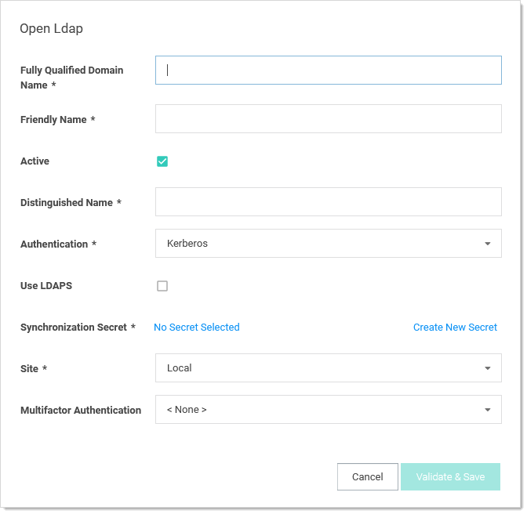

[title]: # (Syncing with OpenLDAP Directory Service)
[tags]: # (LDAP, directory service)
[priority]: # (1000)
[display]: # (all)

# Syncing with OpenLDAP Directory Service

## Introduction

OpenLDAP is a free, open source version of the Lightweight Directory Access Protocol (LDAP) developed by the OpenLDAP Project. This topic describes syncing OpenLDAP to Secret Server (SS).

> **Note:** This feature is only supported by the new interface. The classic interface does not support OpenLDAP Directory Services.

## Unsupported Use Cases

### Anonymous User Authentication

We do not support anonymous user authentication:

When creating an OpenLDAP directory service, “Anonymous” is a supported authentication method.  When this is chosen, SS connects anonymously to the OpenLDAP directory service as configured during the synchronization process and creates any users found on the directory service.  

When anonymous” is selected, a secondary Authentication option appears— “User Authentication,” which is the method used when the synchronized users attempt to authenticate to SS. In short, user authentication cannot be anonymous because SS does not allow anonymous access.

The valid options for user authentication when anonymous is selected for the synchronization process, are “Basic”, “Kerberos”, or “No Authentication.”  “No Authentication” supports using an OpenLDAP directory service as a user directory while enabling alternative methods of authentication, such as SAML.

### Duplicate User Attributes

We do not support configurations where using different attributes yield users with the same username, GUID, or user principal name (email address format—not necessarily an actual email address). These must all be unique to each user. If a duplicate exists, it may result in odd, unpredictable behavior from the application.

## Procedure

1. Create a secret in SS of type **OpenLDAP Account**. This sync secret is used to synchronize users and groups. It requires permission to search and view the attributes of the users and groups. If you plan on using SS discovery, the account will also need permissions to scan computers on the network for accounts. Complete these parameters:

   - Domain. Example: `ldap.omega.thycotic.com`
   - Username. Example: `cn=ldap,dc=omegaldap,dc=local`
   - Password

1. Go to **Admin \> Directory Services**. The Directory Services page appears:

   

1. Click the **Add Domain** dropdown list and select **OpenLDAP Domain**. The OpenLDAP popup appears:

    

1. Type the domain's FQDN in the **Fully Qualified Domain Name** text box. For example: `ldap.omega.thycotic.com`.
1. Type any name you desire in the **Friendly Name** text box.
1. Ensure the **Active** check box is selected.
1. Type the distinguished name (node path) in the **Distinguished Name** text box. For example: `dc=omegaldap,dc=local`

1. Click the **Authentication** dropdown list to select either the **Basic** or **Anonymous** authentication method. 

   - Basic  authentication requires that valid credentials are assigned as the sync secret. Those credentials are used to authenticate to the OpenLDAP system on each sync. 
   - Anonymous authentication does not require valid credentials and removes the Synchronization Secret section. Instead, it exposes a User Authentication field.

   > **Note:** The Kerberos authentication method probably works but has not been test by Thycotic.

1. Basic authentication:

   1. Click the **No Secret Selected** link in the Synchronization Secret section. The Select Secret popup appears.
   1. Navigate to and select the secret you created earlier. The moment you click it, the popup disappears and the secret name appears in the Synchronization Secret section.

1. Anonymous authentication: Click the **User Authentication** list to select **Basic** or **No Authentication**. This sets which authentication method to use when users who are synced anonymously try to authenticate:

   - Basic authentication requires valid OpenLDAP account credentials.
   - No authentication is for when customers want users synced from OpenLDAP but use authentication through another service, such as SAML. We do *not* support anonymous authentication for security reasons.

1. Click to select the **Use LDAPS** check box if you intend to use secure LDAP.
1. Click the **Site** dropdown list to select your site.
1. Click the **Multifactor Authentication** dropdown list to select the desired authentication method.
1. Click the **Validate & Save** button. The information is validated. If there are any connectivity issues, an error message will appear stating what field is the likely cause. If the Active check box is not selected no validation occurs. If you chose anonymous authentication, no secret is needed and no credential validation occurs; however the distinguished name and FQDN are still used. Upon a successful save, a new box appears, prompting the user to select their initial synchronization groups. If groups appear in the search box that  also indicates the connection was successful.
