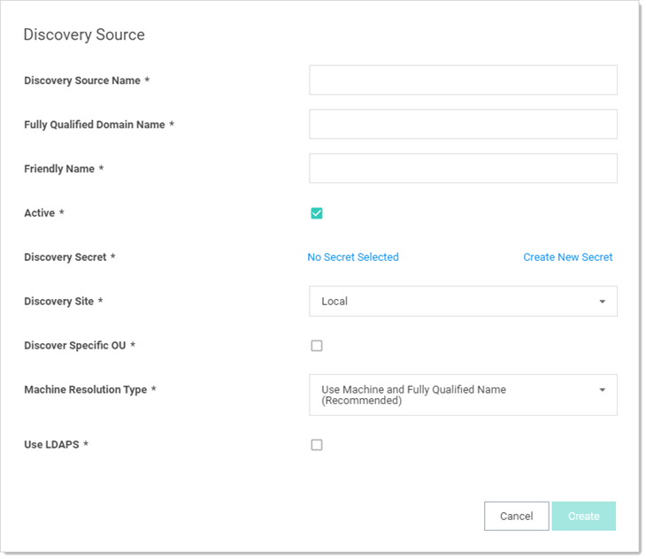

[title]: # "Creating an Active Directory Discovery Source"
[tags]: # "discovery,active directory,discovery source"
[priority]: # "1000"

# Creating an Active Directory Discovery Source

Discovery sources define a set of discovery operations. You must create one based on the built-in types prior to running discovery. To do so for AD:

> **Note:** Adding a new domain as a discovery source also adds it as a synchronization source and vice versa.

> **Note:** If you add a domain as an AD synchronization source within SS but discovery was not initially enabled, the domain is listed as an inactive discovery source. To see such a domain, on the Discovery Sources page, click to select the Show Inactive and Disabled check box.

1.  Click **Admin \> Discovery**. The Discovery Sources tab of the Discovery page appears:

   

1.  Note the list of existing discovery sources.

   > **Note:** If you upgraded from an earlier SS version and have created an AD domain within SS, a corresponding discovery source is displayed on this page. If discovery was not enabled on that domain, the discovery source Active column is not checked for that discovery source.

1.  Click the **Create Discovery Source** button. A dropdown list appears:

   

1.  Click **Active Directory** to select that discovery source type. A Discovery Source page appears for that type:

   

1.  Type the parameters for the discovery source name, FQDN, and friendly (human readable) name. The parameters with asterisks are required.

1.  Ensure the **Active** check box is selected. This activates this discovery Source for scanning. Active discovery sources are scanned at the defined discovery interval defined. If you have multiple discovery sources, the discovery source with the most un-scanned computers is scanned first.

1.  Next, you select a secret this is used as the credentials for discovery scanning and AD synchronization. These credentials must have the proper rights to scan the remote machines. Click the **No Secret Selected** link. The Select Secret popup page appears:

   

1.  **Either** search for and click the secret you want to use for the account credentials during the scan. The popup page closes. The name of the secret you chose replaces the No Secret Selected link.
   
      **Or** create a new secret for the credentials:

      1. Click the **Create New** Secret link. The Create New Secret page appears:

         

      1. Click the **Generic Discovery Credentials** secret template. Another Create New Secret page appears:

         

      1. Type or select the parameters needed for the discovery operation. Parameters with asterisks are required.

      1. Click the **Create Secret** button.

1.  Click the **Discovery Site** dropdown list to select the desired site for the discovery source. If distributed engines are setup, the list shows all active sites. If no distributed engines are setup, the list defaults to local, and you cannot change it.

1. Click the **Discover Specific OU** check box to limit your discovery to an OU. See **Enabling Specific OU Domain Discovery** ADD LINK to define the scanned OU. When you select this option, a Domain Scope tab appears on the Discovery Source page for the created AD discovery source.

1. Leave the **Machine Resolution Type** dropdown list set to **Use Machine and Fully Qualified Name** unless you have a specific reason to change it.

1. Click to select the **Use LDAPS** check box to use secure LDAP for the discovery.

1. Click the **Create** button. SS attempts to access the domain with your specified credentials to ensure the configuration is correct. Thus, SS must have access to the domain provided, and the account credentials must work.
