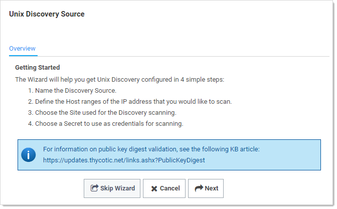
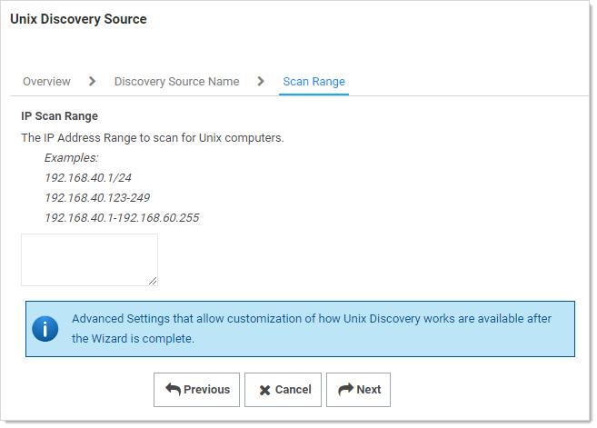
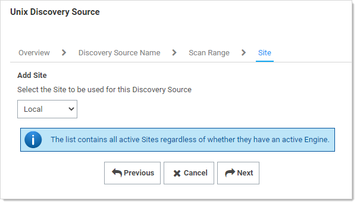
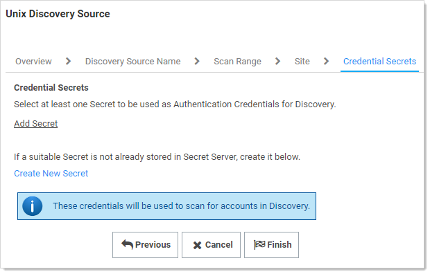
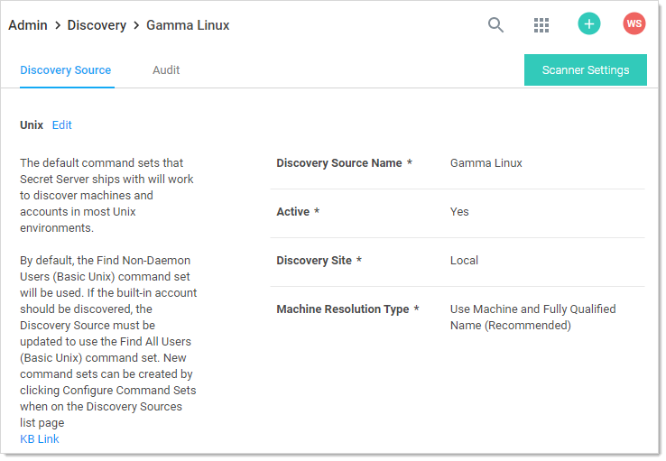
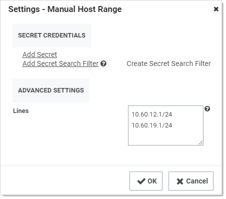
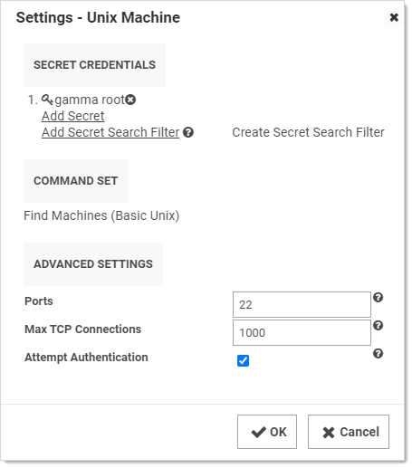
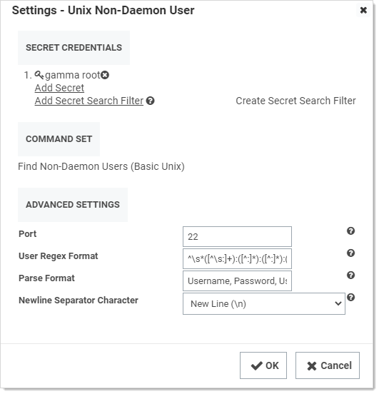

[title]: # (Creating a Unix Discovery Source)
[tags]: # (discovery,unix,discovery source)
[priority]: # (1000)

# Creating a Unix Discovery Source

Discovery sources define a set of discovery operations. You must create one based on the built-in types prior to running discovery. To do so for Unix:

### Creating the Discovery Source

1.  Click **Admin \> Discovery**. The Discovery Sources tab of the Discovery page appears:

    

1.  Note the list of existing discovery sources.

1.  Click the **Create Discovery Source** button. A dropdown list appears:

    

1.  Click **Unix** to select that discovery source type. A Discovery Source page appears for that type:

    

1.  The page briefly summarizes what a Unix discovery Source is. The Unix setup does not allow you to skip the creation wizard. A Unix discovery source created with the wizard has the command set, ports, maximum TCP connections, and parse format settings assigned default values. You can change these by editing the discovery source scanners after finishing the wizard.

1.  Click the **Next** button to continue. The Discovery Source Name wizard page appears:

    

1.  Type an identifying, human-readable name in the **Discovery Source Name** text box.

1.  Click the **Next** button. The Scan Range page of the wizard appears:

    

1.  Type the desired range in the **IP Scan Range** text box using one of the listed formats. Multiple entries should each be on their own line. Host name entries are also allowed. The more precisely you specify the ranges you wish to discover Unix machines on, the faster the discovery scan will run.

1. Click the **Next** button. The Add Site wizard page appears:

   

1. Click the **Add Site** dropdown list to select the desired site for the discovery source. If distributed engines are setup, the list shows all active sites. If no distributed Engines are setup, the list defaults to local, and you cannot change it.

1. Click the **Next** button. The Credential Secrets wizard page appears:

   

1. **Either** click the **Add Secret** link to search for and click the secret you want to use for the account credentials during the scan. The popup page closes, and the selected secret appears:

   

   **Or** create a new secret for the credentials:

   1. Click the **Create New** **Secret** link. The New (secret) popup page appears:

      

   1. Click the **Secret Template** dropdown list and select **Generic Discovery Credentials** secret template.

   1. Type or select the parameters needed for the discovery operation. Parameters with asterisks are required.

   1. Click the **Save and Add New** button. The popup page disappears.

1. Click the **Add Secret** link to add any additional secret credentials. When using multiple credentials, discovery goes through the list of secrets attempting each credential until it either has a successful authentication or has run out of provided accounts. This loop is done for each computer.

1. Click the **Finish** button to complete the wizard. You are returned to the Discovery Sources page where you see the new Unix discovery source.

1. Proceed to the next section to further customize the discovery source scanners.

### Editing the Unix Discovery Source Scanners

1.  Click **Admin \> Discovery**. The Discovery Sources tab of the Discovery page appears:

    

1.  In the list of existing discovery sources, click the name of the one you want to edit. The Unix discovery source's page appears, in this case, Gamma Linux.

    

1.  Click the **Scanner Settings** button. The Discovery Source Scanner Settings page appears:

    

1.  A summary of the scanner, inputs, and outputs is as follows:

    **Table:** Unix Scanner Summary

    | Scanner                              | Input Template   | Output Template   |
    | ------------------------------------ | ---------------- | ----------------- |
    | Manual Host Range (Find Host Ranges) | Discovery Source | Host Range        |
    | Unix Machine (Find Machines)         | Host Range       | Computer          |
    | Unix Non-Daemon User (Find Accounts) | Computer         | SSH Local Account |
    | None (Find Dependencies)             | None             | None              |

    Notice that there is no dependency scanner defined, and it was not an option in the discovery source wizard used to create this scanner set, so if you want to discover dependencies,  you *have* to manually edit the scanner set.

    > **Note:** If no dependency scanners are available with an input template matching an output scan template from the previous step that has not already been used by another scanner in this step, you cannot add a dependency scanner. The output template must be unique for each scanner but the input template may be shared.

1.  Manual Host Range is the first scanner of the discovery source, and it is located in the Find Host Ranges section. The input template for that scanner is Discovery Source. This means the initial information comes from info you entered into the discovery source when you created it. Similarly, the output template is Host Range as you would expect.

1.  Click the pencil icon. The Settings - Manual Host Range page appears:

    

1. Note the following:

    - The host IP ranges and credential secret could have been filled in when creating the discovery source. In this particular case, no credential secret was linked to the discovery source.
    - The Unix discovery source finds all machines and local accounts on a set of manually defined host ranges for Unix machines accessible with SSH.
    - The **Lines** text box may input multiple IP address ranges but not overlapping IP address ranges on the same discovery source. There should be one IP address range per line in the input text box.

1.  The next scanner, Unix Machine, is the consumer of the Computer output template, has the following configurations available:

    

1.  Note the following:

    - Each machine is scanned using SSH and the settings defined in the scanner. To obtain more information from the machine scan, use the default custom commands and authentication and the scanner can return the OS of the Unix machine. 

    - The **Secrets Credentials** may be generic discovery Credentials or a Unix Account (SSH) secret. You can add multiple accounts when editing the scanner. The secret should contain a host name instead of an IP address to minimize potential problems with SS or the machines associated with that account.

    - The **Command Set** contains customizable Unix command sets sent over an SSH connection that are used to gather information from them machine when it is scanned. The command set is defined on the discovery scanner. To change a command set, you must create a new machine scanner. 

      > **Note:** Click the Configure Command Sets button on the Discovery Network View page to view a list of all of the custom command sets that are available for discovery. You can select any existing command set to edit, or you can create a new one. When you create a new command set, you must give it a name and save it before you are able to enter commands.

    - Commands are only run on machines when authentication is enabled and a credential secret is added to the Find Machine settings. 

    - The default command set is Find Machine (Basic Unix). This command set returns the OS.

    - The **Ports** text box contains a comma-delimited list of port values (1-65535). SSH generally uses port 22.

    - The **Max TCP Connections** text box limits the concurrent threads used for scanning your network.

    - The **Attempt Authentication** check box must be selected to run commands on the machines being scanned. The credentials supplied by the secret will be used to access each machine during the scan. If the credentials are correct, the custom commands are run to extract the OS information from the machine.

1. The next scanner, Unix Non-Daemon User, has the following configurations available:

    

1. Note the following:

    - The **Secret Credentials** secret is the same one used for the Unix Machine scanner, but it is possible to use a different one.

    - As earlier, the **Ports** text box is a comma-separated list of port values (1-65535). SSH generally uses port 22. The default port used when attempting to scan a machine for users. This may be overridden by a specific port found during machine scanning.

    - The **User Regex Format** text box contains a regular expression that finds the lines of text received during the scan that are valid for user parsing. The matched groups in the regular expression should correspond to the comma-separated items in the parse format.

    - The **Parse Format** text box defines the order of values retrieved during a scan. If the parse names match the fields defined in the imported secret, the values will be populated from the data collected on the scan.

    - The **Newline Separator Character** text box defines the character that divides the lines in the output received during a scan.
