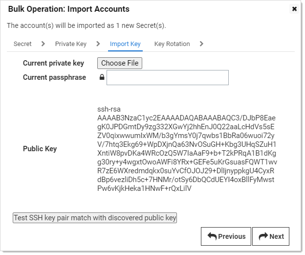

[title]: # "Discovering SSH Private Keys"
[tags]: # "discovery,unix,ssh,ssh private keys"
[priority]: # "1000"

# Discovering SSH Public Keys

Secret Server (SS) can scan for SSH public keys on Unix machines. You can add this ability in the scanner settings section of Unix Account Discovery.

> **Note:** This instruction assumes you already created a Unix account discovery source.  See [Creating a Unix Discovery Source](../../unix-discovery/creating-unix-discovery-source/index.md).

## Task 1: Viewing Discovery Scanners for the Unix Discovery Source

To view the scanners:

1. In SS, click **Admin \> Discovery**. The Discovery Sources tab of the Discovery page appears:

   

1. Click the discovery source name link in the table for your new Unix discovery source. The Discovery Source page for it appears:

   

1. Click the **Scanner Settings** button in the top right of the page. The Discovery Source Scanner Settings page appears, which lists the scanners:

   

## Task 2: Adding the SSH Public Key Scanner for the Unix Discovery Source

1. In the **Find Accounts** section, click **Add New Account Scanner**. The Available Scanners page appears:

   

1. Click the **SSH Public Key Scanner**.

   NEED A GRAB OF THIS

1. Click the **Add Secret** link and choose secret(s) that have Unix sudo or su permissions for the host range selected in the discovery source. These permissions are necessary to navigate each user’s home directory on a machine in search of SSH public key entries in the user’s `<user home directory>/.ssh/authorized_keys` file. 

## Task 3: Importing SSH Public Keys

From the Discovery Network View, Secret Server can import SSH public keys and potentially  take over the account. The import process  creates a new secret for the SSH public key in one of two ways:

- Including a provided matching SSH private key and passphrase.
- Taking over the key by creating a new key and saving the private key file and passphrase with the secret. This can be easily managed by Secret Server.

To Import an SSH public key or keys:

1. Go to **Admin > Discovery**:

   

1. Click the **Discovery Network View** button. The Discovery Network View page appears.

   NEED GRAB WITH PK TAB

1. Click the **Public Keys** tab.

   NEED GRAB

1. Click to select the public keys to import.

1. Click the **Import** button. The importation wizard begins:

   

1. Click the **Secret Type** dropdown list and select either **Unix Account (SSH Key Rotation - No Password)** or **Unix Account (Privileged Account SSH Key Rotation - No Password)**.

1. Click the **Folder** link to select a folder.

1. Type a name in the **Secret Name** text box. (It auto fills `$MACHINE\$USERNAME Key`).

1. Click the **Site** dropdown list to select a site.

1. Click the **Next** button. The Private Key page appears:

   

1. Click to select a selection button:

   - Choose **I have the matching private key** if you want to upload a private key and passphrase known to match the public key discovered. There is a test button on the next page to verify the match. 
   - Choose **I want to change the public SSH key on the Account** if you wish to take over the discovered public key.

1. Click the **Next** button. 

   - If you chose **I have the matching private key**, the Import Key wizard page appears:

     

     The public key chosen to import will be displayed, along with a **Choose File** button and **Current Passphrase** field. Test the key match with the public key by clicking the **Test** button below. 

     >**Note**: You cannot import this public key if the key pair is not a match. If the private key or passphrase is unknown, use takeover to import this public key.

     >**Note**: You may import multiple public keys this way if they are all identical by selecting multiple checkboxes in the Admin Network view page.

     Click the **Next** button. You may add a unix sudo or su secret here for future password changing.

   - If you chose the **I want to change the public SSH key on the Account** selection button, the selected secrets are all taken over and each given a random new SSH key.

1. Click the **Next** button. The Initial Takeover page appears—while the wizard is still on the Import Key step:

   

1. Click the **Add Secret** link to choose a Unix sudo or su secret to take over the public key on the account. This removes the public key from the user’s authorized keys file and adds a new random SSH key.

1. Click the **Next** button, the **Key Rotation** page appears:

   

1. Click the **Add Secret** link to choose a Unix sudo or su secret for future key rotations. 

1. Click the **Finish** button to complete the dialog and import the selected secrets.

## Task 4: Creating SSH Public Key Import Rules

Discovery rules automatically create secrets and send emails when local accounts or public keys match the rule. To create a rule to import discovered SSH public keys:

1. In SS, click **Admin \> Discovery**. The Discovery Sources tab of the Discovery page appears:

   

1. Click the **Discovery Network View** button. The Discovery Network View page appears:

   NEED A GRAB WITH THE PK TAB.

1. Click the **Public Keys** tab:

   NEED A GRAB

1. Click the **Create Rule** button. The New Rule wizard begins:

   

1. Type a rule name in the **Name** text box.

1. Type a description for the rule in the **Description** text box.

1. Ensure the **Active** check box is selected.

1. Click the **Next** button. The **Source** page of the wizard appears:

   

1. Select or type in the filter criteria as desired. Accounts or public keys matches are found during the next discovery run and are imported as secrets.

1. Click the **Next** button. The **Secret** page of the wizard appears:

   

1. Click the **Secret Type** dropdown list and select either **Unix Account (SSH Key Rotation - No Password)** or **Unix Account (Privileged Account SSH Key Rotation - No Password)**.

1. Click the **Folder** link to select a folder.

1. Type a name in the **Secret Name** text box (It auto fills `$MACHINE\$USERNAME Key`).

1. Click the **New Secret Permissions** dropdown list to choose how permissions are propagated for the new secret.

1. Click the **Site** dropdown list to select a site.

1. Click the **Next** button. The **Private Key** page of the wizard appears:

   

1. Click to select a selection button:

   - Choose **I have the matching private key** if you want to upload a private key and passphrase known to match the public key discovered.
   - Choose **I want to change the public SSH key on the Account** if you wish to take over the discovered public key.

1. Click the **Next** button. 

      - If you chose **I have the matching private key**, the Import Key wizard page appears:

         

        1. Click the **Choose File** button to select a key file. Type the passphrase in the **Current passphrase** text box.

           > **Note:**  Public keys matching the filter will not be imported if the private key and passphrase provided are not a valid match. If you do not know the private key or passphrase is unknown, use takeover to import these public keys. 

        1. Click the **Next** button. SOME PAGE APPEARS:

           NEED GRAB

         1. Click the **Add Secret** link to add an optional Unix sudo or su secret for future password changing.

         1. Click the **Next** button. The Key Rotation page of the wizard appears (see below).

      - If you chose the **I want to change the public SSH key on the Account** selection button, an initial takeover page appears on the same Import Key tab:

        

        1. Click the **Add Secret** link to add a Unix sudo or su secret to take over the public key on a discovered account. This will remove the public key from the user's authorized keys file and adds a new random SSH key.

        1. Click the **Next** button. The Key Rotation page of the wizard appears.

      

1. Click the **Add Secret** link to add an optional Unix sudo or su secret for future key rotation.

1. Click the **Next** button. The **Alerts** page of the wizard appears:

    

1. Click to select the **Send Email Alert for Accounts Found** check box if you want an email alert if public keys found during discovery matched the rule and were successfully imported.

1. Type a number in the **Take-Over Threshold** text box if you want to limit the number of accounts imported.

1. Click to select the **Subscribed Users** selection button to chose who gets notified.

1. Click the **Finish** button to save the rule. The rule is evaluated the next time discovery runs.

1. Return to the Discovery Network View page.

1. Click **View Rules** to see a list of rule for your discovery source.
