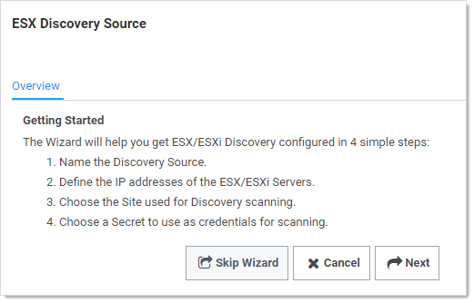
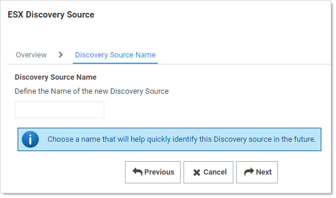
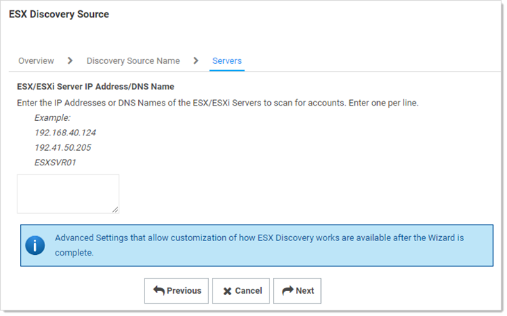
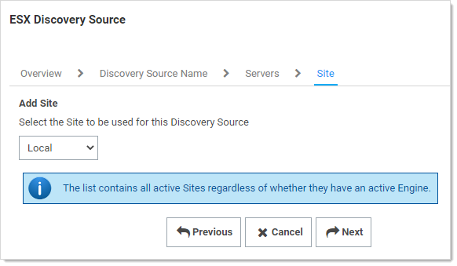
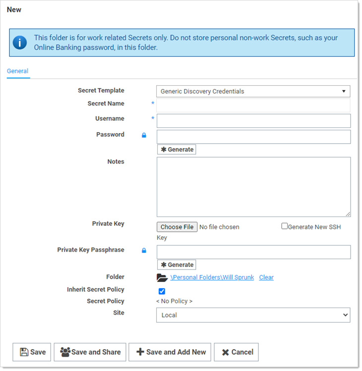

[title]: # "Creating an ESX/ESXi Discovery"
[tags]: # "discovery,esx/esxi,discovery source"
[priority]: # "1000"

# Creating an ESX/ESXi Discovery Source

Discovery sources define a set of discovery operations. You must create one based on the built-in types prior to running discovery. To do so for ESX/ESXi:

1.  Click **Admin \> Discovery**. The Discovery Sources tab of the Discovery page appears:

    

1.  Note the list of existing discovery sources.

1.  Click the **Create Discovery Source** button. A dropdown list appears:

    

1.  Click **VMware ESX/ESXi** to select that discovery source type. A Discovery Source page appears for that type:

    

1.  The page briefly summarizes what an ESX/ESXi discovery Source is. The ESX/ESXi setup does not allow you to skip the creation wizard. A Unix discovery source created with the wizard has the setting assigned a default value. You can change these by editing the discovery source after finishing the wizard.

1.  Click the **Next** button to continue. The Discovery Source Name wizard page appears:

    

1.  Type an identifying, human-readable name in the **Discovery Source Name** text box.

1.  Click the **Next** button. The Servers page of the wizard appears:

    

1.  Type IP address or DNS name in the **ESX/ESXi Server IP Address/DNS Name** text box. Multiple entries should each be on their own line.

1. Click the **Next** button. The Add Site wizard page appears:

   

1. Click the **Add Site** dropdown list to select the desired site for the discovery source. If distributed engines are setup, the list shows all active sites. If no distributed Engines are setup, the list defaults to local, and you cannot change it.

1. Click the **Next** button. The Credential Secrets wizard page appears:

   

1. **Either** click the **Add Secret** link to search for and click the secret you want to use for the account credentials during the scan. The popup page closes, and the selected secret appears:

   

   **Or** create a new secret for the credentials:

   1. Click the **Create New** **Secret** link. The New (secret) popup page appears:

      

   1. Click the **Secret Template** dropdown list and select **Generic Discovery Credentials** secret template.

   1. Type or select the parameters needed for the discovery operation. Parameters with asterisks are required.

   1. Click the **Save and Add New** button. The popup page disappears.

1. Click the **Add Secret** link to add any additional secret credentials. When using multiple credentials, discovery goes through the list of secrets attempting each credential until it either has a successful authentication or has run out of provided accounts. This loop is done for each computer.

1. Click the **Finish** button to complete the wizard. You are returned to the Discovery Sources page where you see the new ESX/ESXi discovery source.