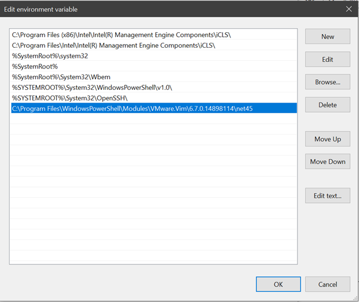

[title]: # (VMware ESX/ESXi Account Discovery and RPC Configuration)
[tags]: # (Discovery, VMware, ESX/ESXi, rpc)
[priority]: # (1000)

# VMware ESX/ESXi Account Discovery and RPC Configuration

> **Note:** Please see the [Discovery Topic](../../index.md) for a comprehensive guide to configuring and using discovery.

## Overview

The ESX/ESXi (API) password changer verifies (using heartbeat) and changes VMware ESX/ESXi passwords via the vSphere API. Password changing and discovery for Secret Server 10.6 and later requires PowerCLI 6.5.1 or higher.

Either must be installed on the servers running discovery—your local SS machine or machines running distributed engine. Earlier versions of the password changer are now deprecated.

> **Important:** VMware PowerCLI 11.5 does not work due to VMware.Binding.WsTrust.dll file missing from the directory.

## Details

Secret Server searches the machine’s Windows path PATH for the VMWare SDK, therefore installing the correct version of it is all that is needed. On the machine you install VMware PowerCLI, update the Windows "Path" environment variable to include the folder where the file `VMware.Vim.dll` is located.

> **Note:** After installing the VMware PowerCLI, the default installation path is: `C:\Program Files\WindowsPowerShell\Modules\VMware.Vim\[version]\net45`. The PowerCLI installation path **must be** in the system PATH variable.

 To edit your PATH:

1. Add `C:\Program Files\WindowsPowerShell\Modules\VMware.Vim\[version]\net45` to the PATH using the system panel (sysdm.cpl).

1. From the **System Properties** dialog, select **Advanced** tab

1. Click **Environment Variables…**

1. Under the **System Variables** section, highlight **Path** then **Edit**. The Edit Environment Variable dialog box appears:

   

1. Click the **New** button

1. Type `C:\Program Files\WindowsPowerShell\Modules\VMware.Vim\[version]\net45`, similar to the example above:

1. Click the **OK** button when done.

## Download Locations

Download supported versions of PowerCLI from VMware:

[VMware PowerCLI 11.4.0](https://code.vmware.com/web/tool/11.4.0/vmware-powercli)

## Troubleshooting and Issues

- The error "The VMware VIM API is not installed or is the wrong version" indicates that PowerCLI needs to be installed.
- We recommend not using an outdated SDK with an updated version of VMWare.
- Secret Server’s VMWare password changer rejects self-signed SSL certificates. Make sure your VMWare servers have valid SSL certificates (see below for settings).
- The error "Exception: The remote certificate is invalid according to the validation procedure" indicates that vCenter server root certificates needs to be installed. More info [here.](https://kb.vmware.com/s/article/2108294)
- For SS installed editions, you may need to restart the SS website after installing PowerCLI. Do this by recycling the SS application pool or performing an IIS reset.
- For distributed engines, the distributed engine service may need to be restarted after PowerCLI is installed.

## ESXi Certificate Settings

> **Note:** VMware recommends not including a CRL/CDP in certificate templates. To that end, we recommend adding the `X509RevocationMode.NoCheck` option to the `ESXi.CertificateChainPolicyOptions` setting.

Thycotic added a configuration option for SS to allow ESXi TLS connections to ignore self-signed certificates, allow certificates from specific issuers (even if issuer is not in trusted certificate lists), or completely skip certificate validation when using ESXi password changer, heartbeat, or discovery.

> **Important:** For security reasons, we do **not** encourage customers to use self-signed certificates. Therefore, the new configuration settings listed below are not accessible through the UI. If you need to alter the default ESXi certificate validation settings, **submit a case through Thycotic's Support Portal** for assistance.

New advanced configuration settings include:

- ESXi.IgnoreSelfSignedCerts: If true, ignores any self-signed certs (subject = issuer) from ESXi hosts during heartbeat, RPC, and discovery.
- ESXi.CertIssuersToIgnore: Semi-colon delimited list of issuer names (in format shown on certificate---such as "O=Issuer Name"). Ignores partial chain errors due to certificate being issued by any issuer in this list when that issuer is not in the trusted root or intermediate CAs lists on the server.
- ESXi.IgnoreAllCertErrors: If true, certificate validation will not be performed. All certificate errors will be ignored.
- ESXi.CertificateChainPolicyOptions: Identical to TLS Audit option, but specifically for ESXi. Allows setting X509 options to be applied to certificate validation. This is a comma-delimited list of options. See TLS Auditing or the Details section for more information.
- ESXi.ClientCertificateIds: identical to TLS Audit option, but specifically for ESXi. If ESXi host requires the client to present a valid certificate, this is a semi-colon delimited list of client certificates on the server to try to present.
- ESXi.AuditTlsErrorsDebug: Identical to TLS Audit option, but specifically for ESXi. If set to true and SS (or DE) auditing is set to DEBUG, detailed debug messages about the certificate chain will be written to the log file.
- ESXi.IgnoreDefaultHostCert: Sets all the TLS configuration options necessary to not fail due to a default ESXi host certificate and its issuer not being in the trusted certificates lists. This is a combination of setting the issuer to ignore and not performing a revocation check. Setting this to true should be the first change to make when attempting to resolve heartbeat, RPC, or discovery issues to ESXi hosts when using PowerCLI versions later than 5.5.

> **Note:** Issues with self-signed certificates previously implemented by customers were caused by a security update to the VMware vSphere PowerCLI in versions after 5.5 that no longer permits the use of self-signed certificates.