[title]: # (Extensible Discovery)
[tags]: # (Discovery,extensible discovery)
[priority]: # (1010)
[redirect]: # (ScriptableDiscoveryMoreInformation)

# Extensible Discovery

## Overview

> **Note:** It is important to have an understanding of built-in discovery scanning before attempting to create your own custom scanner. Please see [Discovery Sources, Scanners, and Templates](../general-information/discovery-sources-scanners-templates/index.md) and [How Discovery Works](../how-discovery-works/index.md).

Extensible discovery lets you extend the already powerful scanning abilities of SS by creating custom scanners that run PowerShell. You can use either built-in or custom scanners and templates at each step of the discovery process in extensible discovery. 

If the built-in discovery sources, scanners, or input and output template, co you meet your needs, you can use PowerShell scripts to perform any part of discovery. Doing so requires that you define your own input and output templates and scanners and then add them to a new or existing discovery source.

## When to Use Extensible Discovery

Creating a discovery source using scripted scanners can be a lot of work to set up, so when should you consider it? If you only need to discover local administrator accounts with standard dependencies (Windows services, application pools, and scheduled tasks), our built-in scanners will do the job, and extensible discovery is not necessary. However, your network probably contains other items you want to discover and bring under managed control. Here are some examples:

- Discover configuration files containing passwords and automatically add them as dependencies.

- Scan computers not joined to the domain.

- Create "dependencies" that run a SQL, SSH, or PowerShell script when a secret's password changes to log events to an external source, such as an external auditing system or an external monitoring system).

- Record information not currently imported by local account discovery  a custom fields in a secret template.

- Discover SQL Server logins as "local accounts" and import them as SQL Server account secrets.

> **Note:** To run PowerShell scanners against machines for local account and dependency discovery, you may need to configure WinRM and CredSSP. See [Configuring WinRM for PowerShell](../../api-scripting/configuring-winrm-powershell/index.md) and [Configuring CredSSP for WinRM with PowerShell](../../authentication/configuring-credssp-for-winrm-with-powershell/index.md)

## Extensible Discovery Tutorial

> **Note:** Extensible Discovery can be a long process for new users. It has many hands-on steps. As such, we believe a step-by-step tutorial is the best way to learn it.

Discovery scanners can run custom PowerShell scripts, as well as our built-in scanners for Active Directory, UNIX, and VMWare ESXi. You can use one or more built-in or custom scanners at each step of the discovery process: host range discovery, machine discovery, local account discovery, and dependency discovery. 

Roughly, this tutorial has four tasks:

- Understanding the process
- Setting up scripts
- Creating scan templates
- Setting up discovery scanners and sources. You define dependency templates to change items manually added to secrets and added through discovery rules. 

The tutorial shows you how to take full advantage of extensible discovery by creating an Active Directory discovery source that replaces each of the built-in scanners with a PowerShell script. 

For simplicity, we will only create a Windows service dependency scanner in the dependencies step, but you can add additional built-in or custom PowerShell scanners to scan for application pools, scheduled tasks, or any other item that requires an action triggered when a secret's password is changed.

### Task One: Understanding the Process

For most of this tutorial we will use the "Extensible Discovery Configuration" page as our launch page into each of the features that needs to be configured. Setting up Extensible Discovery requires making changes on several pages. The "Extensible Discovery Configuration" page has buttons linking to each of these pages as well as short explanations of what you need to do on them. The high-level process is:

1. Create the scripts for each discovery step.

1. If necessary, create scan templates to define the information to return from the objects discovered at each step.

   >**Note:** You want to avoid altering scan templates unless you absolutely need to. First, ensure the regular scanners cannot do the job. Once you change a template, you cannot use out-of-the-box scanners and must maintain your own PowerShell scripts for the local account and dependency scanners.  

1. Create discovery scanners for each step to define which script to use for scanning, which scan template represents the objects used as the source of data for the script, and which scan template represents the object returned from the script.

1. Create a discovery source that is configured to use these discovery scanners in lieu of the default scanners.

1. Create a dependency changer for the type of dependency we want to manage.

1. Create a dependency template for the changer.

1. Manually add a dependency to a secret using the dependency changer.

1. Create a local account rule to import discovered accounts as secrets.

1. Create a dependency rule to import discovered dependencies as secrets.

### Task Two: Creating the Scripts for Each Discovery Step

First, we add the scripts that we will use as our scanners to SS:

> **Note:** To use extensible discovery, you must use a SS edition that supports scripts or has an "Advanced Scripting" add-on license.

1. Go to **Admin \> Scripts**. The PowerShell tab of the Scripts page appears:

   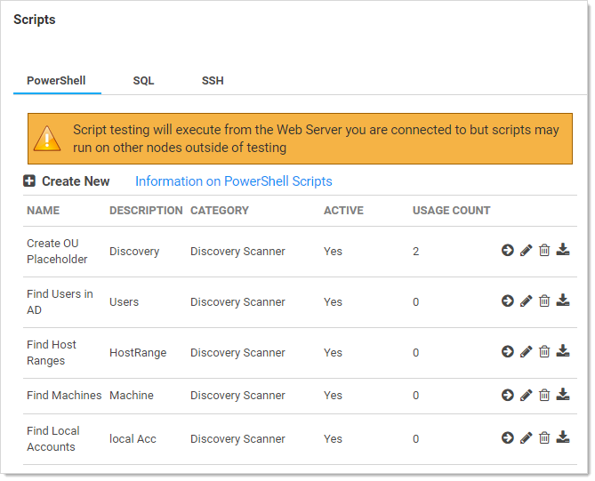

1. Click the **Create New** button. The New PowerShell Script popup page appears:

   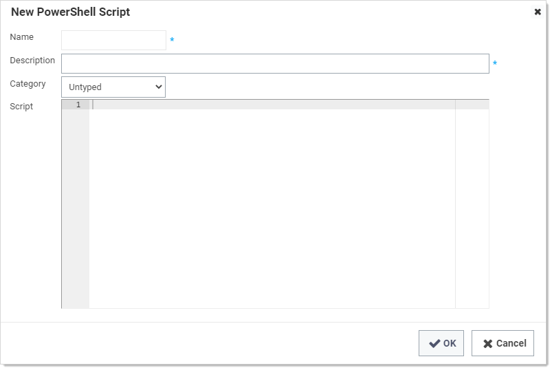

1. For each of the scripts listed below:

   1. Use the name below for the **Name** text box. 
   1. Copy and paste each script into a separate, new script. 
   1. Use the **Discovery Scanner** category for each script. 
   1. Click the **OK** button.
   1. Repeat the process for each script below.

#### Script Name: Host Range Scanner

```powershell
$passwordArg = $args[2]

$username = $args[1]

$domain = $args[0]

write-debug "$domain $username $passwordArg"

$distingisheddomain = "DC=" + ($domain.Split('.') -join ",DC=");

$Spassword = ConvertTo-SecureString "$passwordArg" -AsPlainText -Force #Secure PW

$cred = New-Object System.Management.Automation.PSCredential ("$domain\$username", $Spassword) #Set credentials for PSCredential logon

$ous = Get-ADOrganizationalUnit -filter 'Name -like "*"' -Server $domain -Credential $cred | select-object -property Name, ObjectGUID, @{Name = 'DistinguishedName'; Expression = {$_.DistinguishedName.Replace(",$distingisheddomain",'')}}, ObjectClass

return $ous

# Script Args: $[1]$Domain $[1]$username $[1]$Password
```

#### Script Name: Machine Scanner

```powershell
$Ou = $args[0];

$domain = $args[1];

$distinguisheddomain = "DC=" + ($domain.Split('.') -join ",DC=");

if ($distinguisheddomain.ToLower() -eq $Ou.ToLower()) {

   $searchbase = $distinguisheddomain

} else {

   $searchbase = "$Ou,$distinguisheddomain"

}

$FoundComputers = @()

$ComputersinOU = Get-ADComputer -Filter 'Name -like "*"' -Server $domain -SearchBase $searchbase -properties *

foreach ($comp in $ComputersinOU) {

   $object = New-Object -TypeName PSObject

   $object | Add-Member -MemberType NoteProperty -Name ComputerName -Value $Comp.Name

   $object | Add-Member -MemberType NoteProperty -Name DNSHostName -Value $comp.DNSHostName

   $object | Add-Member -MemberType NoteProperty -Name ADGUID -Value $comp.ObjectGuid

   $object | Add-Member -MemberType NoteProperty -Name OperatingSystem -Value $comp.OperatingSystem

   $object | Add-Member -MemberType NoteProperty -Name DistinguishedName -Value $comp.DistinguishedName.Replace(",$distinguisheddomain",'')

   $FoundComputers += $object

}

return $FoundComputers

# args: $target $[1]$domain
```

#### Script Name: Local Account Scanner

```powershell
$ComputerName = $args[0]

$username = $args[1]

$domain = $args[2]

$password = $args[3]

$objComputer = New-Object System.DirectoryServices.DirectoryEntry("WinNT://$ComputerName", "$domain\$username" , $password)

$children = $objComputer.Children | select-object SchemaClassName, Path, Name, Properties, userflags, SIDType, Disabled

$results = @()

foreach ($child in $children){

  Write-Debug $child

  if ($child.SchemaClassName -eq 'User'){

    write-debug "adding to results"

    $object = New-Object –TypeName PSObject;

    $object | Add-Member -MemberType NoteProperty -Name Username -Value $[child.Name](http://child.name/)[0];

    $object | Add-Member -MemberType NoteProperty -Name Resource -Value $ComputerName;

    $object | Add-Member -MemberType NoteProperty -Name Disabled -Value $child.Disabled; 

    $results +=$object;

  }

}

return $results

# Arguments $target $[1]$username $[1]$Domain $[1]$Password

```

#### Script Name: Windows Service Dependency Scanner

```powershell
$ComputerName = $args[0]

$accounts = Get-WMIObject Win32_Service -ComputerName $computername | Where-Object{($_.StartName -like "*\*" -or $_.StartName -like "*@*") -and $_.StartName -notlike "NT *"}   

if ($accounts) {   

  $dependencyaccounts = @()

  foreach($dependency in $accounts)

  {

  $object = New-Object –TypeName PSObject;

  $object | Add-Member -MemberType NoteProperty -Name ServiceName -Value $dependency.DisplayName;

  $object | Add-Member -MemberType NoteProperty -Name Enabled -Value $dependency.Started;

  if ($dependency.startname.contains('@'))

  {

   $accountinfo = $dependency.startname.split('@')

   $username = $accountinfo[0]

   $domain = $accountinfo[1]

  }

  else

  {

   $accountinfo = $dependency.startname.split('\')

   $username = $accountinfo[1]

   $domain = $accountinfo[0]

  }

  $object | Add-Member -MemberType NoteProperty -Name Username -Value $username;

  $object | Add-Member -MemberType NoteProperty -Name Machine -Value $ComputerName;

  $object | Add-Member -MemberType NoteProperty -Name Domain -Value $domain;

  $object | Add-Member -MemberType NoteProperty -Name DependencyType -Value 'Powershell Script';

  $object | Add-Member -MemberType NoteProperty -Name AccountStatus -Value 'Expired';

  $dependencyaccounts += $object

  $object = $null

  }

  return $dependencyaccounts;

  }

  throw "Error - no service accounts found"

  return $null

# args: $target
```

### Task Three: Creating Scan Templates

The second task is to create scan templates for each object to be discovered. Scan templates define the types of objects that can be retrieved by discovery scanners. The goal of discovery scanning is to retrieve the following:

- Accounts that can be imported and managed as secrets
- Entities (dependencies) requiring knowledge of password changes to managed secrets.

The process of finding these usually involves the following scans prior to scanning for accounts and dependencies:

- Host ranges where machines containing accounts can be found. For Active Directory, this usually involves scanning a domain for organization units or defining which organization units in a domain to check. For Unix and ESXi, this usually involved defining one or more lists of IP address ranges to scan.
- Machines to be scanned for accounts.

Each of these items—host ranges, machines, accounts, and dependencies—is defined by a scan template. The scan template specifies:

- At which step of the scanning process the item is created (scan type)
- The scan template from which the current template gets its required fields (Parent scan template)
- A list of fields that the item contains

The Fields section describes the list of properties that will be returned by the built-in scanner or script for the item. At a minimum, you need to define one field for each of the fields on the parent scan template. For items that are returned from a script, you can define additional fields that the script will return on the object. These are mapped by name to the corresponding field on the scan template. These additional fields can then be used by later scanners.

SS defines scan templates for all of its built-in scanners. Whenever possible, you should use these as input and output sources for your scripted scanners. Create your own scan templates if you need to capture additional information as data for your scripts or if you need to use specific input and output templates on the discovery scanners to drive multiple discovery workflows on a single discovery source. For this tutorial, we create new scan templates for the output of each of our scripts in this tutorial.

#### Host Range

The first scan template is the one that stores the results from our Host Range Scanner script. The script outputs an object with the following properties:

- Name
- ObjectGUID
- DistinguishedName

Thus, our scan template must have fields to store the values of these three properties. The process is as follows:

1.  Go to **Admin \> Discovery**.

1. Click the **Configuration** tab:

   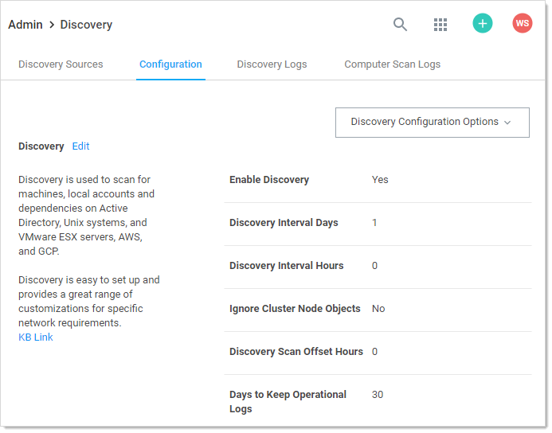

1. Click the **Discovery Configuration Options** button and select **Extensible Discovery**. The Extensible Discovery Configuration page appears:

   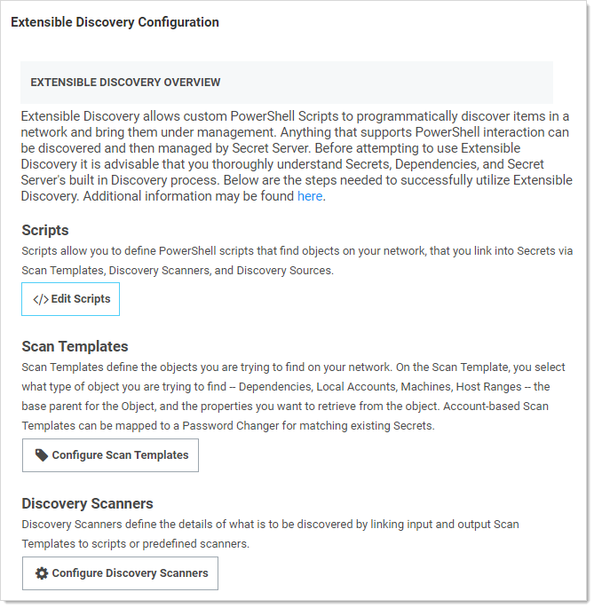

1. Click the **Configure Scan Templates** button. If you are working from a new installation of SS, you should see the following:

   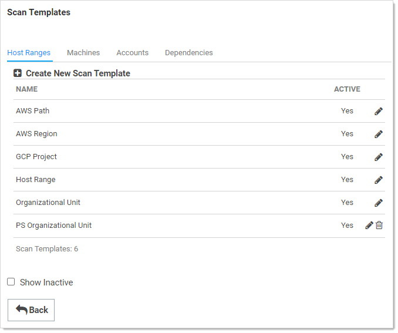

1. On the **Host Ranges** tab, click the **Create New Scan Template** button. The Scan Template Designer page appears:

    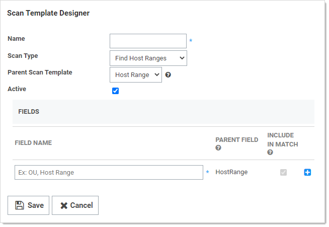

1. Type `PS Organizational Unit` in the **Name** text box.

1. Leave the **Scan Type** dropdown list set to **Find Host Ranges**.

1. Leave the **Parent Scan Template** dropdown list set to **Host Range**.

1. In the **Fields** section, use the blue **+** button to add a field for each of our script output object's properties:

    | **Field Name**    | **Parent Field** |
    | -- | -- |
    | DistinguishedName | \<None\>         |
    | Name              | HostRange        |
    | ObjectGUID        | \<None\>         |
    []()
1. When done, click the **Save** button.

#### Machines

Next, create the scan template to contain the output from our Machine Scanner script. This script takes the name of an OU retrieved from our previous step, scans that OU for computers, and returns a list of custom objects containing some properties of each computer. In this tutorial we are capturing these properties:

- ADGUID
- ComputerName
- DistinguishedName
- DNSHostName
- OperatingSystem

> **Note:** If your later scanners need more information about the computer, you can easily modify this script to return additional properties.

1. Click the **Machines** tab:

   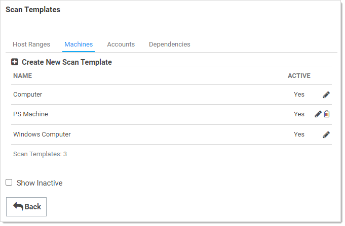

1. Click the **Create New Scan Template** button. The Scan Template Designer page appears:

   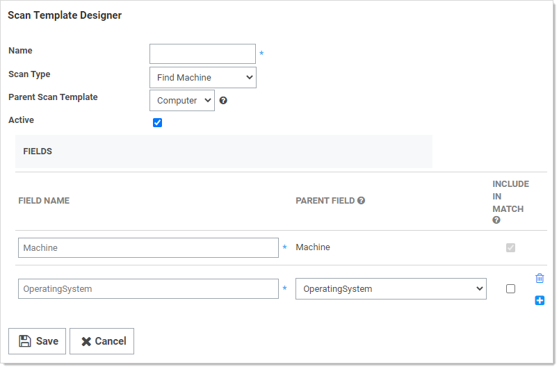

1. Type `PS Machine` in the **Name** text box.

1. Leave the **Scan Type** dropdown list set to **Find Machine**.

1. Leave the **Parent Scan Template** dropdown list set to **Computer**.

1. In the **Fields** section, click the blue **+** to add a field for each of our script output object's properties: ​​

    | **Field Name**    | **Parent Field** |
    | ----------------- | ---------------- |
    | ADGUID            | \<None\>           |
    | ComputerName      | Machine          |
    | DistinguishedName | \<None\>           |
    | DNSHostName       | \<None\>           |
    | OperatingSystem   | OperatingSystem  |
[]()
7. Click the **Save** button.

#### Local Accounts

Our Local Account Scanner script takes the computer name of a computer retrieved from the previous step, scan that computer for local accounts, and return a list of custom objects containing the following properties from each account:

- Disabled
- Name
- Resource

The setup of these fields on the Local Account scan template is a bit different than the other templates that we have created so far. The parent template for local accounts is "Account" and it has three fields: Username, Password, and Resource. Our script is not able to return the password on the account so the objects returned do not have that as a property. We need to map this parent field to a field on our template, but it is only used internally.

1. Click the **Accounts** tab:

   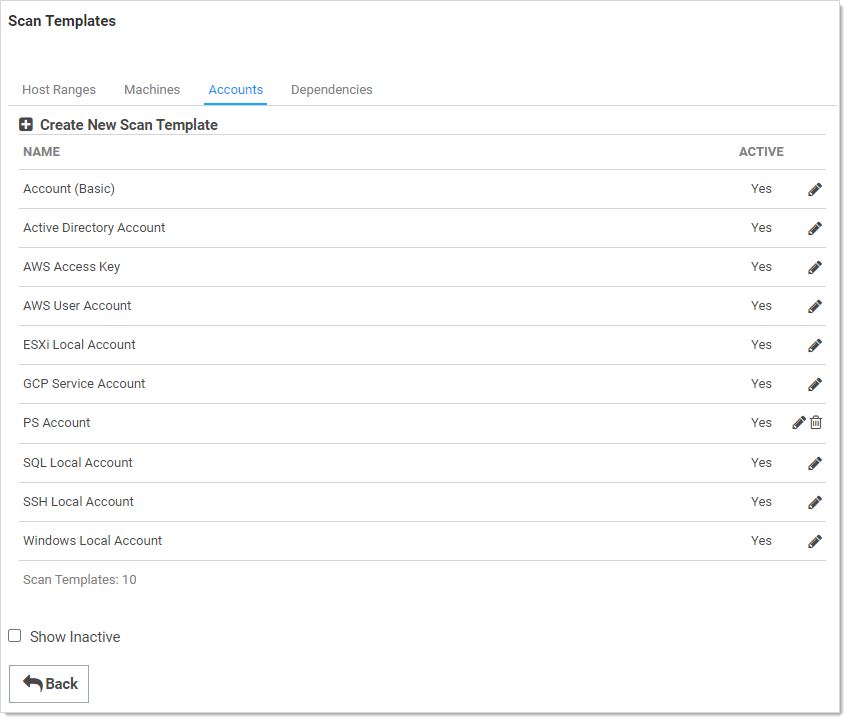

1. Click the **Create New Scan Template** button. The Scan Template Designer page appears:

   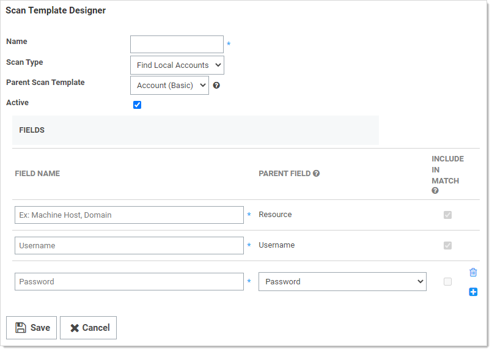

1. Type `PS Account` in the **Name** text box.

1. Leave the **Scan Type** dropdown list set to **Find Local Accounts**.

1. Leave the **Parent Scan Template** dropdown list set to **Account (Basic)**.

1. In the **Fields** section, click the blue **+** button to add a field for each of our script output object's properties:

| **Field Name** | **Parent Field** |
| -- | -- |
| Disabled       | \<None\>         |
| Name           | Username         |
| Password       | Password         |
| Resource       | Resource         |
[]()
7. Click the **Save** button.

#### Dependencies Scan Template

The final scan template we are going to set up is one to find Windows Service dependencies. Our script will return a list of all Windows Services on a computer along with account information for that service. The properties returned by the script for each service are:

- AccountStatus
- DependencyType
- Domain
- Enabled
- Machine
- ServiceName
- Username

Thus, our setup for this scan template will be:

1. Click the **Dependencies** tab:

   

1. Click the **Create New Scan Template** button. The Scan Template Designer page appears:

   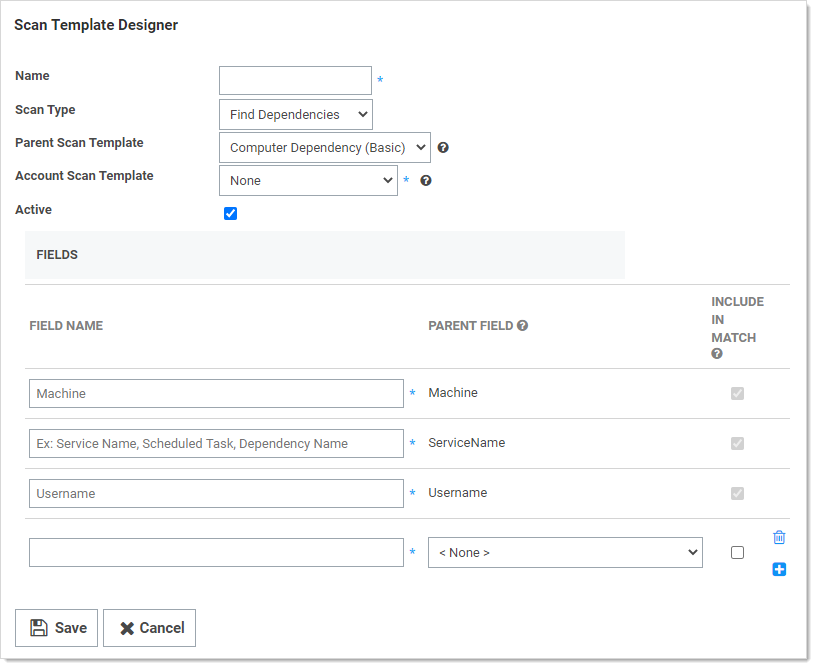

1. Type `PS Dependency` in the **Name** text box.

1. Leave the **Scan Type** dropdown list set to **Find Dependencies**.

1. Leave the **Parent Scan Template** dropdown list set to **Computer Dependencies (Basic)**.

1. Set the **Account Scan Template** dropdown list set to **PS Account**.

1. In the **Fields** section, click the blue **+** button to add a field for each of our script output object's properties:

| **Field Name** | **Parent Field** |
| -- | -- |
| AccountStatus  | None             |
| DependencyType | None             |
| Domain         | Domain           |
| Enabled        | \<None\>           |
| Machine        | Machine          |
| ServiceName    | ServiceName      |
| Username       | Username         |
[]()
8. Click the **Save** button.

### Task Four: Setting up Discovery Scanners and Sources

#### Discovery Scanners

Now that you have created the scan templates that our scripted discovery source will need, you can create the discovery scanners.

When creating a new scanner you specify:

- Which step the scanner runs on
- What type of base scanner to use (for example, Manual Input, Windows Discovery, or PowerShell Discovery)
- Which scan provides the input for the scan
- Which scan template represents the output of the scan. 
- When using a PowerShell base scanner, you also select what script to run and any arguments to pass to the script.

To get started:

1. Return to the **Extensible Discovery** page.

1. Click the **Configure Discovery Scanners** button. The Discovery Scanners page appears:

   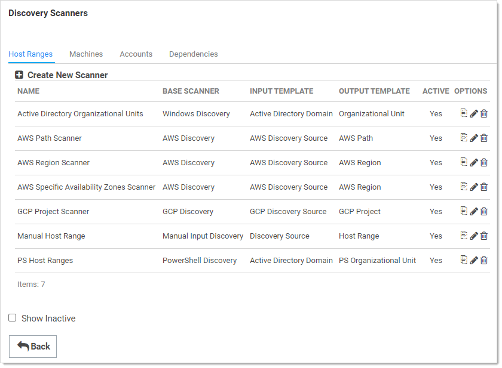

1. The page is similar to the scan templates page, with a tab for each type of scanner and a list of configured scanners within each tab. SS comes with discovery scanners for each built-in scanner. We will add a new PowerShell scanner of each type, using the scripts and scan templates we set up in the previous sections.

#### Host Ranges

1. If necessary, click the **Host Ranges** tab.

1. Click the **Create New Scanner** button. The New Discovery Scanner popup page appears:

   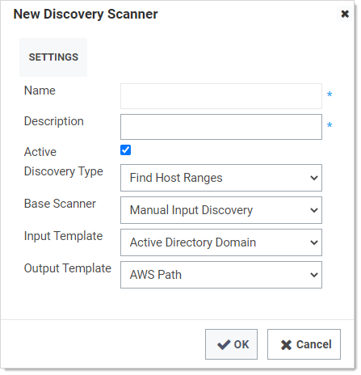

1. Type `PS Host Ranges` in the **Name** text box.

1. Type a description in the **Description** text box.

1. Leave the **Discovery Type** dropdown list set to **Find Host Ranges**. This is the scanner type we are creating. This where in the discovery process the scanner runs. Discovery scanning always proceeds Host Ranges \> Machines \> Local Accounts \> Dependencies. The scan templates, discovery scanners, and discovery source pages all organize their contents in the same order.

   > **Note:** Although the discovery scanning process proceeds in that order, it is important to realize  the output of each step *may* not the input of the next step. Machines take host ranges as their input, and local accounts take machines as their input, but dependencies do not take local accounts as their input. Like local accounts, dependencies are on machines, so they also take machines as their input.​

1. Click to select **PowerShell Discovery** in the **Base Scanner** dropdown list. The popup expands to show more controls:

   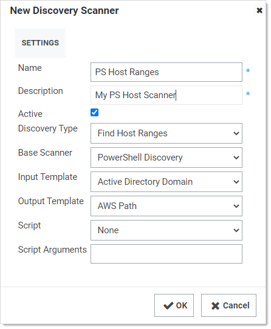

   For any scripted scanner, choose "PowerShell Discovery" as the "Base Scanner." That tells the discovery process this scanner is running a script. Other options are available here based on the discovery type, such as manual entry, Windows discovery, or SSH discovery. If you do not need to run a script for a specific step of discovery but need to use a custom scan template for the input, output, or both to create a specific workflow, you can choose an option other than "PowerShell Discovery" here.

1. Click to select **Active Directory Domain** in the **Input Template** dropdown list. The input and output templates are where you define the information flow through the discovery process. Each scanner uses the output of a previous step as its input. Each scanner returns a list of results as its output. The input template defines what to use as the input data for this scanner. The output template defines what is returned from the scan and used elsewhere. To see what scanner (if any) consumes the output of a given scanner, look for the one that has the same input template as the original scanner's output. 

   > **Note:** You can have multiple scanners in each step with the same input template, but each scanner has to have a unique output template. When a scanner runs, it compares the results of the current scan with the results of the previous scan that was stored in the database. It updates any existing records, adds new records for new items, and removes any records that do not match items found during the current scan. Thus, if there were more than one scanner with the same output template, the second scanner would overwrite the results of the first scan, making it pointless. This is why each output template must be unique.

1. Click to select **PS Organizational Unit** in the **Output Template** dropdown list. This is the Host Range template we created in the previous section. Generally, each output template feeds a single scanner at the next level, but you can have multiple scanners using the same input template with each using the results to find different things. For example, you could have two local account scanners defined that both use the input from the previous find machines step—one for finding Windows local accounts and the other for finding AD accounts that have rights on the computer. In turn, each scanner returns its results to its own output scan template—one creating Windows account secrets and the other creating Active Directory account secrets. 

1. Click to select **Find Host Ranges** in the **Script** dropdown list. The script runs for each object matching the input template, using the arguments in the next step, finally returning an object defined by the output template.

1. Type the following in the **Script Arguments** text box, separating each with a space: `$[1]$Domain $[1]$username $[1]$Password`. Script arguments can be a combination of literal values and tokens. When the script runs, these tokens are replaced with values from the input object and any privileged accounts associated with the scanner. Privileged accounts are assigned to scanners when the scanners are added to a discovery source. The table below lists the tokens that can be used as script arguments.

1. Ensure the **Active** check box is selected.

1. Click the **OK** button to save the scanner.

**Table:** Script Tokens 

| **Token**     | **Description**                                              |
| -- | -- |
| $target       | A generic placeholder for the input object. This is not used when scanning for host ranges because there is no previous scanner input source. For machine scanners, $target refers to either the OU (for Active  Directory discovery sources) or the IP address (for Unix and ESXi discovery sources) from the host range input. For local account and dependency scanners, $target is the name of the scanned computer. |
| $[x]$Username | The username of the nth privileged account associated with the scanner ("x" represents n). Each scanner can have one or more privileged accounts associated  with it. Thus, if you need to use the username of the first privileged account in your script, you would pass in $[1]$Username. The second would be $[2]$Username and so forth. You can have as many privileged accounts as necessary. |
| $[x]$Password | Similar to $[x]$Username, this is the password of the nth privileged account associated with the scanner. |
| $[x]$Domain   | Similar to $[x]$Username, this is the  fully-qualified domain name of the nth privileged account associated with the  scanner. |
[]()

#### Machines

Once you set up one discovery scanner, the rest should be straight-forward:

1. Click the **Machines** tab:

   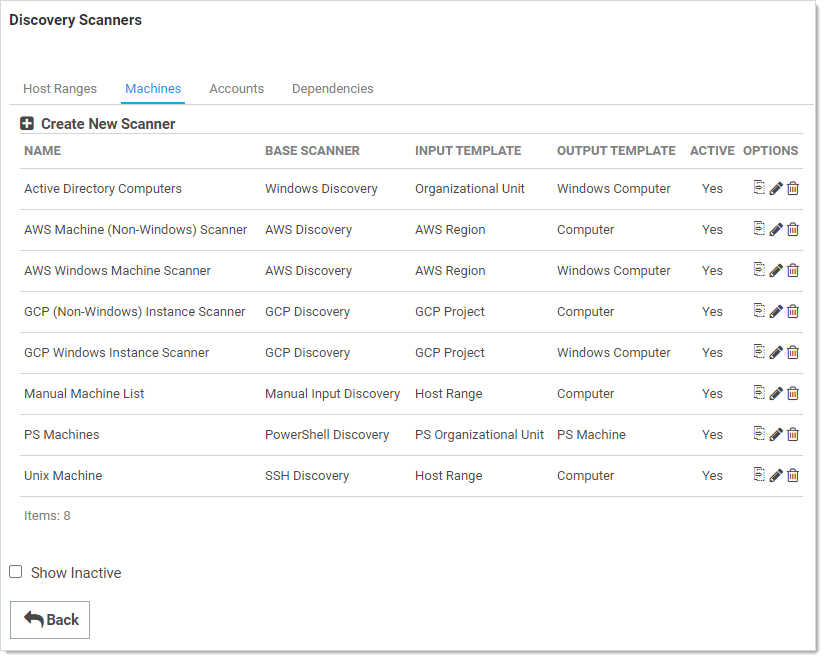

1. Click the **Create New Scanner** button. The New Discovery Scanner popup page appears.

1. Type `PS Machines Ranges` in the **Name** text box.

1. Type a description in the **Description** text box.

1. Leave the **Discovery Type** dropdown list set to **Find Machine**. 

1. Click to select **PowerShell Discovery** in the **Base Scanner** dropdown list. The popup expands to show more controls.

1. Click to select **PS Organizational Unit** in the **Input Template** dropdown list. This is the same as the output template from the last scanner.

1. Click to select **PS Machine** in the **Output Template** dropdown list. This is the Host Range template we created in the previous section. 

1. Click to select **Machine Scanner** in the **Script** dropdown list. The script runs for each object matching the input template, using the arguments in the next step, finally returning an object defined by the output template.

1. Type the following in the **Script Arguments** text box, separating each with a space: `$target $[1]$domain`. 

1. Ensure the **Active** check box is selected.

1. Click the **OK** button to save the scanner.

#### Local Accounts

Repeat the process for the local accounts scanner:

1. Click the **Accounts** tab:

   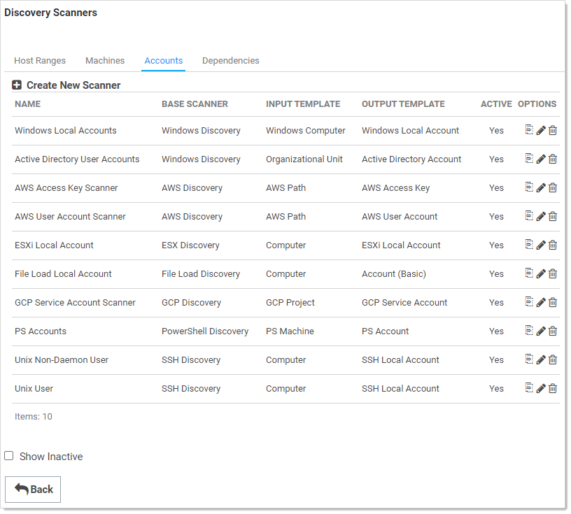

1. Click the **Create New Scanner** button. The New Discovery Scanner popup page appears.

1. Type `PS Accounts` in the **Name** text box.

1. Type a description in the **Description** text box.

1. Leave the **Discovery Type** dropdown list set to **Find Local Accounts**. 

1. Click to select **PowerShell Discovery** in the **Base Scanner** dropdown list. The popup expands to show more controls.

1. Click to select **PS Machine** in the **Input Template** dropdown list. This is the same as the output template from the last scanner.

1. Click to select **PS Account** in the **Output Template** dropdown list. This is the Host Range template we created in the previous section. 

1. Click to select **Local Account Scanner** in the **Script** dropdown list. The script runs for each object matching the input template, using the arguments in the next step, finally returning an object defined by the output template.

1. Type the following in the **Script Arguments** text box, separating each with a space: `$target $[1]$username $[1]$Domain $[1]$Password`. 

1. Ensure the **Active** check box is selected.

1. Click the **OK** button to save the scanner.

#### Dependencies

And repeat the process for the dependencies scanner:

1. Click the **Dependencies** tab:

   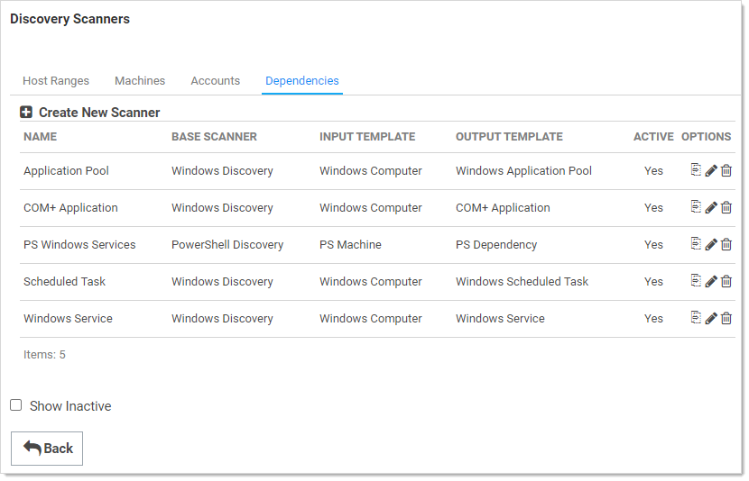

1. Click the **Create New Scanner** button. The New Discovery Scanner popup page appears.

1. Type `PS Windows Services` in the **Name** text box.

1. Type a description in the **Description** text box.

1. Leave the **Discovery Type** dropdown list set to **Find Dependencies**. 

1. Click to select **PowerShell Discovery** in the **Base Scanner** dropdown list. The popup expands to show more controls.

1. Click to select **PS Machine** in the **Input Template** dropdown list. This is the same as the output template from the PS Machines scanner.

1. Click to select **PS Dependency** in the **Output Template** dropdown list. This is the template we created in the previous section. 

1. Click to select **Windows Service Scanner** in the **Script** dropdown list. The script runs for each object matching the input template, using the arguments in the next step, finally returning an object defined by the output template.

1. Type the following in the **Script Arguments** text box: `$target`. 

1. Ensure the **Active** check box is selected.

1. Click the **OK** button to save the scanner.

#### Discovery Sources

The final step is to create a discovery source and assign the discovery scanners we just created to it:

1.  Click **Admin \> Discovery**. The Discovery Sources tab of the Discovery page appears:

    

1.  Note the list of existing discovery sources.

    > **Note:** If you upgraded from an earlier SS version and have created an AD domain within SS, a corresponding discovery source is displayed on this page. If discovery was not enabled on that domain, the discovery source Active column is not checked for that discovery source.

1.  Click the **Create Discovery Source** button and select **Active Directory** to choose that discovery source type. A Discovery Source page appears for that type:

    

1.  Type the parameters for the discovery source name, FQDN, and friendly (human readable) name. The parameters with asterisks are required.

1.  Ensure the **Active** check box is selected. This activates this discovery Source for scanning. Active discovery sources are scanned at the defined discovery interval defined. If you have multiple discovery sources, the discovery source with the most un-scanned computers is scanned first.

1.  Next, you select a secret this is used as the credentials for discovery scanning and AD synchronization. These credentials must have the proper rights to scan the remote machines. Click the **No Secret Selected** link. The Select Secret popup page appears:

    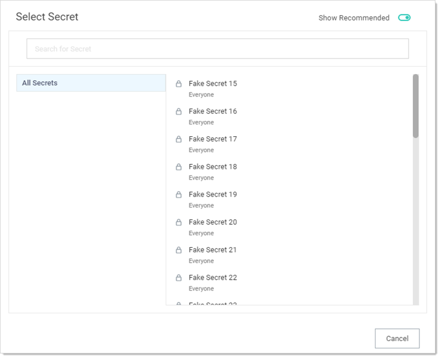

1.  **Either** search for and click the secret you want to use for the account credentials during the scan. The popup page closes. The name of the secret you chose replaces the No Secret Selected link.

      **Or** create a new secret for the credentials:

      1. Click the **Create New** Secret link. The Create New Secret page appears:

         

      1. Click the **Generic Discovery Credentials** secret template. Another Create New Secret page appears:

         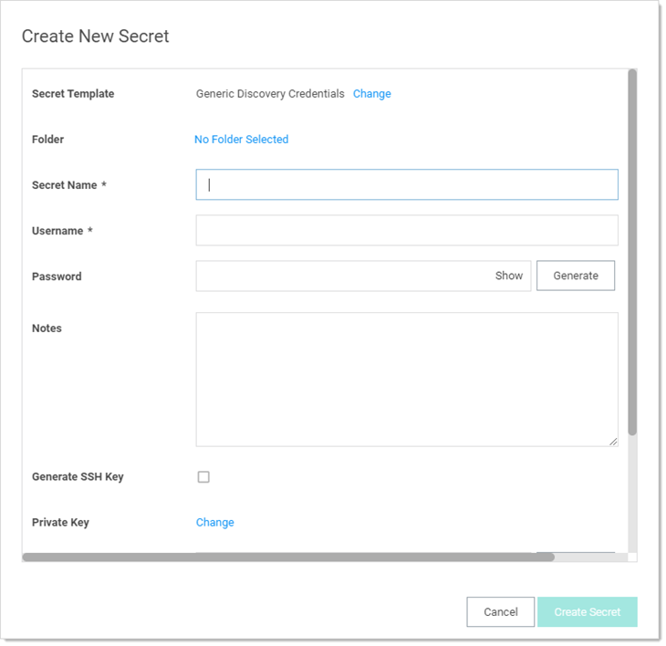

      1. Type or select the parameters needed for the discovery operation. Parameters with asterisks are required.

      1. Click the **Create Secret** button.

1.  Click the **Discovery Site** dropdown list to select the desired site for the discovery source. If distributed engines are setup, the list shows all active sites. If no distributed engines are setup, the list defaults to local, and you cannot change it.

1. Click the **Discover Specific OU** check box to limit your discovery to an OU. See **Enabling Specific OU Domain Discovery** ADD LINK to define the scanned OU. When you select this option, a Domain Scope tab appears on the Discovery Source page for the created AD discovery source.

1. Leave the **Machine Resolution Type** dropdown list set to **Use Machine and Fully Qualified Name** unless you have a specific reason to change it.

1. Click to select the **Use LDAPS** check box to use secure LDAP for the discovery.

1. Click the **Create** button. SS attempts to access the domain with your specified credentials to ensure the configuration is correct. Thus, SS must have access to the domain provided, and the account credentials must work. The new discovery source is created. It appears on the Discovery Source tab of the Discovery page.

1. Click the link for the newly created discovery source. The Discovery Source tab for the source appears:

   

1. Click the Scanner Settings button. The Discovery Source Scanner Settings page appears:

   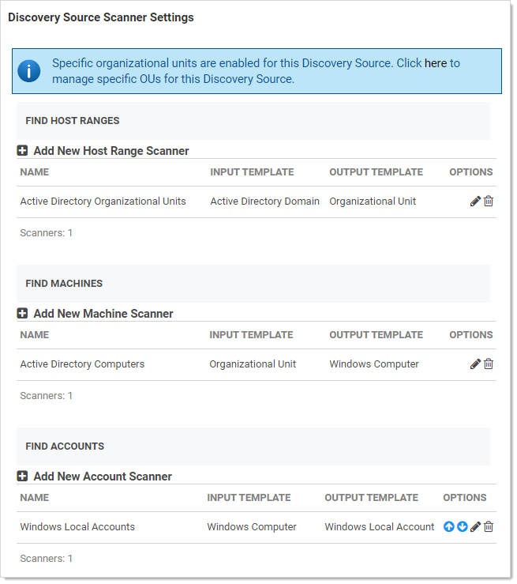

1. Note that a discovery source with default scanner options is already created. For this tutorial, we are not using any of those scanners.

1. Click the trashcan icon next to each scanner. 

1. In the **Find Host Ranges** section, click the **Add New Host Range Scanner** button. The Available Scanners popup appears.

1. Click the **+** icon next to the PS Host Range scanner to select it. A settings popup for the scanner appears:

   

1. Click the **Add Secret** link. The Select a Secret popup appears.

1. Select a secret that has permissions to scan the domain, such as the account you linked to the domain when adding the discovery source.

   > **Note:** The "Advanced Settings" section allows you to configure options necessary for running a PowerShell script. For more information see [Configuring CredSSP for WinRM with PowerShell](../../authentication/configuring-credssp-for-winrm-with-powershell/index.md).

1. Click the **OK** button to save your settings.

1. Now that you have defined the host range scanner, repeat the process for the machine scanner, **PS Machines**, with the appropriate secret. Repeat any advanced settings from the last scanner. Once you have added a machine scanner, you can add a local account scanner.

1. Repeat the process for the local account scanner, **PS Accounts**, with the appropriate secret. Repeat any advanced settings from the last scanner. 

1. Finally, repeat the process for the dependency scanner, **PS Window Services**, with the appropriate secret. Repeat any advanced settings from the last scanner. 

1. Your scripted discovery source is now complete. You can go to the main discovery page to run discovery followed by a computer scan. When both are done, you should see identical results in your discovery network view to what you would get if you ran discovery with our built-in scanners.
