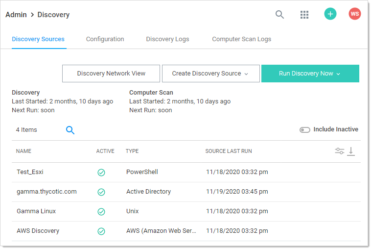
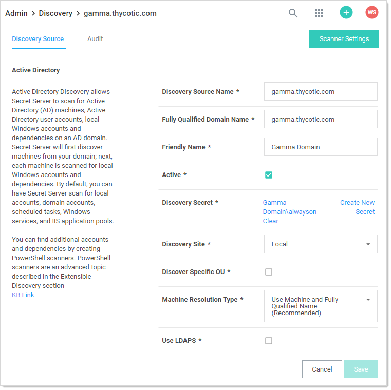
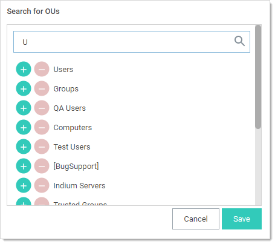

[title]: # (Enabling Specific OU Domain Discovery)
[tags]: # (Account Discovery)
[priority]: # (1000)

# Enabling Specific OU Domain Discovery

1. On the **Admin** menu click **Discovery**. The Discovery Sources tab appears:

   

1. Click the link for the discovery source you want to configure. The Discovery Source tab for that discovery source appears:

   

1. Click the Edit link next to the discovery source name. The page becomes editable:

   

1. Click to select the **Discover Specific OU** check box.

1. Click the Save button. The Domain Scope tab appears.

1. Click the **Domain Scope** tab:

   

1. Click the **Edit** link next to **Domain Scope**. The page becomes editable:

   

1. Type the name of the desired OU in the Search for OUs text box. Matching OUs appear:

   

1. Click the **+** in the green icon to add the OU. To remove an OU, click the red icon. The selected OU appears:

   

1. Click the site link to edit the sites (distributed engines) included.

1. Click the credential secret link to edit the secret used.

1. Click the scan target link to edit what you want scanned in the OU.

1. Repeat the previous steps for any additional OUs.

1. Click the **Save** button.

> **Note:** The ports required for Discovery are documented in [Secret Server Ports](https://updates.thycotic.net/links.ashx?SecretServerPorts) (KB).
