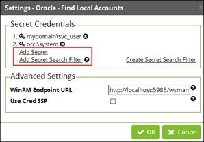
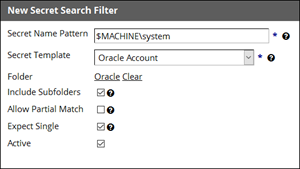

[title]: # (Discovery on Non-Domain Joined or Unix Targets)
[tags]: # (discovery,secret search filter,non-domain joined,unix,target)
[priority]: # (1000)

# Discovery on Non-Domain Joined or Unix Targets

When running discovery on non-domain joined targets or Unix targets, there are two methods of finding local administrator credentials to authenticate to the target, and the methods can be used together.

* Specify a secret with an expected default password, recommended for performing an initial scan if you have a known password or key for a privileged account.
* Specify a Secret Search Filter, recommended when you cannot use a default password because each machine’s account password is unique. A Secret Search Filter dynamically searches for a secret with a name or folder location that corresponds to the target scanned. If a matching secret is found, Secret Server will authenticate to the target using the administrator credentials in the secret.

>**Note**: To use a Secret Search Filter, the administrator account names must exist as secrets in Secret Server and they must follow a regular naming pattern.

>**Note**: The Discovery Secret Search Filter is available in Secret Server 10.0.000006 and newer.

## Setting Credentials on a Discovery Scanner

1. In a Discovery Source, click the Edit icon on a Scanner. A Find Local Accounts window opens.
1. In the **Secret Credentials** section, choose among the following options:
   * Click **Add Secret** to specify a default credential.
   * Click **Add Secret Search Filter** to specify an existing Secret Search Filter.
   * Click **Create Secret Search Filter** to create a new Secret Search Filter.

   

Secret Server will try the secrets and Secret Search Filters in sequence until it finds a match.

## Creating a Secret Search Filter

1. In the **Secret Credentials** section, click **Create Secret Search Filter**.
1. In the **New Secret Search Filter** window, specify a Secret Name Pattern and settings as described below:

   

   * **Secret Name Pattern**. Specifies the pattern that Secret Server will search for. The search is dynamic based on the target. In the example depicted in the screen shot, if scanning a machine named `appserver01`, Secret Server will also search for a secret named `appserver01\system`.
   * **Secret Template**. Specifies the template that returned secrets should be based on. In the example depicted in the screen shot, only secrets based on the Oracle Account template will be returned.
   * **Folder**. Specifies the folder to search within.
   * **Include Subfolders**. Specifies that the search should include not only the specified folder, but the subfolders as well.
   * **Allow Partial Match**. Specifies that Secret Names will be returned if they partially match the pattern. By default the secret name must be an exact match to the Secret Name Pattern.
   * **Expect Single**. Specifies that only one result should be returned. If more than one is returned, Secret Server will log an error to the discovery log.

1. Click **OK** and go back to your Discovery Source.
1. Click **Add Secret Search Filter** and select the filter you just created.

Now when scanning a machine, Secret Server will try a default credential, and then it will try the Secret returned by the search filter.
