[title]: # "Creating Discovery Rules"
[tags]: # "Discovery, sites, distributed engine"
[priority]: # "1020"

# Creating Discovery Rules

Discovery *account rules* automatically create secrets or send emails when local accounts that match the rule criteria are discovered. 

Discovery *dependency rules* automatically add discovered dependencies to *existing* secrets when rule criteria are met—no secrets are created.

## Creating Account Rules

Discovery account rules are search queries against the accounts found by discovery (and visible in the discovery network view). When these rules are created and run, accounts that match rules can be automatically imported as secrets. When matches are found, email notifications can also be sent out. The rule order determines the rule application order. Drag rules to reorder them. Rules can specify a combination of the domain or OU, the computer name and the account name. 

To create a rule:

1.  Click **Admin \> Discovery**. The Discovery Sources tab of the Discovery page appears:

    

1.  Click the **Configuration** tab:

    

1.  Click the **Discovery Configuration Options** button and select **Rules**. The Discovery Rules page appears:

    

    Note that a "import everything found" rule already exists.

    > **Note:** The rule order determines the order in which the rules are applied. Drag rules to reorder them.

1.  Click the **Create Rule** button. The Rule page of the New Rule wizard appears:

    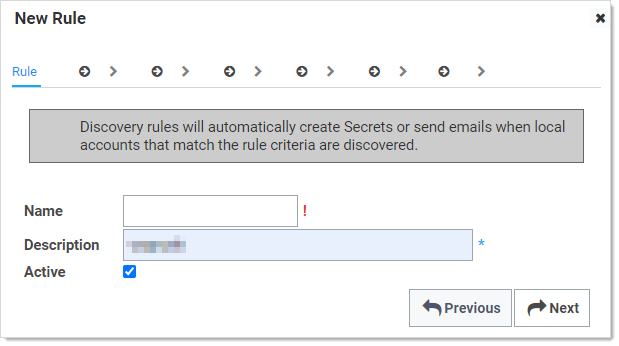

1.  Type the name for the new rule in the **Name** text box.

1.  Type a description in the **Description** text box. At a minimum, leave the suggested log on account name as is.

1.  Ensure the **Active** check box is selected.

1.  Click the **Next** button. The Source page of the wizard appears:

    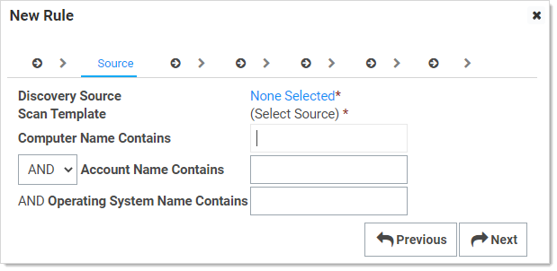

1.   Click the **Discovery Source** link to select a discovery source or container (folder). The Discovery Source or Container popup appears:

    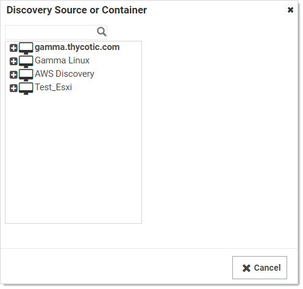

    When you click a domain or subfolder with no children, the popup automatically disappears, and the information you chose appears on the Source tab:

    

1.  If you want the rule to apply to children of what you chose, ensure the **Include Children** check box is selected.

1.  Click the **Scan Template** dropdown list to select an output scan template. For a standard discovery configuration, without scripted scanners, there should only be one option here. If you added multiple local account scanners, then you can select one of their output scan templates. This limits the rule to the output results of scanners with the listed output template. 

1.  (Optional) Filter when the rule applies:

    >**Note**: Using a discovery rule as a search filter only applies to accounts that are found on computers in the OUs included in the discovery scan. To change those settings, modify the AD source to include more OUs or the entire domain.

    1.  (Optional) Type any computer name substring to filter the rule in the **Computer Name Contains** text box.

    1.  (Optional) **Either** if you want to add any of the following parameters to the computer name portion of the rule (one must apply), click to select the unlabeled AND/OR dropdown list and select **OR**. 
        **Or** if you want to mandate using any of the following parameters in addition to the computer name portion of the rule (all must apply), select **AND**.

    1.  (Optional) Type any account name substring to filter the rule in the **Account Name Contains** text box.

    1.  (Optional) If you chose to use it, type any OS name substring to filter the rule in the **Operating System Name Contains** text box.

        > **Note:** The AND/OR dropdown can radically change your results, so carefully think it through. The OS name is ANDed by default—it cannot be ORed. 

1.  Click the **Next** button. The Secret tab appears:

    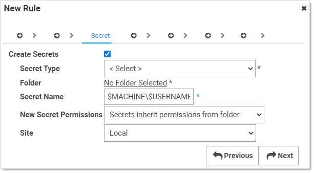

    This is where you add creating secrets as accounts are discovered to the rule. 

    > **Note:** Your previous choice of scan template (on the Source tab) alters the follow-on parameters on this tab.

1.  Click the **Secret Type** dropdown list to select the secret template the new secret will originate from.

1.  Click the **Folder** link to select a folder for the new secret to belong to.

1.  Click the **New Secret Permissions** dropdown list to select whether you want secrets to copy (standalone) or inherit (change with the folder) the permissions from the folder. 

1.  Type the naming convention for the new secret in the **Secret Name** text box. You may use [dependency tokens](../../../api-scripting/dependency-tokens/index.md) for the name. We automatically suggest a naming convention based on the hostname and username.

1.  Click the **Site** dropdown list to select the SS local installation or a distributed engine to run the rule from.

1.  Click the **Next** button. The Password tab appears:

    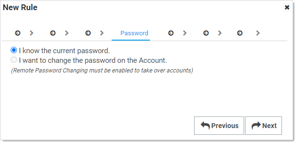

1.  Click to select **I know the current password** selection button if you do not want SS to change the account password when the secret is created. If you want SS to change it, choose the other option. 

1.  If you chose to change the password, addional selection buttons appear:

    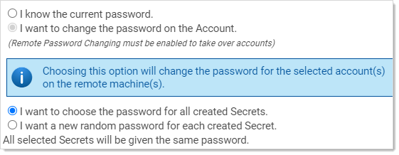

    > **Note:** Remote password changing must be enabled to change the password.

1.  **Either** click the **I want to choose…** selection button if you want all the new secrets to have the same password, which you can later change.
    **Or** Click the **I want a new random password…** selection button to have SS create a strong password for the secret.

1.  Click the **Next** button. The Import Password tab appears:

    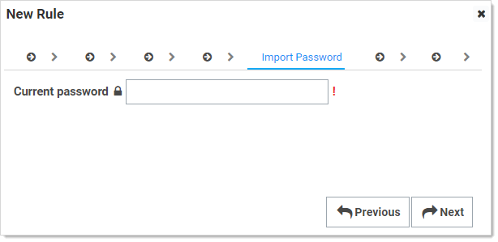

    For the random password choice, you see:

    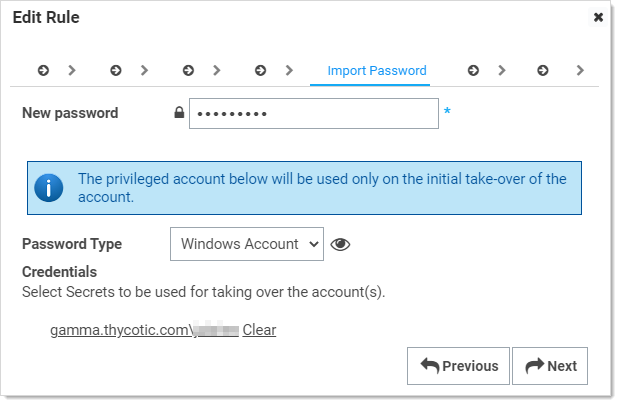

1.  If you chose a random password:

    1.  Type the new password for the account used to take over the accounts for the password change in the **New Password** text box. This is *not* the password for the created secret.
    1.  Click the **Password Type** dropdown list to select a password template.
    1.  Click the folder link to select the existing secrets to use for taking over the accounts.
    1.  For Unix Rules, select the password type command set for taking over the account. You can hold your cursor over the eye icon to see the commands to be used to change the password.

1.  Type the password to use in the **Current Password** text box.

1.  Click the **Next** button. The Password Changing tab appears:

    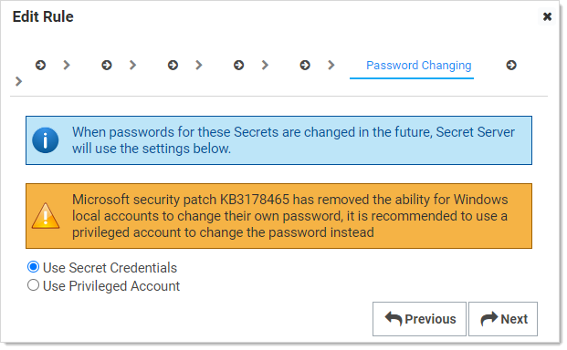
    If you do not have RPC enabled, you will see this instead:

    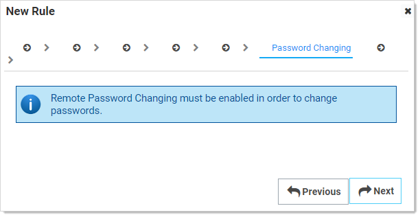

1.  Click to select the password changing selection button to choose whether you want to access the accounts with a secret credential or a privileged account. If you choose the latter, you will be prompted to select a secret for that account.

1.  Click the **Next** button. The Alerts tab appears:

    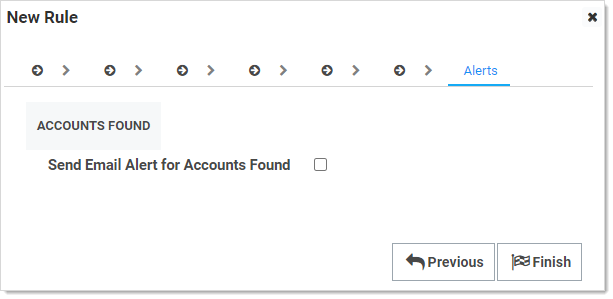

1.  Click to select the **Send Email Alert for Accounts Found** check box.  Additional controls appear:

    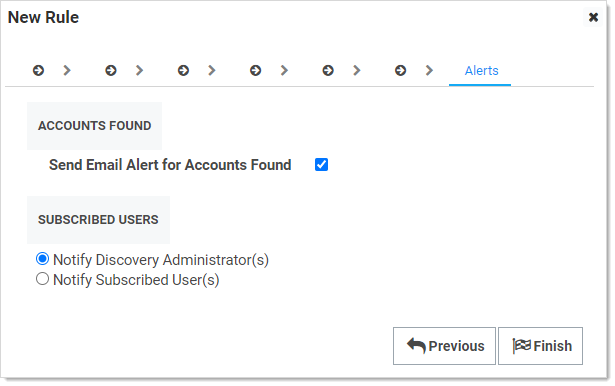

1.  Click to select the **Subscribed Users** selection button to choose who receives an email alert. If you select **Notify Subscribed User(s)** a text box appears for you to add email addresses. Other wise SS discovery admins receive one.

1.  Click the **Finish** button. The rule is created.

## Creating Dependency Rules

Dependency rules automatically add dependencies (Windows services, schedule tasks, application pools) to existing secrets. You can receive email notifications of linkages by adding an event subscription in the Event Subscriptions page. Rules can specify a combination of the domain or OU.

> **Note:** The rule order determines the order in which the rules are applied. Drag rules to reorder them.

> **Note:** You must have a discovery scanner and dependency template configured to apply a dependency rule.

1.  Click **Admin \> Discovery**. The Discovery Sources tab of the Discovery page appears:

    

1.  Click the **Configuration** tab:

    

1.  Click the **Discovery Configuration Options** button and select **Rules**. The Discovery Rules page appears:

    

1.  Click the **Dependency Rules** tab:

    

1.  Click the **Create Rule** button. The New Rule page appears:

    

1.   Click the **Discovery Source** link to select a discovery source or container (folder). The Choose Org Unit popup appears:

    

    When you click a domain or subfolder with no children, the popup automatically disappears.

1. Click the **Scan Template** dropdown list to select an output template.

1. Click the **Dependency Template** dropdown list to select a dependency template.

1. Click the **Site** dropdown list to select the SS local installation or a distributed engine to run the rule from.

1. Click the **Privileged Account** link to choose a secret for the scanning account.

1. Click to select the **Windows Services: Restart on Change** check box if you want the services restarted after discovery.

1. Click the **OK** button.

