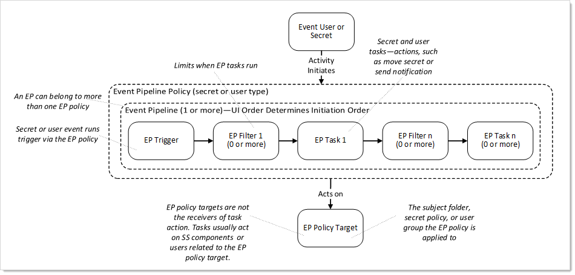
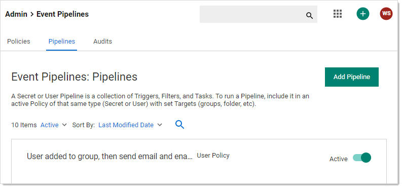
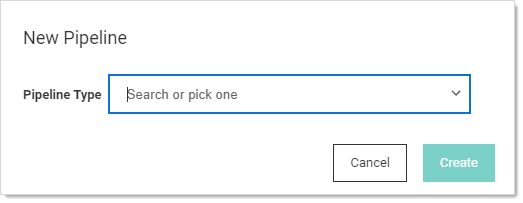
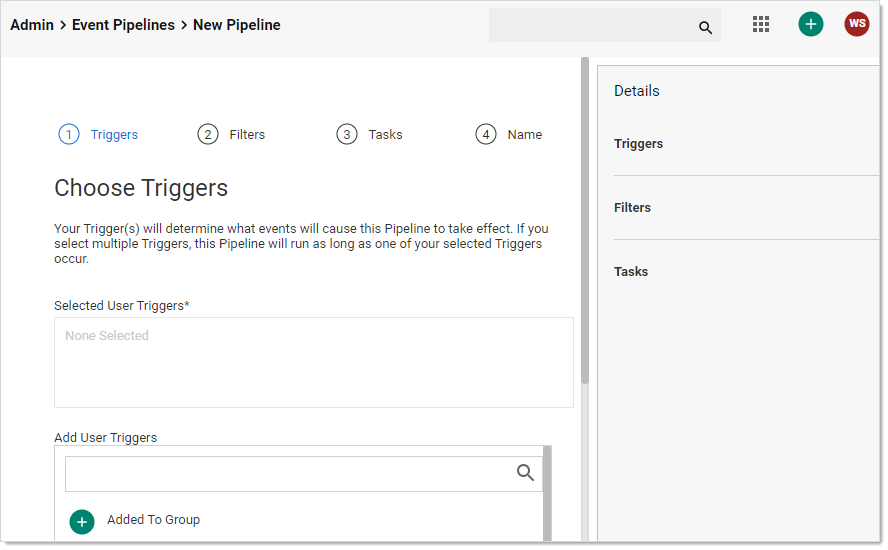
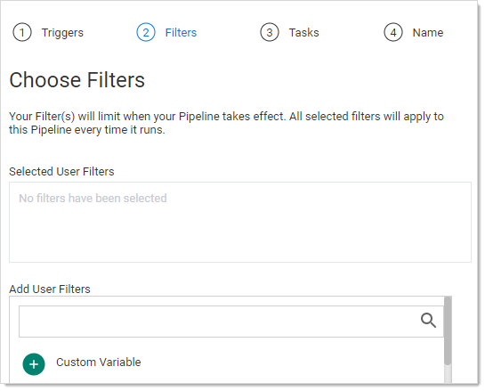
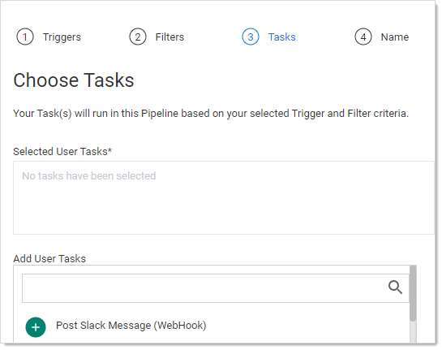
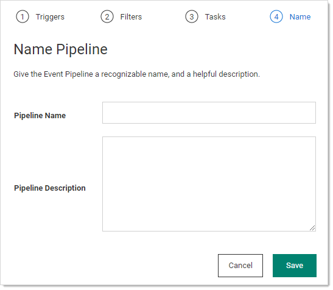

[title]: # (Event Pipelines)
[tags]: # (Event Pipelines)
[priority]: # (1000)

# Event Pipelines

## Overview

*Event pipelines* (EPs) are a named group of triggers, filters, and tasks to manage events and responses to them. Event pipelines themselves can be grouped into EP policies. The SS EP system is essentially a flexible instruction set builder and manager for controlling events and responses.

## Event Pipeline Components

### Definitions

#### Event Pipeline

An EP is a single named group of triggers, filters, and tasks. The same EP can be in multiple EP policies. Changing an EP affects all EP policies that EP is a part of. EPs do nothing if not assigned to an EP policy. There are two types of event pipelines—secret and user. To run an EP, include it in an active EP policy of that same type (secret or user) with set EP policy targets, such as user groups or folders.

#### Event Pipeline Policy

An *EP* *policy* is a named group of EPs that are run at the same time (in sequential order). Similar to EPs, there are two types of EP policies: *secret* or *user*.  Secret EP policies target secret policies or folders and can only contain secret EPs. User EP policies target users in Groups and can only contain user EPs. EP policies must have an assigned EP policy target to work. Similarly, an EP policy with no assigned EPs does nothing.

#### Event Pipeline Filter

EP *Filters* are parameters that limit when an EP task runs. All Filters have settings and can be added to an EP multiple times. The filters are:

##### Secret Policy Filters

The current secret policy filters:

- Custom Variable
- Day of Week
- Event Time
- Event User: Group
- Event User: Has Two Factor
- Event User: Role
- Event User: Role Permission
- Event User: Team
- Event User: User Domain
- Event User: User Last Login
- Event User: User Setting
- IP Address
- Group
- Policy on a Secret
- Role
- Role Permission
- Secret Access Role Permission
- Secret Field
- Secret has Field
- Secret has RPC enabled
- Secret Name
- Secret Setting
- Secret Template
- Site
- Target User: Two Factor Type
- Two Factor Type

##### User Policy Filters

The current user policy filters:

- Custom Variable
- Day of Week
- Event Time
- Event User: Group
- Event User: Has Two Factor
- Event User: Role
- Event User: Role Permission
- Event User: Team
- Event User: User Domain
- Event User: User Last Login
- Event User: User Setting
- IP Address
- Multi-Group
- Target User: Group
- Target User: Has Two Factor
- Target User: Multi-Group
- Target User: Role
- Target User: Role Permission
- Target User: Team
- Target User: Two Factor Type
- Target User: User Domain
- Target User: User Setting
- Two Factor Type

Some filters prompt you for additional information when you select them.

#### Event Pipeline Policy Target

EP policy *targets* are SS folders, secret policies, or user groups that are the *subject* an EP policy is applied to. For secret EP types, the secrets inside the folders or secrets under the secret policies trigger the EPs in an EP policy. As targets, folders are not recursive—only the secrets directly in the folder can trigger an EP. For user EP types, only users in the selected groups can trigger an EP.

> **Note:** EP policy targets are *not* the receivers of task action. Those receivers are usually components of SS. The term *target* is instead used for the *subject* of an EP policy—the policy targets the secret in the policy or folder to trigger the EPs to process.

> **Note:** Event users are different than target users: The event user triggers the event. The target user is the recipient of the event.

#### Event Pipeline Task

> **Important:** Tasks are powerful and can potentially do a lot of damage, so we highly recommend testing EPs in a safe environment before using them on production secrets.

EP *tasks* are actions that are triggered in an EP, assuming any filtering conditions are met. Tasks can edit secrets, move secrets, change permissions, send notifications, and more.

Tasks run in order of their appearance on the Task tab of the Event Pipeline details page. To change the task running order, hover the mouse pointer over the one you want to move, and use  the anchor on the left of its card to drag the task to the order you want it to run. If a task fails, the follow-on tasks will not run.

> **Note:** EP targets are *not* the receivers of task action. Those receivers are usually components of SS. The term *target* is instead used for the *subject* of an EP policy—the policy targets the secret in the policy or folder to trigger the EPs to process.

> **Note:** To reference the additional secrets in the script's Args field for the update secret with a script task or run script, use `$[ADD:1]` before the token. For example:  `$[ADD:1]$USERNAME` to reference additional secret one and `$[ADD:2]$USERNAME` to reference additional secret two.)

##### Secret Tasks

The secret tasks are:

- Add Custom Audit
- Add Share
- Assign Secret Policy
- Assigning Site to Secret
- Change Password Remotely
- Change Secrets to not require a comment when viewed
- Change Secrets to not require Check Out
- Change Secrets to require Check Out
- Change Secrets to require Comment on View
- Change to Inherit Permissions
- Delete
- Disable Auto Change
- Disable Heartbeat
- Edit Share
- Enable Heartbeat
- Expire Secrets
- Fail with a message
- Hide Launcher Password
- Move to Folder
- Post Slack Message (WebHook)
- Retry with new random password
- Run Heartbeat
- Run Script
- Schedule Pipeline
- Secret: Add Custom Audit
- Secret: Add Share
- Secret: Assign Secret Policy
- Secret: Assigning Site to Secret
- Secret: Change Password Remotely
- Secret: Change Secrets to not require a comment when viewed
- Secret: Change Secrets to not require Check Out
- Secret: Change Secrets to require Check Out
- Secret: Change Secrets to require Comment on View
- Secret: Change to Inherit Permissions
- Secret: Delete
- Secret: Disable Auto Change on Secret
- Secret: Disable Heartbeat
- Secret: Edit Share
- Secret: Enable Auto Change on Secret
- Secret: Enable Heartbeat
- Secret: Expire Secrets
- Secret: Fail with a message
- Secret: Move to Folder
- Secret: Retry with new random password
- Secret: Run Heartbeat
- Secret: Send Email to Owners
- Secret: Set Privileged Account
- Secret: Stop RPC
- Secret: Undelete
- Secret: Update Secret by field
- Secret: Update Secret Name
- Secret: Update Secret with a script
- Secret: Viewing Password Does Not Require Edit
- Secret: Viewing Password Requires Edit
- Send Email to Event User
- Send Email to Group
- Send Email to List
- Send Email to Owners
- Set Custom Variable
- Set Privileged Account
- Stop RPC
- Undelete
- Unhide Launcher Password
- Update Secret by field
- Update Secret Name
- Update Secret with a script
- Update Secrets to automatically change the password

##### User Tasks

The user tasks are:

- Post Slack Message (WebHook)
- Run Script
- Schedule Pipeline
- Send Email to Event User
- Send Email to Group
- Send Email to List
- Set Custom Variable
- Target User: Add User to Group
- Target User: Add User to Team
- Target User: Disable Duo Two Factor
- Target User: Disable Email Two Factor
- Target User: Disable FIDO2 Two Factor
- Target User: Disable RADIUS Two Factor
- Target User: Disable TOTP Auth Two Factor
- Target User: Disable Users
- Target User: Enable Duo Two Factor
- Target User: Enable Email Two Factor
- Target User: Enable FIDO2 Two Factor
- Target User: Enable RADIUS Two Factor
- Target User: Enable TOTP Auth Two Factor
- Target User: Enable Users
- Target User: Force Logout
- Target User: Lock User
- Target User: Remove User from Group
- Target User: Remove User from Team
- Target User: Reset FIDO2 Two Factor
- Target User: Reset TOTP Auth Two Factor
- Target User: Send Email to Target User
- Target User: Unlock User

#### Event User

An event user is the user making the action. For example: Admin updated user Jane’s email. Admin is the event user.

#### Event Variable

An event variable is a place holder for a piece of information that will manifest when the event occurs, for example the user initiating the event ($ByUser) or whether or not the applicable secret is active ($secret.active). 

#### Target User

A target user is the affected user. Example: Admin updated user Jane’s email. Jane is the target user.

#### Triggers

EP *triggers* are events in SS that cause the EP to begin processing. All triggers have no settings and can only be added to an EP once. The triggers are:

##### Secret Triggers

- Access Approved
- Access Denied
- Cache View
- Check In
- Check Out
- Copy
- Create
- Custom Audit
- Custom Password Requirement Added To Field
- Custom Password Requirement Removed From Field
- Delete
- Dependency Added
- Dependency Deleted
- Dependency Failure
- Edit
- Expired Today
- Expires in 1 Day
- Expires in 15 Days
- Expires in 3 Days
- Expires in 30 Days
- Expires in 45 Days
- Expires in 60 Days
- Expires in 7 Days
- Export
- File Save
- Heartbeat Failure
- Heartbeat Success
- Hook Create
- Hook Delete
- Hook Edit
- Hook Failure
- Hook Success
- Launch
- Password Change
- Password Change Failed
- Password Change Maximum Attempts Reached
- Password Displayed
- Pre-Check In

>**Note:** When using the Pre-Check In trigger, we recommend applying a group filter too. That trigger is a blocking call prior to secret check in that runs a script or causes the check in to fail with a warning. A problem arises when SS does the same check-in process for the system "user" in the background at the end of the checkout interval. When the Pre-Check In trigger causes the check in to fail with a warning, the SS background process continues to attempt check in forever, causing SS to disable the pipeline. Applying a group filter ensures the trigger does not apply to the system user.

- Pre-Check Out
- Secret Policy Change
- Session Recording View
- Undelete
- View
- Viewed Secret Edit
- Web Password Fill

##### User Triggers

- Added to Group
- Challenge Applied
- Challenge Cleared
- Disable
- Enable
- Lockout
- Login
- Login Failure
- Logout
- Owners Modified
- Remove Personally Identifiable Information
- Removed From Group
- Two Factor Changed
- Two Factor Reset Failure
- Two Factor Reset Success
- User: Create
- User: Edit
- User: Password Change

### Component Relationships

The following diagram shows how the components in the Definitions section relate. 

> **Note:** Please refer to the Definition section when viewing this diagram.

**Figure:** Component Relationships

## Event Variables

Event variables are used in EP filters or tasks. They are:

#### Secret Field Tokens

These can be any secret field name in the tbSecretField table that is not a Password (IsPassword=0) or File (IsFile=0) type. For example, for an Active Directory Account (SecretTypeID=6001), these tokens are available: $Username, $Domain, or $Notes.

#### Event Setting Tokens

**Table:** Event Setting Tokens with Filter Values

| Token Name          | Purpose                                                      | Values |
| ------------------- | ------------------------------------------------------------ | ------ |
| $ByUser             | Username that initiated the event                            | Text   |
| $ByUserDisplayName  | Display name of user that initiated event                    | Text   |
| $ContainerName      | Folder name for the event                                    | Text   |
| $EventAction        | Action that occurred on the event entity type. See list of triggers. | Text   |
| $EventDetails       | Event notes. For heartbeats and RPC, this contains the status and any error message. | Text   |
| $EventUserKnownAs   | Username for user that caused the event. If a domain account exists, then this appears as domain\username. | Text   |
| $ItemId             | Secret ID for the event                                      | Text   |
| $ItemNameForDisplay | Event secret name                                            | Text   |

#### Secret Setting Tokens

**Table:** Secret Setting Tokens with Filter Values

| Token Name                                            | Purpose                                              | Values                                                       |
| ----------------------------------------------------- | ---------------------------------------------------- | ------------------------------------------------------------ |
| $Secret.Active                                        | Active                                               | Boolean                                                      |
| $Secret.AutoChangeOnExpiration                        | Auto change on expiration                            | Boolean                                                      |
| $Secret.ChangePasswordNow                             | Change password now                                  | Boolean                                                      |
| $Secret.CheckOutChangePassword                        | Checkout change password                             | Boolean                                                      |
| $Secret.CheckOutEnabled                               | Checkout enabled                                     | Boolean                                                      |
| $Secret.EnableInheritPermissions                      | Enable inherit permissions                           | Boolean                                                      |
| $Secret.EnableInheritSecretPolicy                     | Enable inherit secret policy                         | Boolean                                                      |
| $Secret.Expired                                       | Expired                                              | Boolean                                                      |
| $Secret.HideLauncherPassword                          | Hide launcher password                               | Boolean                                                      |
| $Secret.IsDoubleLock                                  | Double lock                                          | Boolean                                                      |
| $Secret.IsSessionRecordingEnabled                     | Session recording enabled                            | Boolean                                                      |
| $Secret.IsSSHProxyEnabled                             | SSH proxy enabled                                    | Boolean                                                      |
| $Secret.LastHeartBeatStatus                           | Status of last heartbeat                             | AccessDenied; AccountLockedOut; ArgumentError; Disabled; DnsMismatch; Failed; IncompatibleHost; Pending; Processing; Success; UnableToConnect;    UnableToValidateServerPublicKey; UnknownError |
| $Secret.PasswordChangeFailed                          | Password change failed                               | Bolean                                                       |
| $Secret.PasswordChangeOutOfSync                       | Password change out of sync                          | Boolean                                                      |
| $Secret.PasswordChangeStatus                          | Password change status                               | None; Pending; Processing                                    |
| $Secret.PasswordComplianceCode                        | Password compliance code                             | Pending; Pass; Fail                                          |
| $Secret.RequireApprovalForAccess                      | Require approval for access                          | Boolean                                                      |
| $Secret.RequireApprovalForAccessForEditors            | Require approval for access for editors              | Boolean                                                      |
| $Secret.RequireApprovalForAccessForOwnersAndApprovers | Require approval for access for owners and approvers | Boolean                                                      |
| $Secret.RequireViewComment                            | Require view comment                                 | Boolean                                                      |
| $Secret.RestrictSshCommands                           | Restrict SSH commands                                | Boolean                                                      |
| $Secret.RPCAttemptCount                               | RPC attempt count                                    | Boolean                                                      |
| $Secret.SecretId                                      | Secret ID                                            | Text                                                         |
| $Secret.SecretPolicyId                                | Secret policy ID                                     | Text                                                         |
| $Secret.SecretTemplateName                            | Secret template name                                 | Text                                                         |

#### Additional Tokens

##### Secret

- $SecretName
- $SecretId

##### Folder

- $FolderId
- $FolderName
- $FolderPath

##### Event User

- $EventUserDomain
- $EventUserKnownAs
- $EventUserName
- $EventUserLastLogin
- $EventUserId

##### Target User

- $TargetUser.DisplayName
- $TargetUser.IsApplicationAccount
- $TargetUser.IsSystemUser
- $TargetUser.UserEmail
- $TargetUser.UserEnabled
- $TargetUser.UserName
- $TargetUserDomain
- $TargetUserId
- $TargetUserKnownAs
- $TargetUserLastLogin
- $TargetUserName

#### Custom Task Variables

These are variables created with the EP task. There are two types, global and item, both of which are referenced in the same way.

> **Note:** You must set a custom variable before using it. Thus, you cannot set a variable and use it in the same pipeline. One way around this is to create two pipelines in a policy—the first pipeline sets the variable and the second one uses it. Another way is to first set the variable in SS.

##### Global Variable

- $GlobalVariable.CustomVariableName
- This custom task variable is global, so there should only be one per variable name.

##### Item Variable

- $ItemVariable.CustomVariableName
- This variable is per SecretId (secret pipeline) or UserId (user pipeline).

> **Note:** The first time an EP task is invoked, an item variable is not  translated, but subsequent invocations have the variable. Global variables are immediately available.

## Permissions

There are three permissions:

- **Administer Pipelines:** Allows the user to create, edit, and remove EPs and EP policies.
- **Assign Pipelines:** Allows the user to assign an EP policy to secret policies, or folders.
- **View Pipelines:** Allows the user to view EP policies and policy activities.

## Procedures

### Event Pipelines

#### Activating or Deactivating Event Pipelines

To control if an EP is available to all EP policies, you can toggle the EP's active status:

1. Go to the **Event Pipelines** page.

1. Click the **Pipelines** tab.

1. Locate the card for the EP you want to activate or deactivate.

1. Click the **Active/Inactive** toggle button. A confirmation popup appears.

1. Click the **OK** button. The EP's status is changed for all EP policies it belongs to.

#### Creating New Event Pipelines

> **Note:** You can create EPs from the Event Pipelines list (shown below) or an EP policy's details view. With the former method, you will have to add the EP to an EP policy separately. With the latter method, the EP is automatically added to the EP policy you are viewing. You can later manually add additional EPs to the policy as desired.

To create a new EP:

##### Step One: Create EP

1. Go to the **Event Pipeline** page.

1. If necessary, click the **Pipelines** tab. The Event Pipeline Pipelines page appears:

   

1. Click the **Add Pipeline** button. The New Pipeline popup page appears:

   

1. Click the **Pipeline Type** dropdown list to select the EP type: **Secret** or **User**. For this instruction, we chose User.

1. Click the **Create** button. The New Pipeline wizard appears on the Choose Triggers page:

   

##### Step Two: Add Triggers

>**Note:** When using the pre-check-in trigger, we recommend applying a group filter too. That trigger is a blocking call prior to secret check in that runs a script or causes the check in to fail with a warning. A problem arises when SS does the same check-in process for the system "user" in the background at the end of the checkout interval. When the Pre-Check In trigger causes the check in to fail with a warning, the SS background process continues to attempt check in forever, causing SS to disable the pipeline. Applying a group filter ensures the trigger does not apply to the system user.

1. In the **Add Triggers** section, click the **+** button next to the triggers you desire. You can also search for a trigger by typing in the search text box. The selected triggers appear in the Selected Triggers list. Consider the following when selecting triggers:

   - Currently triggers are centralized around events that are linked to a secret.
   - You can add multiple triggers.
   - You can limit when the EP runs by adding filters.
   - Multiple triggers are logically ORed (not XORed) together. Each trigger is considered individually, and only one needs to apply for the EP to run—if concurrent triggers do not apply, it does not matter. If multiple triggers do apply, the EP will only run once per EP policy.

   The added trigger appears in the Selected User Triggers box and the Details Triggers section:
   
   

1. Click the **Next** button. The Choose Filters page of the wizard appears:

   

##### Step Three: Add Filters

1. Use the exact same method to add filters to the EP. All filters present a popup page for you to provide additional information when you click on them. Consider the following when selecting filters:

   - Whereas triggers focused on secrets, filters can access secret and user information.
   - Because the same filter can differ by its settings, you can add the same filter multiple times to an EP.
   - Filters are logically ANDed together—all filters apply at once and all matter.

    The selected filters appear in the Selected User Filters section:

   

1. Click the **Next** button. The Choose Tasks page of the wizard appears:

   

##### Step Four: Choose Tasks

1. Use the exact same method to add tasks to the EP. Many tasks present a popup page for you to provide additional information when you click on them. The selected user tasks appear:

   

1. Set the task order if you selected more than one. Tasks run in order of their appearance in the **Task** tab of the **Event Pipeline** page. To change the task running order, hover the mouse pointer over the one you want to move, and use the anchor on the left of its card to drag the task to the order you wish it to run. If a Task fails, then the following tasks will not run.

   > **Warning:** Tasks are very powerful and thus can be dangerous. You can alter SS in dramatic, sometimes irreversible ways. We strongly recommend testing EPs in a safe sandbox environment before applying them to production SS servers.

1. Click the **Next** button. The Name Pipeline page of the wizard appears:

   

1. Type the EP's name in the **Pipeline** text box.

1. Type a description of the EP in the **Pipeline Description** text box.

1. Click the **Save** button.

#### Editing Existing Event Pipelines

To create an EP:

1. Go to the **Event Pipeline** page.

1. If necessary, click the **Pipelines** tab. The Event Pipeline Pipelines page appears.

1. Click the title of the card representing the EP you want to edit. The EP wizard appears.

1. See [Creating New Event Pipelines](#creating-new-event-pipelines) for instructions on using the wizard.

#### Viewing Event Pipelines

Because EPs are not directly tied to a single EP policy, they can be viewed through an EP policy or directly from the EP list. The EP list is a tab on the main Event Pipeline Policy page directly after navigating from the Admin page. After selecting an EP policy, its associated EPs are displayed in cards.

### Event Pipeline Policies

#### Activating or Deactivating Event Pipeline Policies

To control if an EP policy is available, you can toggle its active status:

1. Go to the **Event Pipelines** page.

1. If necessary, click the **Policies** tab.

1. Locate the card for the EP policy you want to activate or deactivate.

1. Click the **Active/Inactive** toggle button. A confirmation popup appears.

1. Click the **OK** button. The EP policy's status is changed.

> **Note:** The EPs belonging to the EP policy remain available to other EP policies.

#### Adding an Existing Event Pipeline

> **Note:**  Adding an existing pipeline enables that pipeline to be used in other policies.  Only pipelines of the same type (secret or user) can be added. 

> **Note:**  This does not create a copy of the existing pipeline, it creates a link. Thus, any changes to the pipeline will affect the other policies that  use it.

1. Go to the **Event Pipelines** page.

1. If necessary, click the **Policies** tab.

1. Select the EP policy you want to add a pipeline to.

1. Click the **Add Pipeline** button.

1. Click the **Add Existing Pipeline** dropdown list and select the pipeline (only pipelines of the same type will show).

1. Click the **Create** button.

#### Assigning Folders and Secret Policies to Event Policy Targets

##### Folders

1. Go to the **Event Pipeline** page.

1. If necessary, click the **Policies** tab. The Event Pipeline Policies page appears.

1. Click the title of the EP policy on its card on the **Event Pipeline Policies** page. The page for that EP policy appears.

1. Click the **No Folder Selected** link in the **Targets** section. A destination page appears.

1. Click to select the check boxes for the desired target folders in the tree. Click the tiny arrow next to the check box to expand the tree. Remember, selecting a folder does *not* automatically select its subfolders.

1. Click the **Save** button.

##### Secret Policies

1. Click **Admin > Secret Policies**. The Secret Policy page appears.

1. Click the desired secret policy's name in the list. The Secret Policy page for that policy appears.

1. Click the **Edit** button. The list becomes editable.

1. Click the **Event Pipeline Policy** dropdown list in the **Security Setting** section and select **Enforced**.

1. Click the **Save** button. All secrets under that secret policy are now affected by the EP policy.

#### Creating, Importing, and Duplicating Event Pipeline Policies

> **Note:** Newly added EP policies are deactivated by default.

1. Click **Admin \> See All**.

1. Click the **Action** button and select **Event Pipeline Policy**.

1. If you plan to duplicate an existing EP policy, click the card for that policy in the **Event Pipeline Policies** list.

1. Click the **Add Policy** button, and you will be presented with the following options:
   - **Create New Policy:** Click the selection button, and type a name in the **Policy Name** text box, and optionally type a description in the **Policy Description** text box.
   - **Import Policy:** Import an exported EP policy in JSON format. This can be a policy exported from a separate SS instance. Click the selection button, and paste the JSON payload in the **Add Policy** text box, click the **Create** button.
   - **Duplicate Selected Policy:** Copy an existing EP policy. Click the selection button, and then click the **Create** button.
    The new EP appears in the Event Pipeline Policies list.

#### Monitoring Event Pipeline Policies

There are two ways to monitor your EP policy:

- **Audit:** Shows changes to EP policies, targets, and EPs. Click the **Audits** tab on the **Event Pipeline Policies** page.
- **Activity:** Shows the actions each EP policy or single EP took each time it is triggered. This includes failures, skips, and successes. Click the card for the desired EP policy, and then click the **View Policy Activity** button on the right. Alternatively, you can click the title on the card. When the page for the EP policy appears, click the **Activity** tab.

#### Ordering Event Pipelines in Event Pipeline Policies

Event Pipelines run in order they appear in the EP policy. Since EPs can be in multiple EP policies, the order is unique to each policy. To change the EP order in the EP policy:

1. Go to the **Event Pipeline Policies** page.

1. Click the name on the card for the EP policy you want to edit. The policy's page appears on the Details tab.

1. Hover the mouse pointer over the EP you want to reorder. An anchor appears on the left of the card.

1. Drag that anchor to the desired position.

> **Note:** If an error occurs in a policy's EP, then the following EP  still runs.

#### Removing Event Pipelines from Event Pipeline Policies

To remove an EP from an EP:

1. Go to the **Event Pipeline Policies** page.

1. Click the name on the card for the EP policy you want to edit. The policy's page appears on the Details tab.

1. Click on an EP in the details of an EP policy. A panel appears on the right of the page.

1. Click the **Remove Pipeline** button.

> **Note:** The button removes the EP from the EP policy, but it does not remove it from SS. Other EP policies using the EP still have access to it.

## Advanced Settings and Troubleshooting

### Configuring Advanced Settings

There are a few new advanced settings you can use with EP polices:

- **Event Pipeline Activity Log entries removed after (days)**: The EP activity log entries stay in the log for this many days. Default value: 90.
- **Event Pipelines: Allow Confidential Secret Fields to be used in Scripts**: Allows confidential secret fields to be used in EP script, such as $password. Default value: False.
- **Event Pipelines Infinite Loop Time (Minutes)**: If an EP executes the number of times specified in the infinite loop  threshold during the Infinite Loop Time period, it is marked as an infinite loop. Default Value: 5 (on premises), 20 (cloud).
- **Event Pipelines Infinite Loop Threshold:** Number of times that an EP can execute within the infinite loop time on an individual item before it is considered to be an infinite loop. Default Value: 5.
- **Event Pipelines Log Skipped Policies**: If true, the the pipeline activity log will log filtered policies runs. Default value: False.
- **Event Pipelines Maximum Script Run Time (Minutes)**: Scripts ran by EP tasks are stopped after this many minutes. Default Value: 5 minutes.
- **Heartbeat: Include UnableToConnect as Heartbeat Failure Event**: Adds the ability to trigger EPs on heartbeat UnableToConnect status. When toggled to true, this setting allows the user to include UnableToConnect as part of the heartbeat failure EPs. It defaults to false.

### Infinite Loops

It is possible for EPs to trigger each other over and over in an endless loop. For example:

1. Editing a secret triggers one EP to run a heartbeat on the secret.

1. The heartbeat triggers another EP to edit the secret.

1. Editing the secret triggers the original EP to run another heartbeat, restarting the cycle, creating an infinite feedback loop.

Fortunately, SS detects these loops and automatically deactivates the involved EPs. So, if you have EPs that seem to be deactivating themselves, look for circular logic paths involving the EPs.

> **Note:** By default, pipelines are configured to consider any event that executes five tasks within five minutes from the same trigger as an infinite loop. For example, "secret edit" is selected as a pipeline trigger, and "remote password change" is selected as the task. After the first edit is made on a secret, an RPC is triggered. Every time the RPC completes, a new edit is triggered, which, in turn, triggers another RPC. If this happens five times within five minutes, then an infinite loop is declared. If the RPC is slow, taking more than five minutes for five password changes to occur, then an infinite loop is **not** declared. In this case, use the "configuration advanced" page to change "event pipelines infinite loop time (minutes)" to a longer time.
