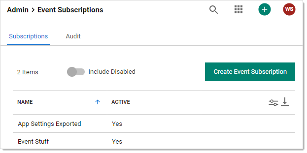
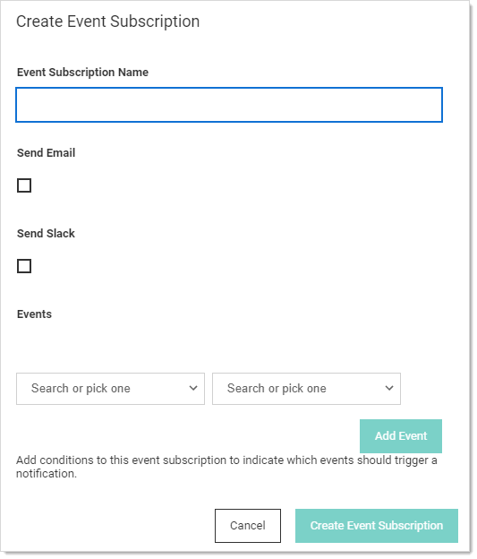
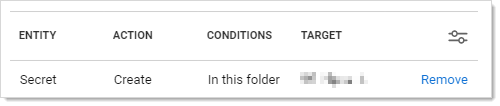
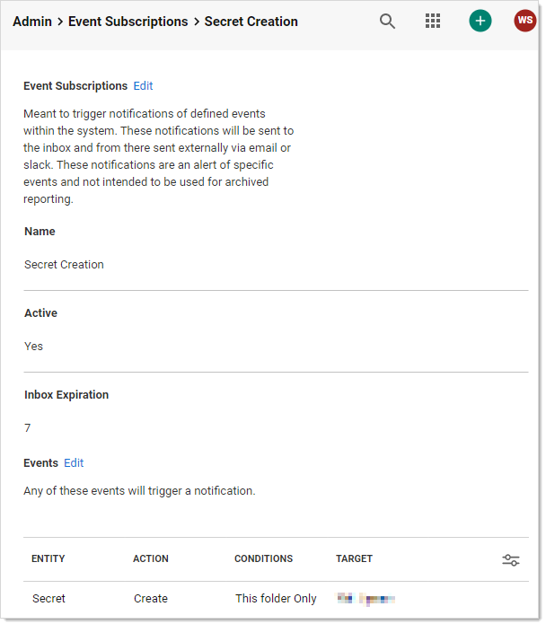
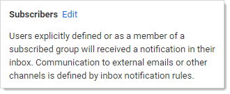
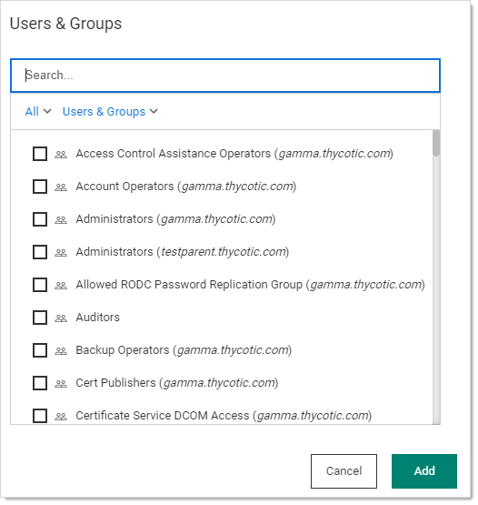

[title]: # (Creating Event Subscriptions)
[tags]: # (event subscription)
[priority]: # (1000)

# Creating Event Subscriptions

Event subscriptions trigger notifications of defined events within the system. These notifications are sent to the inbox, which may send them externally via email or Slack, depending on your configuration. 

> **Note:** These notifications are an alert of specific events and not intended to be used for archived reporting.

To add an event subscription:

## Task 1: Creating an Event Subscription

1. Navigate to **Administration > Event Subscriptions**:

   

2. Click the **Create Event Subscription** button. The Create Event Subscription page appears:

   

3. In the **Subscription Name** text box, enter a name for this new event subscription.

4. Click to select the **Send Email** check box if you want to send an email via an inbox notification.

5. Click to select the **Send Slack** check box if you want to send an Slack message via an inbox notification.

## Task 2: Adding Events

Create the events that trigger notifications:

1. Click the **Events** dropdown list to select an event object to trigger a notification.

2. Click the second **Events** dropdown list to select the event for the chosen object. For some events, one or more follow-on dropdown lists may appear. For example, if you chose Secret and then Create, another dropdown list would appear for you to select whether you want all secrets, those in the selected folder or those in the selected folder and its subfolders. Similarly, if you chose those in a folder, a link appears for you to chose the folder.

3. Click the **Add Event** button to add the event. An event table appears:

   

4. Add more events as desired.

5. Click the **Create Event Subscription** button. The event subscription's page appears:

    

1. If you want to change the status from active to inactive or adjust the number of days before an event notification expires, click the **Edit** link next to **Event Subscriptions** and make changes.

## Task 3: Adding Subscribers

Subscribers are users that are explicitly defined or are a subscribed group member. They receive a notification in their inbox when this event subscription is triggered. 

> **Note:** Communication to external emails or other channels is defined by inbox notification rules.

1. Scroll down the the **Subscribers** section:

   

1. Click the **Edit** link. Three buttons appear.

1. Click the **Add** button. The Users & Groups popup page appears:

   

1. Type the name of the user or group you want to add in the **Search** text box.

1. Click to select the check box next to the user or group that remains.

1. Repeat the process for additional users or groups.

1. Click the **Add** button. The new subscriber appears in a table in the section.

## Task 4: Associating Inbox Rules

Inbox rules filter a specified event subscription (or other alerts)—in this case, the one you just created. When you create an event subscription, an inbox rule based on the event subscription system rule is automatically created. It can be updated or reviewed to change the actions, email template, or other communication preferences. 

The event subscription subscribers defines who *potentially* receives the event alert. The associated inbox rules filters which events are shared with those subscribers via Slack or email messages. Inbox rules search for specified text strings in specified locations in the incoming notification. 

> **Note:** Notifications can be triggered by defined conditions and not a specific event subscription. Those rules may not appear in this list.

1. Scroll down to the **Associated Rules** section. Note that a link to your new event subscription inbox rule already appears at the bottom.
1. If you want to edit the rule, click the link for the inbox rule. See [Using Inbox Rules](../../inbox/inbox-rules/index.md).

