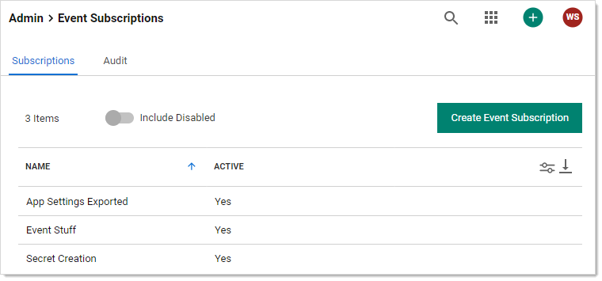
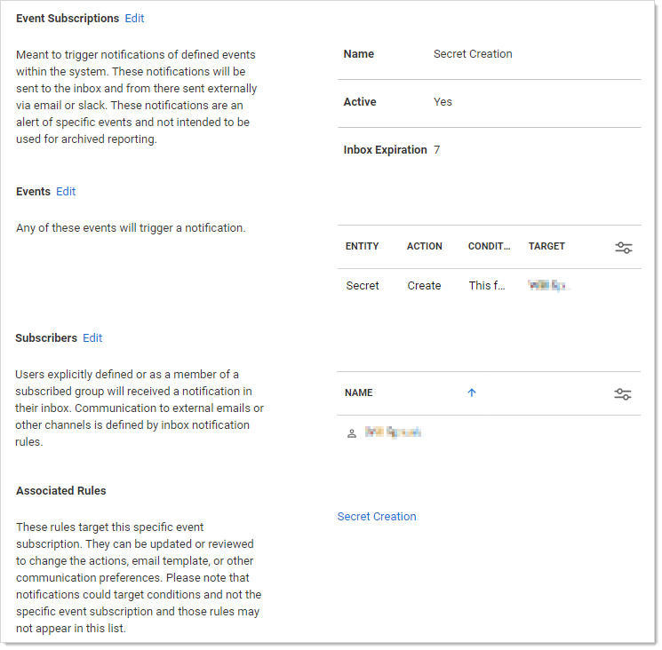

[title]: # "Event Subscriptions"
[tags]: # "Event Subscription"
[priority]: #	"1000"

# Event Subscriptions

> **Note:** Please click the table of contents on the left to see the sub-pages to this one. Click the table of contents on the right to see headings on this page.

Event subscriptions trigger notifications of defined events within the system. These notifications are sent to the inbox and from there can be sent externally via email or Slack. 

> **Note:** The notifications are an alert of specific events and not for archived reporting.

Go to **Admin \> Event Subscriptions** to view the Event Subscriptions page:

Click the name of one of the subscriptions to see its page:

The Event Subscription Page includes:

- **Event Subscriptions:** The name of the event subscription, whether it is active, and how long notifications from last in the inbox before expiration.
- **Events:** .

- **Send Email with High Priority:** Sends the email for this subscription with high priority set.
- **Subscribed Events:** List of the events that are contained in this subscription.
- **Subscribed Users:** List of the SS users and groups subscribed to this event.
- **Subscription Name:** Name for the subscription.
