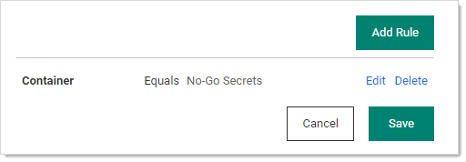

[title]: # "Using Inbox Rules"
[tags]: # "inbox rules, notification digest, inbox, notify external email, subscribers"
[priority]: # "1000"

# Using Inbox Rules

## Overview

An inbox rule (notification rule) triggers on notifications and sends either an email or a Slack message to a specified group of users. First, we discuss an inbox rule's components. Second, we show how to create an inbox rule from scratch and based on an existing notification.

> **Note:** There are some emails types that Secret Server sends that do not go through the inbox. For example, the test email button on the email configuration page sends a plain-text email directly. There are also some diagnostic emails that are directly sent. For example, discovery can directly send a detailed log which is essentially a text dump. Inbox rules are primarily for non-admin end-user communications and event subscriptions.

> **Note:** You can still send legacy emails (earlier email notifications that did not go through the inbox) if desired. Go to **Admin \> Configuration \> Email Tab \> Enable Legacy Email** to set this up. 

### Inbox Rule Components

Inbox rules have the following components:

#### Message (Notification) Types

This is the notification message (alert) types that the rule responds to. These include:

- Dependency Failure
- Event Subscription
- Inbox Test Message
- Password Reset
- Secret Access Approved
- Secret Access Cancel Request
- Secret Access Deny Request
- Secret Access Request
- Secret Changed
- Secret Heartbeat Failed
- Secret View
- Workflow Access Approval Request
- Workflow Access Request Expired
- Workflow Access Request Incomplete
- Workflow Access Request Next Step
- Workflow Access Step Approved

#### Rule Conditions

Rule conditions are filters that define who receives the email or Slack message when a notification arrives. Conditions are matched with text string matching: equals, not equals, or regex. If no condition exists, the rule triggers for every message of the defined types. Condition types include: 

- **ActionType:** Specific entities via text matching of the action's value or display value. Actions types vary by inbox message type. For example, "EXPORTED."

  > **Note:** In the case of an event subscription notification, these are the same as the event subscription events. Other notification types have different action types.

- **Container:** Specific containers via text matching of the container name. Containers include folders (secret containers) and roles (quasi user containers).

- **Details:** Specific text string in the details section. The Details type serves as a summary of the message for display in the inbox. Sometimes it contains information that is from other condition types.  For example: "App Settings Exported - SECRETSERVERSETTINGS - EXPORTED." 

- **EntityType:** Specific entities via text matching of the entity name or value. Entities are what is having the action done to it, for example, "SECRETSERVERSETTINGS." These are the same as the event subscription entities.

- **EventDetails:** Specific text string in the Event Details section. For example: "Application Settings," "Launcher Settings," and "Protocol Handler Settings." 

- **ItemName:** The source item. Specific items via text matching of the item's value or display value. The "item" varies by message. For an event subscription secret action it contains the secret name. For an event subscription folder action, it contains the folder name.

- **SubscriptionName:** The source event subscription. Specific subscriptions via text matching of the subscription's value or display value.

- **User:** The user that created the rule. Specific users via text matching of the username's value or display value. 

- **Rule Subscribers:**  What users receive the action result (an email or Slack message). 
- **Rule Actions:** What actions the rule performs:
  - Send to an email address using a specific HTML template, which the user defines.
  - Send to Slack using a specific markdown template, which the user defines.

### Predefined System Rules

Secret Server ships with several predefined system rules in inbox templates. These rules can only be disabled or enabled. However, you can copy a system template to your own custom template and edit that.  This allows us to upgrade system rules without interfering with your customizations. The predefined system rules are:

- Dependency Failure
- Inbox Test Message
- Password Reset
- Secret Access Deny Request
- Secret Access Request
- Secret Changed
- Secret Heartbeat Failed
- Workflow Access Approval Request

### Example Rule Diagram

> **Note:** This example diagram is specific to event subscription notifications. There are many other types that differ slightly, especially in content.

In the following diagram:

1. A secret triggers an event matching an event subscription.
2. Secret Server notifies the users and groups on the event subscription subscribers list. The notifications appear in their inboxes.
3. The inbox rule associated with the event subscription evaluates the conditions for forwarding the notification via email or Slack.
4. The inbox rule checks its schedule to determine when to forward the message.
5. The inbox rule checks its subscribers list to determine who to forward the message to. 

   > **Note:** Remember, arriving notifications may have already been filtered by whose inbox gets the notification in the first place. Thus, the inbox rule could be set to sent to everybody but only those who receive the notification in their inbox will receive the email or Slack message.
6. The inbox rule references the message type's inbox template to format and populate the message's variables.
7. When the scheduled time arrives, which can be immediately, Secret Server sends the messages to the subscribers.

**Figure:** Event Subscription Using an Inbox Rule to Forward a Notification via the Inbox

## Procedures

### Creating a Rule from Scratch

Let us say we want to be notified when anybody tries to edit the permissions on the "No-Go Secrets" folder. This is an event, so the notification type will be an event subscription.

#### Task 1: Create the Inbox Rule

1. Go to **Admin \> See All.**

1. Click the **Notification Rules and Templates** link. The Notification Settings page appears:

   

1. Click the **Create Rule** Button. The Create Rule popup appears:

   

1. Type the new rule's name in the **Rule Name** text box.

1. Click to select the **Message Types** check box for the message types you wish to apply the new rule to. 

1. Ensure the **Active** check box is selected if you want to use the rule right away.

1. Click to select the **Action** selection button for the type of notification.

1. If necessary, scroll down to the bottom of the popup.

1. Click the **Template** dropdown list to select the desired inbox template to associate the rule with.

1. Click the **Create Rule** button. The configuration page for the new rule appears:

   

#### Task 2: Add Rule Conditions

1. Click the **Edit** link for the **Conditions** section to add conditions. 

   > **Note:** If you do not add any conditions, the rule will apply to all messages of the types you chose. New buttons appear:
   
   

1. Click the **Add Condition** button. The Add Rule Condition popup appears:

   

1. Click the **Field** dropdown list to select the type of rule condition. For this instruction, we chose Container (a folder). A Condition dropdown list appears:

   

1. Click the **Condition** dropdown list to select how the value (added next) is compared to the message. Choose "Value RegEx" if you want to create a regular expression to further refine the condition. We chose Value Equals. The Value text box appears:  

   

1. Type the string you want to test for in the **Value** text box.

1. Click the **Add** button. The new condition appears:

   

   It tells us the rule is triggered if there is an associated event. 

1. Click the **Save** button.

1. Click the **Edit** link in the **Schedule** section. The section becomes editable:

    

    > **Note:** Any schedule choice other than *Immediate* produces a digest (summary) of notifications. Users receiving a digest can click on individual entries to see the notification. The following instructions show how to set up a digest.

1. If you want to send one email per notification, ensure the Immediate check box is selected, and skip to Task 4.

#### Task 3: Set up an Email Digest

1. If you do not want the notifications sent immediately, click to deselect the Immediate check box. A time setting section appears:

   

1. Click the **Timezone** dropdown list to select a time zone for the scheduled notification. 

1. Click the clock icon to select a time to add. A time setting table appears:

   

1. Hover the mouse over the one of the columns for a scrollbar appears. Click or drag to select the hour, half hour, or AM/PM. 

   > **Note:** You also can simply type the time prior to clicking the clock icon in the format hh:mm AM/PM. If you choose minutes other than 00 or 30, it will be converted to the nearest 00 or 30 when you input it.

1. Click the **OK** button. The time appears in the text box.

1. Click the **Add Another Time** link to commit the time.

1. Add more times as desired.

1. Click the **Recurs** dropdown list to choose the frequency. The Every section will change, depending on what you chose:

   - Daily: Type the number of days that pass between notifications in the **Days** text box.

   - Weekly: Type the number of weeks that pass between notifications in the **Weeks** text box. Click to select the days of the week check box to select which days to send the notifications.

   - Monthly: Click the **Monthly Recurrence Type** dropdown list to select either specific or conditional days of the month. The former provides a calendar to choose which days. The latter provides check boxes for selecting relative days where you choose the day of the week and the position in the month, for example, Last and Friday.

     

1. Click the **Starting** calendar icon to select the date when you want to start the notification schedule.

1. Click the **Save** button to commit your choices. 

1. Scroll down to the **Actions** section.

1. Click the **Edit** link next to **Actions**. The section becomes editable:

   

1. Click to select either the **Send Email** or **Send Slack** check box (or both).

1. If you chose to send email, click the **Email Template** dropdown list to choose the email format (inbox template). There are several standard ones, and you can customize your own. For this instruction, we choose **Standard Email** if did not create a digest and **Standard Email Digest** if we did. See [Using Inbox Templates](../inbox-templates/index.md) for details.

1. Click the **Save** button

#### Task 4: Add Subscribers to the Email or Slack Message

1. Click the **Subscribers** tab:

   

1. Click the Subscribe button and select **Users**, **Groups**, or **External Emails**. Users provides a list of users for you to select from. Groups provides a list of groups for selection. External Emails provides a text box to enter a specific email to somebody without a Secret Server account. For this instruction, we added one of each:

   > **Note:** External emails get sent without regard to whether somebody has a notification in their inbox because external "users" do not have an inbox.

   

1. You can return to this page at a later date to edit this list. You can also unsubscribe users that are members of a subscribed group without actually removing them from the list for ease of subscribing them later.

### Creating an Inbox Rule from a Notification

If a inbox notification is what you want to forward to an email or Slack message from here on out, we provide a shortcut feature that allows you to quickly build an inbox rule from the notification. To create the inbox rule:

1. Click a notification in the inbox. A details popup appears. For instance:

   

1. If you desire an inbox rule to react to that sort of message, click the **Quick Create Rule** button. A very similar, editable page appears:

   

1. Type the new rule's name in the **Rule Name** text box.

1. Click to select the check box for each rule component you want to include.

1. Click to select the **Action** selection button for the type of notification.

1. If necessary, scroll down to the bottom of the popup.

1. Click the **Template** dropdown list to select the desired inbox template to associate the rule with.

1. Click the **Add Rule** button. The configuration page for the new rule appears:

   

1. Edit the rule as desired. See [Creating a Rule from Scratch](#Creating-a-Rule-from-Scratch).
