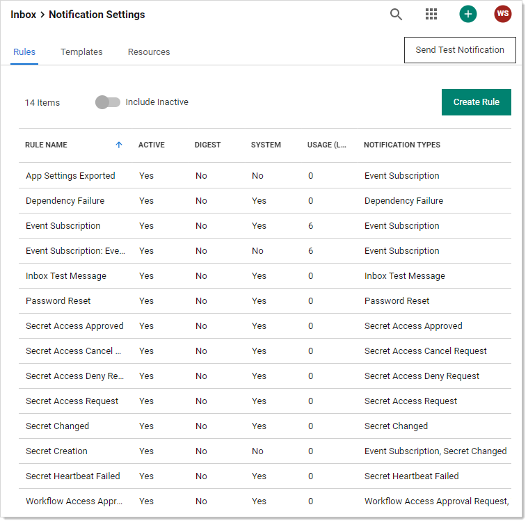
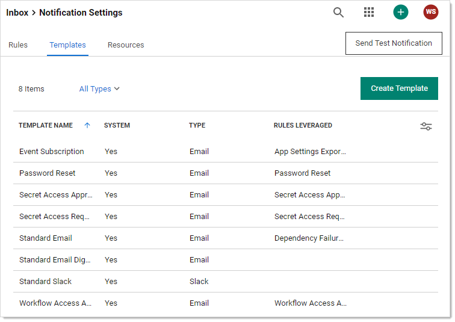
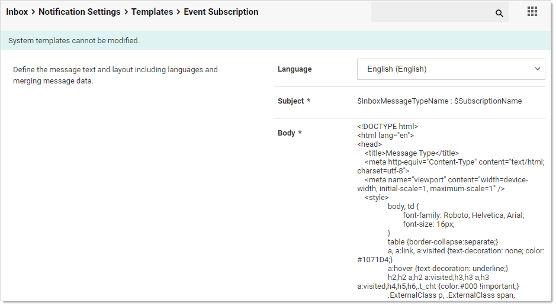
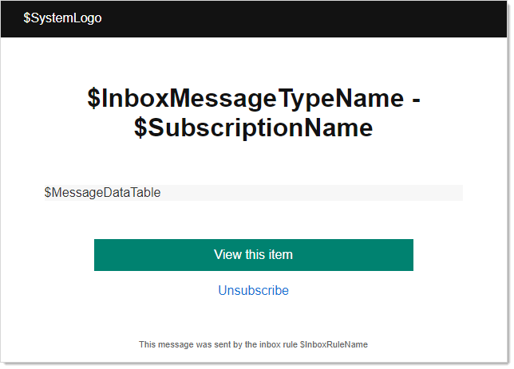
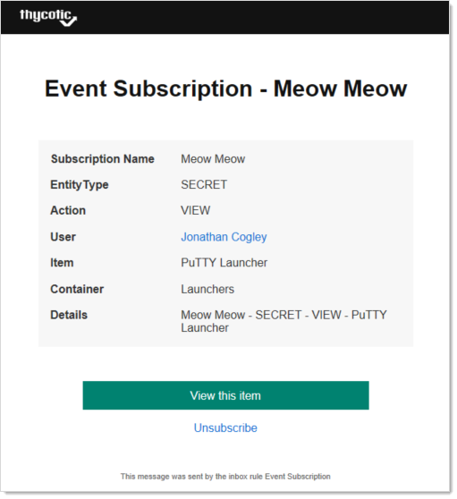

[title]: # "Using Inbox Templates"
[tags]: # "inbox templates,email,slack"
[priority]: # "1000"

# Using Inbox Templates

## Overview

First, let us open a system inbox template to look at:

1. Go to **Admin \> All**.

1. If necessary, click the view link to switch to **Alphabetized View**.

1. Click the **Notification Rules and Templates** link. The Notification Settings page appears:
   ==I'm really surprised there's no link in the inbox to get here.==

   

1. Click the **Templates** tab:

   

1. Note that most, if not all, of the templates are system templates. These are **read-only** templates that you can clone to create custom templates. That is, system templates are templates for your templates. Most of the templates are email templates, and one is a Slack template. 

1. Click the Template Name for the Event Subscription template. The template's page appears:

   

Note that each template has:

- A details section that contains the name, a system template flag, and a template type (email or Slack).
- A body section that defines the subject, language used, and the canned text for the message. The message contains variables that are drawn from the alert or event. The body is read only in system templates and is editable in custom templates cloned (copied) from system templates.
- Zero or more associated inbox rules. These are the built-in rules that use the template. Rules define filters for the alerts or events (what characteristics trigger the rule)  and who gets externally notified via email or Slack (the subscribed users or groups). The following table lists the system templates and their associated inbox rules that use them.
- Zero or more resources. These are items, such as images, that go along with any email based on the template. 

**Table:** System Rules by Template

| System Inbox Template            | Type  | Associated Inbox Rules                                       |
| -------------------------------- | ----- | ------------------------------------------------------------ |
| Event Subscription               | Email | App Settings Exported<br />Event Subscription<br />          |
| Password Reset                   | Email | Password Reset                                               |
| Secret Access Approved           | Email | Secret Access Approved                                       |
| Secret Access Request            | Email | Secret Access Request                                        |
| Standard Email                   | Email | Dependency Failure<br />Inbox Test Message<br />Secret Access Cancel Request<br />Secret Access Deny Request<br />Secret Changed <br />Secret Heartbeat Failed |
| Standard Email Digest            | Email |                                                              |
| Standard Slack                   | Slack |                                                              |
| Workflow Access Approval Request | Email | Workflow Access Approval Request                             |

Note the Body section is HTML for emails and Slack template text. For the Event Subscription template it looks like this:

```html

<!DOCTYPE html>
<html lang="en">
<head>
    <title>Message Type</title>
    <meta http-equiv="Content-Type" content="text/html; charset=utf-8">
    <meta name="viewport" content="width=device-width, initial-scale=1, maximum-scale=1" />
    <style>
		body, td {
			font-family: Roboto, Helvetica, Arial;
			font-size: 16px;
		}
		table {border-collapse:separate;}
		a, a:link, a:visited {text-decoration: none; color: #1071D4;}
		a:hover {text-decoration: underline;}
		h2,h2 a,h2 a:visited,h3,h3 a,h3 a:visited,h4,h5,h6,.t_cht {color:#000 !important;}
		.ExternalClass p, .ExternalClass span, .ExternalClass font, .ExternalClass td {line-height: 100%;}
		.ExternalClass {width: 100%;}
		h1 { color: #121212; font-family: Roboto, Helvetica, Arial;font-style: normal;font-weight: bold;font-size: 32px; }
    </style>
</head>
<body style="background-color: #F7F7F7;">

  <table width="100%" border="0" cellspacing="0" cellpadding="0"><tr><td align="center">

  <table cellspacing="0" cellpadding="0" border="0" width="100%" style="max-width: 640px; ">
	<tr>
		<td style="background-color: #121212;width: 80%; height: 48px; color: #ffffff; padding-left: 32px;">
			$SystemLogo
		</td>
	</tr>
	<tr>
		<td style="background-color:#ffffff">
		
			<table cellspacing="16" width="100%">
				<tr>
					<td width="24">&nbsp;</td>
					<td align="center" style="padding-top: 42px; color: #121212; font-family: Roboto, Helvetica, Arial;font-style: normal;font-weight: bold;font-size: 32px;text-align: center;">
						$InboxMessageTypeName - $SubscriptionName
					</td>
					<td width="24">&nbsp;</td>
				</tr>
				<tr>
					<td>&nbsp;</td>
					<td style="font-family: Roboto, Helvetica, Arial; font-weight: normal; font-size: 16px; color: #323232;">
						
						&nbsp;
						
					</td>
					<td>&nbsp;</td>
				</tr>
				
				<tr>
					<td>&nbsp;</td>
					<td style="background-color: #F7F7F7; font-family: Roboto, Helvetica, Arial; font-weight: normal; font-size: 16px; color: #323232; padding: 0px">
					
						$MessageDataTable
						
					</td>
					<td>&nbsp;</td>
				</tr>
				
				<tr>
					<td>&nbsp;</td>
					<td style="font-family: Roboto, Helvetica, Arial; font-weight: normal; font-size: 16px; color: #323232; padding: 16px" align="center">
					
						<p>
							<a href="$ApplicationUrl/app/#/inbox/view/notifications?messageId=$MessageId" style="text-decoration: none; display: inline-block; background-color: #008270; width: 400px; height: 40px; line-height: 40px; color: #ffffff; text-align: center">
								View this item
							</a>
						</p>
						<p>
							<a href="$ApplicationUrl/app/#/inbox/view/notifications?messageId=$MessageId&unsubscribe=true">
								Unsubscribe
							</a>
						</p>
						
					</td>
					<td>&nbsp;</td>
				</tr>
				
				<tr>
					<td>&nbsp;</td>
					<td style="font-family: Roboto, Helvetica, Arial; font-weight: normal; font-size: 11px; color: #646464" align="center">
					
						This message was sent by the inbox rule $InboxRuleName
						
					</td>
					<td>&nbsp;</td>
				</tr>
				
			</table>
			
		
		</td>
  </table>
  </td></tr></table>
</body>
</html>

```

Rendered, the body looks like this:



Note the variables starting with $ that are in the message. These are replaced by Secret Server when it sends the message. For example:



The variables here include:

- `$InboxMessageTypeName` was replaced by the inbox template type.
- `$InboxRuleName` was replaced by the inbox rule that sent the message. In this case, it is the same name as the inbox template type—Event Subscription.
- `$MessageDataTable` was replaced by an entire table that summarized the message.
- `$SubscriptionName` was replaced by the event subscription name.
- `$SystemLogo` was replaced by the image resource containing the Thycotic logo. 

Nearly the entire template HTML is customizable once you make a customized clone of the system te 
