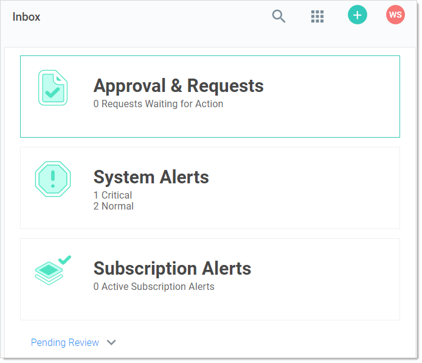

[title]: # "Inbox"
[tags]: # "Alert, Inbox,Alert Notification Center"
[priority]: #	"1000"

# Inbox

The _Inbox_ page shows notifications such as event subscription alerts, access requests and approvals, and other configuration alerts in a single interface. In addition to viewing notifications in the inbox, you can configure the inbox to forward them via email or Slack, subject to numerous configurable criteria. You can also customize the format of the email messages. You access the inbox by clicking the **Inbox** button on the main menu. See the subordinate topics for details.

> **Note:** The Inbox was also called the *Alert Notification Center* in earlier Secret Server versions.

Event subscriptions disappear from the notification center after you view them. System alerts and access requests stay active until resolved.
