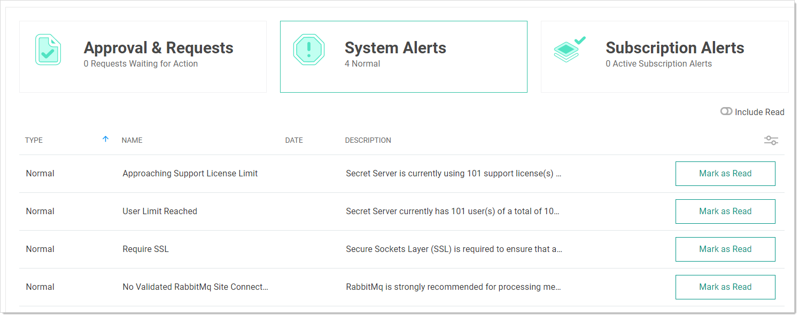

[title]: # "Marking Alerts as Viewed"
[tags]: # "Alert, Inbox"
[priority]: #	"1000"

# Marking Alerts as Viewed

1. Access the alert notification center by clicking the **Inbox** button on the main menu. The Inbox appears:

   

1. Click the **System Alerts** button. The System Alerts page appears:

   

1. Click the **Mark as Read** button for the each alert you no longer wish to view. The alert disappears, but you can still see it if you click the **Include Read** toggle button.
