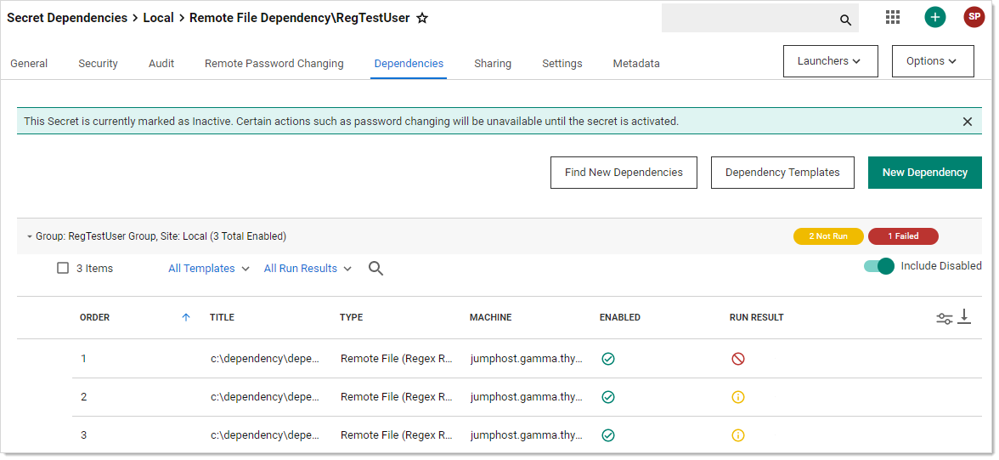
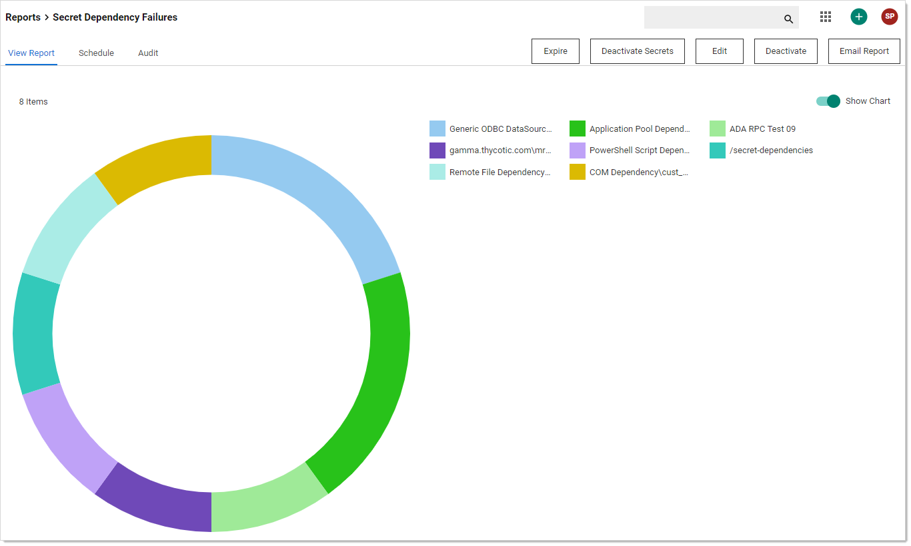
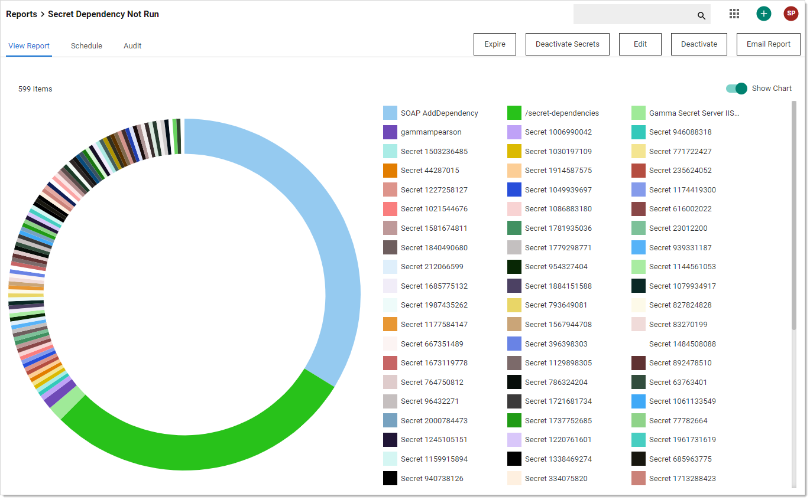
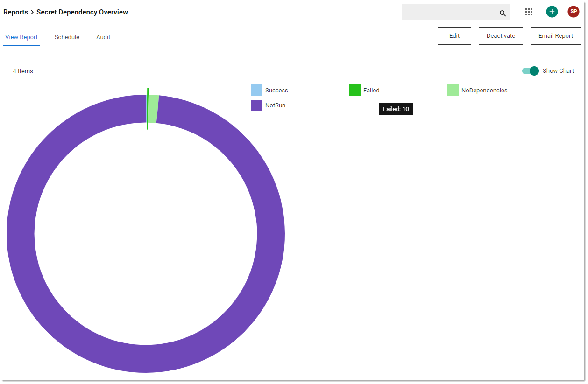
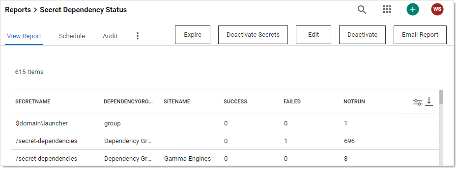

[title]: # (Secret Dependency Status)
[tags]: # (secret dependency,status,report)
[priority]: # (1000)

# Secret Dependency Status

You can see a list and status of all dependencies for a secret when viewing that secret in the UI. For example:

## Account Dependence

You can use a single account (username and credential) for OS login and also for running Windows services, scheduled tasks, IIS application pools, and more. This is especially common for functional accounts. You can link the credentials of one account object to such usages. The link is independent of the actual system that the dependency is running on.

For example, given this scenario:

- The Windows domain account DOM\svc_app1 is managed on windows domain controller, where it is located. 
- SRV1 is running a Windows service under the user DOM\svc_app1.
- SRV2 is running a scheduled task under the user DOM\svc_app1.
- When the account DOM\svc_app1 is changed, the dependencies of that account on SRV1 and SRV2 need to be updated too.
- The Windows service on SRV1 may have to be restarted for the password change to work.

The modeling of the dependency would take place in / with the master object, which in this case is the windows domain account DOM\svc_app1. When selecting the master account object in the UI, it shows the dependencies along with their status. 

## Account Clusters

You can group different account objects in clusters where the account name may be different but the credential and password are the same for all members of the cluster. Account clusters can also support the account dependency functionality from above. For example:

For example, given this scenario:

- Windows domain account DOM\svc_app1 has dependencies as outlined above.
- Linux OS login svc_app2 on LinSRV1 runs a daemon local to that system.
- Database login svc_db1 on DBSRV1 is consumed by a billing application.
- A dependency exists where the account's password can also be pushed into the configuration file of an application running as user svc_app2 on LinSRV1.

Accounts DOM\svc_app1, svc_app2 and svc_db1 would all have the same password when the password is rotated. The system can re-sync passwords of all members of the account cluster in case one of the members runs out of sync for whatever reason, such as restoring from a backup.

## Viewing Dependency Status

We offer four reports for viewing your secret dependency status:

### Secret Dependency Failures

**Figure:** Secret Dependency Failures Report

### Secret Dependency Not Run

**Figure:** Secret Dependency Not Run Report

### Secret Dependency Overview

**Figure:** Secret Dependency Overview Report

### Secret Dependency Status

**Figure:** Secret Dependency Status Report

