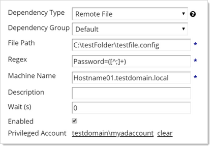

[title]: # (Using Regex with Dependencies)
[tags]: # (Dependencies,Regex)
[priority]: # (1000)
[redirect]: # (DependencyRegex)

# Using Regex with Dependencies

## Overview

In release version 7.8.00010 and later, SS allows a secret to have file dependencies. File dependencies allow text files with embedded credentials to be changed via Regex.

A Regular Expression (Regex) is a phrase in a language for matching text. For details on the .NET Regex language, see [.NET Framework Regular Expressions](http://msdn.microsoft.com/en-us/library/hs600312(v=VS.85).aspx).

 Secret Server replaces the contents of the first group (within parentheses) within the Regex.

Setting up a remote file dependency, requires:

-  **File Path:** This is the file path on the remote server where the remote password exists. UNC paths do not work here. See [UNC Names](#unc-names).
- **Regex:** This regular expression to be used to locate the password embedded in the configuration file.
- **Machine Name:** Computer name or IP address where the dependency is located.
- **Privileged Account:** The account SS will authenticate as when changing the dependency. It must have privileges on the remote machine.

A typical filled in New Dependency page looks something like this:



## UNC Names

UNC names, such as:

`\\BARAKA\SHARE\test.txt` or

`\\192.168.1.154\SHARE\test.txt`

do **not** work in the file path. You can, however, put the machine name or IP address in the Machine Name text box, and put the rest of the path in the file path. For example:

In the **File Path** text box:

`\SHARE\test.txt` or

`SHARE\test.text`

In the **Machine Name** text box:

`192.168.1.154` or

`BARAKA`

## Examples

The following are some examples of using Regex within file dependencies:

###  XML Configuration Files

#### Example One

##### Source

```xml
<Configuration>
  <User>
    <UserName>Bob</UserName>
    <Password>Password1</Password>
  </User>
  <User>
    <UserName>Sam</UserName>
    <Password>DontChangeThisOne</Password>
  </User>
</Configuration>
```
##### Regex

`<UserName>Bob</UserName>\s*<Password>([^<]+)</Password>`

#### Example Two

##### Source

```xml
<Configuration>
  <User name="Bob" password="Password1" />
  <User name="John" password="Password1" />
</Configuration>
```

##### Regex

`<User name="Bob" password="([^"]+)" />`

### Windows Initialization (.ini) Files

#### Source

```ini
[owner]
name=John Doe
password=Password1
organization=Acme Widgets Inc.
```
#### Regex

`name=John\sDoe\s*password=([^\r\n]+)`


### SQL Server Connection Strings

#### Source

````
Data Source=myServerAddress;Initial Catalog=myDataBase;UserId=myUsername;Password=myPassword;Server=myServerAddress;Database=myDataBase;Trusted_Connection=False;
````

#### Regex

`Password=([^;]+)`

### Oracle Connection Strings

#### Example One

##### Source

````
Data Source=(DESCRIPTION=(ADDRESS_LIST=(ADDRESS=(PROTOCOL=TCP)(HOST=MyHost)(PORT=MyPort)))(CONNECT_DATA=(SERVER=DEDICATED)(SERVICE_NAME=MyOracleSID)));

User Id=myUsername;Password=myPassword;
````
##### Regex

`Password=([^;]+)`

#### Example Two

##### Source

````
Data Source=username/password@//myserver:1521/[my.service.com](http://my.service.com);
````

##### Regex

`username/([^@/]+)`

### YAML

#### Source

````yaml
receipt: Oz-Ware Purchase Invoice

date: 2007-08-06

user:

name: Dorothy

password: Password1
````

#### Regex

`name:\s*Dorothy\s*password:\s*([^\r\n]+)`