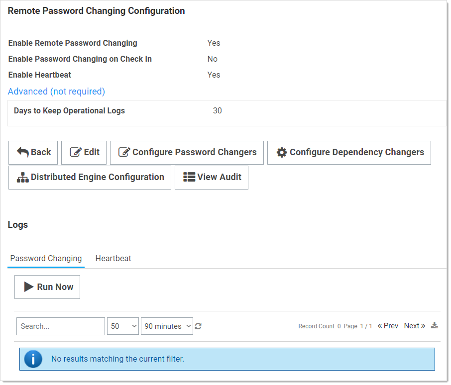

[title]: # (Triggering an RPC When Defined Errors Occur)
[tags]: # (Defined Errors)
[priority]: # (1000)

# Triggering an RPC When Defined Errors Occur

When the “Attempt Password Change with new password when error contains (regex)” setting is enabled, SS generates a new password to use during the next RPC attempt when the defined error is returned. Using a regular expression, which you define, SS scans the error message for specific text strings. When there is a match, SS generates and sets a new next password for the secret that will be used in the next RPC attempt, which will occur based on the templates RPC interval. To keep this process from generating too many next passwords, it is restricted to five attempts while failing RPC. 

> **Note:** Only the password field is updated. Passcodes and SSH keys are left alone.

**Figure:** Attempt Password Change with new password when error contains (regex) setting

Logic:

(RPC Error) AND (one or more regex matches) AND (five or fewer attempts) \=\> New password generated

Examples:

`.*UnknownError.*`  (any unknown error)

`.*`  (any error)

`.*minimum.*`  (minimum password length requirement error)

`.*0x80072035.*`  (server rejects password error)

`.*0x80072035.*|.*minimum.*`  (server rejects password or password length error)

## Procedure

To configure RPC in response to specific unknown errors:
$1
$2

$1
$2

$1
$2

$1
$2$1
$2$1
$2$1
$2$1
$2