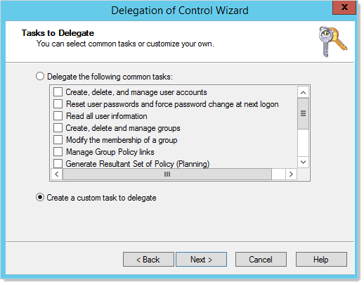
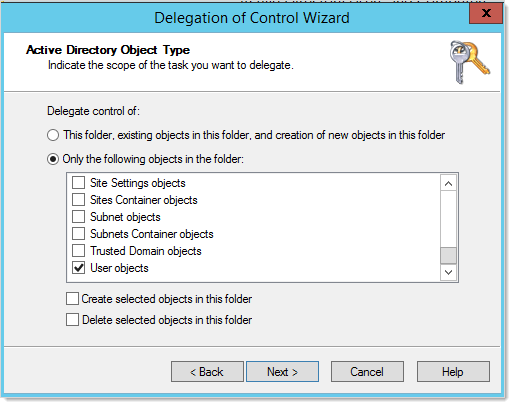

[title]: # (Minimum Permissions for Active Directory Remote Password Changing)
[tags]: # (Remote Password Changing,active directory, least privilege permissions, minimum permissions)
[priority]: # (1000)

# Minimum Permissions for Active Directory Remote Password Changing

## Overview

Secret Server requires proper permissions to perform remote password changing. The privileged secret used for remote password changing of an Active Directory (AD) account secret must have the following minimum permissions:

- Change password
- Reset password
- Write lockoutTime
- Reset password
- Write UserAccountControl
- Read all properties on CN=System,CN=Password Settings Container and all child containers or objects, or read all properties on any other fine-grained password policy objects (this is completed through ADSIedit).

## Setting Permissions

1. Open the Active Directory Users and Computers administrative console.

1. Right-click the Organizational Unit (OU) or the top-level domain you want to configure and select **Delegate Control...** from the context menu. The Delegation of Control Wizard appears on the Welcome page.

1. Click the **Next** button. The **Users or Groups** dialog appears (not shown).

1. Click the **Add...**  button to enter and search Active Directory for the appropriate users or groups. The Select Users, Computers, or Groups dialog box appears (not shown).

1. When done with the selection, click the **OK** button.

1. Click the **Next** button. The **Tasks to Delegate** dialog box appears:

   

1. In the **Tasks to Delegate** dialog, click to select the **Create a custom task to delegate** selection button.

1. Click **Next**. The Active Directory Object Type dialog box appears:

   

1. Click to select the **Only the following objects in the folder** selection button.

1. Scroll to bottom of the list.

1.  Click to  select the **User objects** check box.

1.  Click the **Next** button. The Permissions dialog box appears (not shown).

1.  Click to select the **Genera**l check box.

1.  Locate and select the following in the **Permissions** list:

    - Change password
    - Reset password

1. Click to deselect the **General** check box.

1. Click to select the **Property-specific** check box.

1. Locate and select the followings in the **Permissions** list:

    - Write lockoutTime

    - Read lockoutTime

    - Write pwdLastSet

    - Read pwdLastSet

    - Write UserAccountControl

    - Read UserAccountControl

1. Click the **Next** button.

1. Click the **Finish** button.

 

 