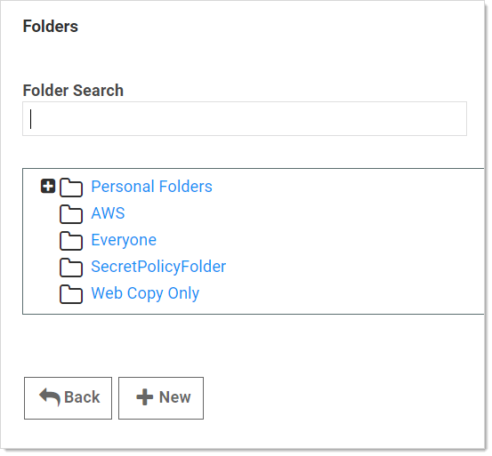
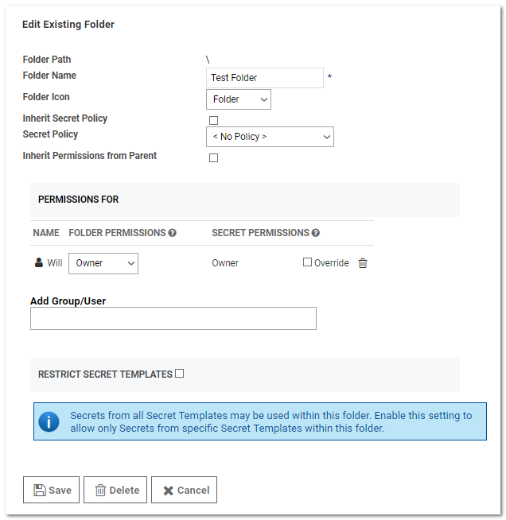

[title]: # (Editing Folder Permissions)
[tags]: # (Folder)
[priority]: # (1000)

# Editing Folder Permissions

1. Click **Admin > Folders**. The Folders page appears:

   

1. Navigate to or search for the desired folder.

1. Click the folder's name. The folder is bolded, which indicates it is selected, as does the appearance of several new buttons:

   

1. Click the **Edit** button. The Edit Existing Folder page appears:

   

1. Edit the following  folder-specific settings as desired:

   > **Important:** A secret only inherits permissions from a folder if the secret has the "Inherit Permissions from Folder" check box enabled on the secret's Sharing tab. Otherwise, folder permissions are ignored.

   - **Folder Path label:** The location in the folder tree, which only changes by moving the folder.
   - **Folder Name text box:** The folder's name
   - **Folder Icon list:** The icon for the folder. "Customer" creates a user icon, and "Computer" creates a monitor icon, representing a computer.
   - **Inherit Secret Policy check box:** Any added or created secrets inherit their policy from the folder's parent (or higher) folder, thus having the same policy as the folder. Secret policies are sets of configurations for secrets. When this control is selected, the Secret Policy list is disabled.
   - **Secret Policy list:** Specifies the secret policy for the folder, if any, which is applied if the Inherit Secret Policy check box is disabled.
   - **Inherit Permissions from Parent check box:** Added or created secrets get their permissions from the folder's parent folders. Permissions are rules on what users and roles can and cannot do. When this check box is enabled, the Permissions table becomes disabled because the folder no longer enforces its own permissions.

1. Add users or groups to the folder by typing their name in the **Add Group/User** search text box and clicking the result in the dropdown. A new user or group appears in the Permissions table:

   

1. Click the **Folder Permissions** dropdown list for the user to select folder permission level for the user or groups: View (folder), Add Secret (to folder), Edit (folder), or Owner (of folder).

1. Click to select the **Override** check box to override that user or group's assigned permission in the secret itself (on the Sharing tab). The Secret Permissions list box for that user or group becomes enabled so you can choose what new permission to override the secret permission with.

1. Click the **Secret Permissions** list for the user to select secret-related permissions for the user or groups: List (secrets in folder), View (secrets in folder), Edit (secrets in folder), or Owner (of secrets in folder).

1. Proceed to [Restricting Secret Templates for Folders](#Restricting-Secret-Templates-for-Folders) to customize allowed secret templates for the new folder.

   > **Note:** It is possible to setup an automatically replicated folder structure from an external database, such as ConnectWise or other CRM systems. This topic is discussed later in [Folder Synchronization](#folder-synchronization).
