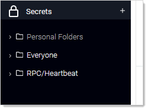
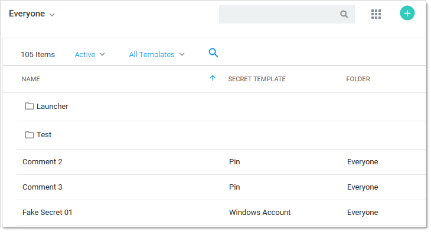
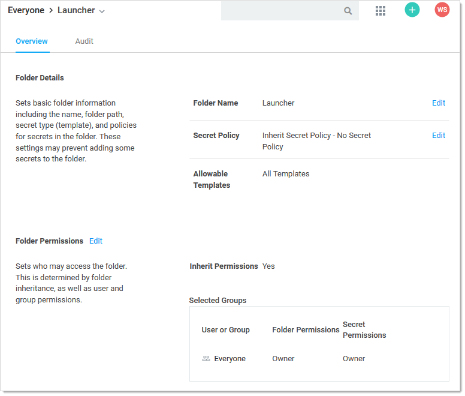
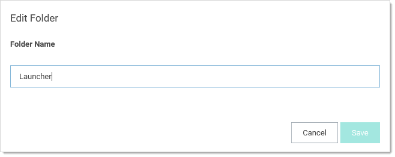
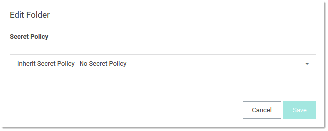
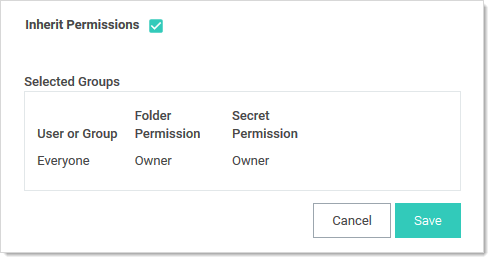
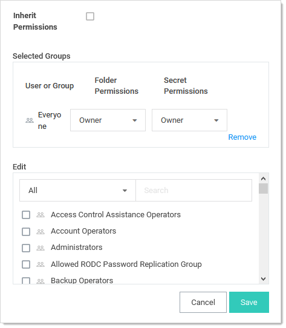

[title]: # (Editing Folder Permissions)
[tags]: # (Folder)
[priority]: # (1000)

# Editing Folder Permissions

1. In the main menu, locate the folders in the folder tree, which us under the Secret icon:

   

1. Navigate to or search for the desired folder.

1. Click the folder's name. The folder is highlighted, which indicates it is selected, and a page showing all folders and secret belonging to that folder appears:

   

   >**Note:** There is an alternative way to right clicking: When you hover the mouse pointer over a folder row, a sideways **…** (three stacked dots) appears on the far right of the row. That is the unlabeled "more" button. You may need to horizontally scroll over to see where it appears.

1. To edit the folder name:

   1. Right-click the folder and select **Edit**. The unlabeled folder page appears:

      

   1. Click the **Edit** link next to the folder name. An Edit Folder popup appears:

      

   1. Type the desired name in the **Folder Name** text box.

   1. Click the **Save** button.

1. To edit the policy that is inherited by secrets in the folder:

   1. Click the **Edit** link next to **Secret Policy**. An Edit Folder popup appears:

      

   1. Click the **Secret Policy** dropdown list to select the desired policy.

   1. Click the **Save** button.

1. To edit the folder permissions:

   1. Click the **Edit** link next to **Folder Permissions**. The Folder Permissions section becomes editable. It is currently set to the default, which is Inherit Permissions, so the Inherit Permissions check box is selected and the selected groups are not editable:

      

   1. Click to deselect the **Inherit Permissions** checkbox. The permissions section becomes editable:

      

   1. In the **Selected Groups** section, click the **Folder Permission** dropdown list for the desired user of group to select the desired maximum permission available to them for the folder: **View** (folder), **Add Secret** (to folder), **Edit** (folder), or **Owner** (of folder).

   1. In the **Selected Groups** section, click the **Secret Permission** dropdown list for the desired user of group to select the desired maximum permission available to them for secrets in the folder: List (secrets in folder), View (secrets in folder), Edit (secrets in folder), or Owner (of secrets in folder).

   1. If you wish to add a user or group (to set their permissions):

      1. (optional) Click to select the dropdown list in the **Edit** section to filter the available list.

      1. (optional) Type a desired user or group name in the **Search** text box.

      1. Click the desired user or group in the **Edit** list that you want to add to the **Selected Groups** list. The user or group appears in the section.

   1. To delete an entry in the **Selected Groups** section, click the **Remove** link next to the entry.

   > **Note:** It is possible to setup an automatically replicated folder structure from an external database, such as ConnectWise or other CRM systems. This topic is discussed later in [Folder Synchronization](#folder-synchronization).

