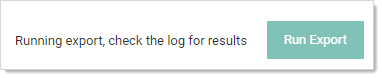

[title]: # (Automatic Secret Export)
[tags]: # (Export secret, migration)
[priority]: # (1000)

# Automatic Secret Export

This feature allows you to automatically export secrets on a schedule to an external location in an encrypted, password-protected archive.

The secret export settings and XML export format matches the existing Export/Import tool (Admin > Export / Import).  This feature lets lets you automate that export process.

To access this feature, your user must have at least one automatic export permission where you can then find it at **Admin > Automatic Export**.

The export is performed using the permissions of the user last that set up the automatic export, this means only secrets that user can access can be exported.

All actions, successful or not, related to this feature are audited and logged.

## Export Process

> **Note:** The actual export of secrets to XML is exactly the same as the standard  Export / Import tool—only the triggering differs.

The automatic export follows this process in order:

1. Either a user clicks the Run Export button on the Automatic Export tab or the configured frequency days have passed.

   > **Note:** Users can manually run the automatic export to determine if the export performs as desired.

1. Secret Server determines if the user who set up the automatic export has either the Run Automatic Export or Administer Run Automatic permission.

1. Secret Server exports secrets to XML, subject to your export settings.

1. Secret Server compresses the XML export into an encrypted, password-protected ZIP archive. The filename for both the XML file and the zipped XML file includes the export date and time—both are named the same, except the file extension. The encryption is 256-bit AES, and the password comes from the Export Password configuration setting.

1. Secret Server saves the archive to the export path (on-premises customers) or to cloud storage (cloud customers).

1. Secret Server logs the results, successful or not, noting any errors. You can view the logs on the Automatic Export Log tab.

## Considerations and Settings

### Configurations and Returned Data

The Automatic Export page shows the following information and configurations:

Those unique to automatic exports:

- **Enabled**: Whether the feature is enabled.

- **Last Exported:** The last time an automatic export successfully ran.

- **Export Path:** The path the export archives are saved to. 

  > **Note:** On-premises Secret Server customers must have write permissions to the directory. 

- **Export User:** The user the secret export runs as. Thus, only secrets this user has access to can be exported. This setting is updated automatically to the last user who saved automatic export configuration changes.

- **Frequency (Days):** Number of days between automatic exports.

Those in common with the secret export tool:

- **Export Child Folders:** Whether the export should include child folders, performing a recursive export. 

- **Export Folder Paths:** Whether the export should include folder paths. 

- **Export Password:** The secret whose password value will be used to password-protect the export archive.

- **Export TOTP Settings:** Whether the export should include Time-based One-Time Password (TOTP) settings. 

- **Folder:** The folder the exported secrets are in. If no folder is selected, all secrets are exported. If Export Child Folders is enabled, the folder's subfolder's secrets are included.

## Export Storage

Once the XML export is encrypted and archived in a ZIP file, the file is stored at an external location, which differs for on-premises customers and cloud customers. Only the 10 most recent exports are retained. Older export archives are purged as new exports are stored. This applies to both on-premises customers and cloud customers.

On-Premises storage export archives are saved in the directory in the Export Path configuration. Secret Server must have write permissions to this folder.

Cloud export archives are listed for viewing and downloading on the Automatic Export Storage tab. You can automate downloading these export archives using the REST API Automatic Export. See the [REST Web Services API Reference](../../api-scripting/rest-api-reference-download/index.md).

## Security

Because this feature moves sensitive data outside of Secret Server, it is very important to understand that **anyone with access to the export archive** ***and*** **the export password has access to all exported secrets**. This bypasses Secret Server security features and may result in a user having access to secrets they would not have access to in Secret Server.

The export archive is a password protected, 256-bit AES-encrypted zip file. Thus, the only thing preventing a possible breech is the password, so it is important you use a cryptographically strong password to foil brute force attacks.

##  Permissions

The following permissions relate to automatic secret export:

- **Administer Automatic Export**: The user can do everything the other permissions allow *and* edit the automatic export configuration.
- **Download Automatic Export**: The user can view all of the automatic export tabs *and* download exports from cloud storage (cloud customers only).
- **Run Automatic Export:** The user can view all of the automatic export tabs *and* run the export manually by clicking the Run Export button.
- **View Automatic Export:** The user can view all of the automatic export tabs. 

## Event Subscriptions

The following automatic export events are available for event subscriptions:

- **Download:** When an export archive is downloaded (cloud customers only).
- **Edit:** When changes are made to the automatic export configuration settings.

- **Export:** When an automatic export executes, automatically or manually.

  > **Note:** This event also triggers when a *fatal* error occurs during the export causing the export to fail. Non-fatal errors do not trigger this event, but they are logged on the Automatic Export Log tab.

- **Run Export:** When an automatic export is executed manually by a user clicking the Run Export button. 

  > **Note:** If you subscribe to both this event and the Export event, both events trigger at once.

# Setting up Automatic Exports

To set up an automatic export:

> **Note:** Only the secrets the user has view access to are exported.

> **Important:** File  attachments on the original secret are not exported into the XML file and require using the API to migrate. Secret audits and history  are not preserved during the migration. 

> Note: If you later use the export to import into another Secret Server instance, be sure to first create the AD  groups and users using the permissions on the secrets in the original SS instance. Otherwise, they will not be created when the secrets are imported into the new instance.

1. Create a new secret to store the export password in.

1. Go to **Admin \> See All**. A popup menu appears.

1. Click the **Automatic Export** link. The Automatic Export (configuration) tab appears:

   

1. Click the **Edit** link next to **Automatic Export**. The page becomes editable:

   

1. Click to select the **Enable Automatic Export** check box.

1. There is no need to set the export user—Secret server automatically notes who is logged on when you save the export.

1. Type the path to export the secret to in the **Export Path** text box (on-premises users only). On-premises Secret Server customers must have write permissions to the directory. 

1. Click the **No Secret Selected** link. The Select Secret popup appears.

1. Click the secret you want to store the password in. Your choice appears as a link next to Export Password:

   

1. Click the **No Folder Selected** link to choose a folder to export. By default, all secrets are exported if a folder is not selected. The Select Folder popup appears. Click on the desired folder. You chosen folder appears as a link:

   

1. (Optional) Click to select the **Export Folder Paths** check box. This adds the full folder path to the export. Folder paths in the export file provide organizational structure if secrets need to be imported later.

1. (Optional) Click to select the **Export Child Folders** check box. This option includes any subfolders of the one you chose earlier.

1. (Optional) Click to select the **Export TOTP Settings** check box if you want to include time-based one-time password settings in the export.

1. Type the number of days between automatic exports in the **Frequency (Days)** text box.

1. Click the **Save** button. Any error messages, such as secrets with doublelocks, appear. The page leaves edit mode, and the Run Export button appears.

1. Click the **Run Export** button to text the export. A confirmation popup appears:

   

1. Click the **Run Now** button. A notification appears:

   

   And then disappears.

1. Click the **Log** tab to confirm the export worked:

   

1. Using the stored password, open the zip file to confirm its contents.