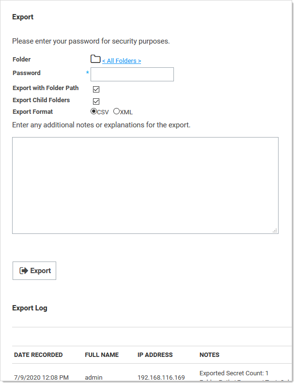

[title]: # (Exporting Secrets)
[tags]: # (Export secret, migration)
[priority]: # (1000)

# Exporting Secrets

To export a secret, either CSV or XML:

> **Note:** Only the secrets the user has view access to are exported.

> **Imported:** File  attachments on the original secret are not exported into the XML file and require using the API to migrate. Secret audits and history  are not preserved during the migration. Be sure to first create the AD  groups and users using the permissions on the secrets in the original SS instance. Otherwise, they will not be created when the secrets are imported into the new instance.

1. Go to **Admin \> See All**.

1. Click the **Export** link. The Export page appears:

   

1. Click the folder icon to choose a folder to export. By default, all secrets are exported if a folder is not selected.

1. Type your password in the **Password** text box. The administrative password must be entered, as it is a security measure to verify the permission of the user performing the export.

1. (Optional) Click to select the **Export with Folder Path** check box. This adds the full folder path to the export. Folder paths in the export file provide organizational structure if secrets need to be imported later.

1. (Optional) Click to select the **Export Child Folders** check box. This option includes any subfolders of the one you chose earlier.

1. Click the **Export Format** selection button to choose the type of export. CSV is for Excel and the like, and XML is for migrating to other SS instances.

1. Click the **Export** button. The Export Secrets popup appears. Any error messages, such as secrets with doublelocks, appear. When the exportation is finished, a dialog box appears for you to choose a location for the file.