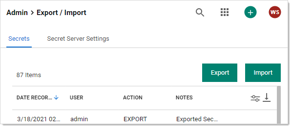
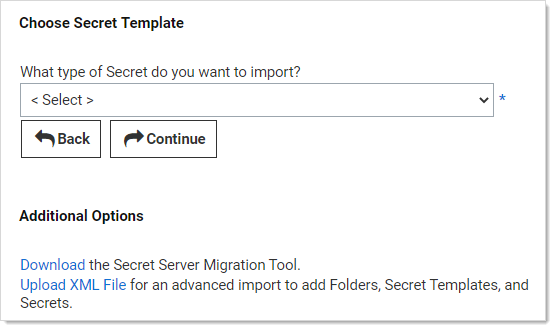
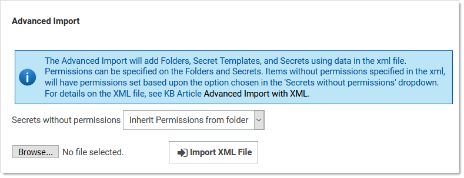

[title]: # (Importing Secrets)
[tags]: # (Import)
[priority]: # (1000)

# Importing Secrets

SS's importation feature simplifies integration with legacy systems and allows users to easily add large numbers of secrets from an Excel or comma-separated values (CSV) file. Secrets are batch imported by template, so multiple types of input data need to be imported in several batches. The [Secret Server Migration Tool](../secret-server-migration-tool/index.md) supports easy addition of existing passwords from other third-party password-storing applications.

## Importing CSV Data

1. Go to **Admin \> See All**. The admin menu appears:

   

1. Hover the mouse pointer over the **Setup and System Maintenance** panel and select **Export / Import**. The Export / Import page appears:

   

1. Click the **Import** button on the **Secrets** tab. The Choose Secret Template page appears:

   

1. Click the **What type of Secret…** list box to select the type of secrets you intend to import.

1. Click the **Continue** button. The Import Secrets page appears:

   

1. Paste the secrets for importation from MS Excel or a CSV file directly into the text box in the **Import Secrets**  page. The order of the imported fields is based on the template selected. Consider the following:

   - Do not include a header line. The field names are determined by the order, not a header line.

   - The fields **must** be in this order: `Secret Name`, `AccessKey`, `SecretKey`, `Username`, `SecretId`, and `Trigger`.

   - Secret names must be included, but other text-entry fields can be blank unless the secret template indicates that the text-entry field is required

   - Fields containing commas or tabs must be surrounded with double quotation marks
   - If you have to include double quotation marks inside your data, escape all of  them with a `\` character so the importer does not get confused.

1. Click to select the **Allow Duplicate Secrets** check box if you wish to import a secret with the same name as an existing one.

1. Click to select the **Import with Folder** check box if you included an additional field in the importation text with a fully qualified folder name for the secret to be created in.

1. Click to select the **Import with TOTP Settings** check box if you want to include time-based one-time password settings in the import.

1. Click the **Next** button. SS displays a preview. 

1. If you are happy with what you see, click the **Yes, Import these Secrets** button.

## Importing Secrets with XML

Advanced XML importation adds folders, secret templates, and secrets based on an XML file. Permissions can be specified on the folders and secrets or the default is to inherit permissions. This import can only be done by administrators with proper role permissions.

> **Important:** Migration is **not** supported by Thycotic Technical Support.

### Procedure

1. Ensure your XML is formatted correctly. If coming from a SS export, you should be good to go. See [Example XML File](#example-xml-file).

    > **Important:** Do not edit the XML file with Windows Notepad. Instead, use Notepad++, Visual Studio Code, or Atom to make your edits. Windows Notepad can add invisible characters that can prevent importation.

1. Go to **Admin \> See All**.

1. Click the **Import Secrets** link. The Import page appears:

   

1. Click the **Upload XML File** link. The Advanced Import page appears:

   

1. Click the **Secrets without permissions** dropdown list to choose how you want secrets without permissions to get them assigned.

1. Click the **Browse** button to choose the XML file.

1. Click the **Import XML** File button.

### Example XML File

The XML file should look like the example below, the comments are for explanation only and may be removed before importing, if desired.

> **Important:** Migration is **not** supported by Thycotic Technical Support.

#### Notes

- Leaving the `<Permissions>` tag empty for a folder will cause that folder to inherit permissions from its parent folder.

- Leaving the `<Permissions>` tag empty for a secret will cause it to inherit permissions from its folder.

- To add a line-break within a Notes field use `##BR##`.

> **Note:** Please do **not** edit the XML file with Windows Notepad. Use Notepad++, Visual Studio Code, or Atom to make your edits. Using Notepad increases you chances of importation failure.

#### Sample XML

```xml
<?xml version="1.0" encoding="utf-16"?>

<ImportFile xmlns:xsi="[http://www.w3.org/2001/XMLSchema-instance"](http://www.w3.org/2001/XMLSchema-instance) xmlns:xsd="http://www.w3.org/2001/XMLSchema"%3E;

  <Folders>
    <Folder>
      <FolderName>Customers</FolderName>
      <FolderPath>Customers</FolderPath>
      <Permissions>
        <Permission>
          <View>true</View>
          <Edit>true</Edit>
          <Owner>true</Owner>
          <UserName>admin</UserName>
<!-- Either UserName or GroupName is required in permissions -->
        </Permission>
        <Permission>
          <View>true</View>
          <Edit>false</Edit>
          <Owner>false</Owner>
          <GroupName>Auditors</GroupName>
        </Permission>
      </Permissions>
    </Folder>
    <Folder>
      <FolderName>Customer A</FolderName>
      <FolderPath>Customers\Customer A</FolderPath>
      <Permissions />
<!-- Empty Permissions will cause folder to inherit from parent -->
    </Folder>
  </Folders>
<!-- Groups are optional -->
  <Groups>
    <Group>
      <GroupName>Other Administrators</GroupName>
      <GroupMembers>
        <GroupMember>
          <UserName>admin2</UserName>
        </GroupMember>
        <GroupMember>
          <UserName>DomainAdmin</UserName>
          <Domain>http://testdomain.test.com</Domain>
        </GroupMember>
      </GroupMembers>
    </Group>
    <Group>
      <GroupName>Domain Administrators</GroupName>
      <Domain>http://testdomain.test.com</Domain>
      <GroupMembers>
        <GroupMember>
          <UserName>DomainAdmin</UserName>
          <Domain>http://testdomain.test.com</Domain>
        </GroupMember>
      </GroupMembers>
    </Group>
  </Groups>
  <SecretTemplates>
<!-- You can have multiple secrettype entries -->
    <secrettype>
      <name>Windows Account</name>
      <active>true</active>
      <fields>
        <field isexpirationfield="false">
          <name>Resource URL</name>
          <mustencrypt>false</mustencrypt>
          <isurl>false</isurl>
          <ispassword>false</ispassword>
          <isnotes>false</isnotes>
          <isfile>false</isfile>
          <passwordlength>0</passwordlength>
           <historylength>0</historylength>
          <isindexable>false</isindexable>
        </field>
        <field isexpirationfield="false">
          <name>Username</name>
          <mustencrypt>false</mustencrypt>
          <isurl>false</isurl>
          <ispassword>false</ispassword>
          <isnotes>false</isnotes>
          <isfile>false</isfile>
          <passwordlength>0</passwordlength>
           <historylength>0</historylength>
          <isindexable>false</isindexable>
        </field>
        <field isexpirationfield="false">
          <name>Password</name>
          <mustencrypt>true</mustencrypt>
          <isurl>false</isurl>
          <ispassword>true</ispassword>
          <isnotes>false</isnotes>
          <isfile>false</isfile>
          <passwordlength>12</passwordlength>
<!-- Use this number for 'All' history -->
           <historylength>2147483647</historylength>
          <isindexable>false</isindexable>
        </field>
        <field isexpirationfield="false">
          <name>Notes</name>
          <mustencrypt>false</mustencrypt>
          <isurl>false</isurl>
          <ispassword>false</ispassword>
          <isnotes>true</isnotes>
          <isfile>false</isfile>
           <passwordlength>0</passwordlength>
          <historylength>0</historylength>
          <isindexable>true</isindexable>
        </field>
      </fields>
      <expirationdays>0</expirationdays>
    </secrettype>
 </SecretTemplates>
 <Secrets>
    <Secret>
      <SecretName>Test Secret</SecretName>
      <SecretTemplateName>Windows Account</SecretTemplateName>
      <FolderPath>Customers\Customer A</FolderPath>
      <Permissions>
        <Permission>
          <View>true</View>
          <Edit>true</Edit>
          <Owner>false</Owner>
          <GroupName>IT Admins</GroupName>
        </Permission>
        <Permission>
          <View>true</View>
          <Edit>true</Edit>
          <Owner>true</Owner>
          <UserName>admin</UserName>
        </Permission>
      </Permissions>
      <SecretItems>
        <SecretItem>
          <FieldName>Resource URL</FieldName>
          <Value>10.10.0.25</Value>
        </SecretItem>
        <SecretItem>
          <FieldName>Username</FieldName>
           <Value>Administrator</Value>
        </SecretItem>
        <SecretItem>
          <FieldName>Password</FieldName>
          <Value>D*KGY#$5</Value>
        </SecretItem>
        <SecretItem>
          <FieldName>Notes</FieldName>
          <Value>Just some notes##BR##...and some more notes on a new line. </Value>
        </SecretItem>
      </SecretItems>
    </Secret>
    <Secret>
      <SecretName>Another Test Secret</SecretName>
      <SecretTemplateName>Windows Account</SecretTemplateName>
      <FolderPath>Customers\Customer A</FolderPath>
<!-- Empty Permissions causes secret to inherit from folder -->
      <Permissions />
      <SecretItems>
        <SecretItem>
          <FieldName>Resource URL</FieldName>
          <Value>10.10.0.25</Value>
        </SecretItem>
        <SecretItem>
          <FieldName>Username</FieldName>
          <Value>JSmith</Value>
        </SecretItem>
        <SecretItem>
          <FieldName>Password</FieldName>
          <Value>DKud3()DS</Value>
        </SecretItem>
         <SecretItem>
          <FieldName>Notes</FieldName>
          <Value>This line has an empty line##BR####BR##in between this line.</Value>
        </SecretItem>
      </SecretItems>
      <SecretDependencies>
<!-- Secret dependencies are optional, and there can be multiple ones -->
        <SecretDependency>
          <Active>true</Active>
          <Restart>true</Restart>
          <Description>Some Dependency</Description>
          <MachineName>192.168.99.1</MachineName>
          <DependencyName>Some Service</DependencyName>
          <Type>Windows Service</Type>
<!-- Leave this blank to not use a PrivilegedAccount -->
          <PrivilegedAccount>Some Account</PrivilegedAccount>
          <WaitBeforeSeconds>10</WaitBeforeSeconds>
        </SecretDependency>
      </SecretDependencies>
    </Secret>
  </Secrets>
</ImportFile>

```