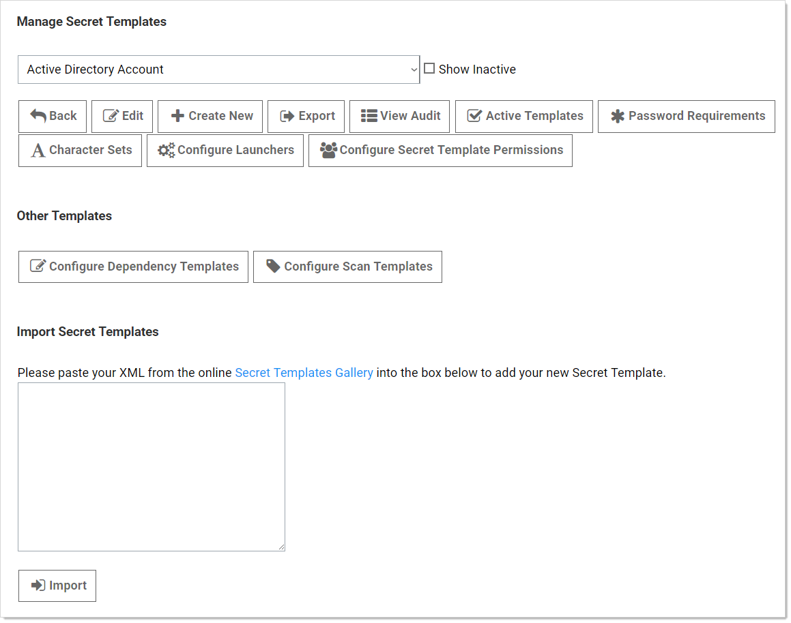
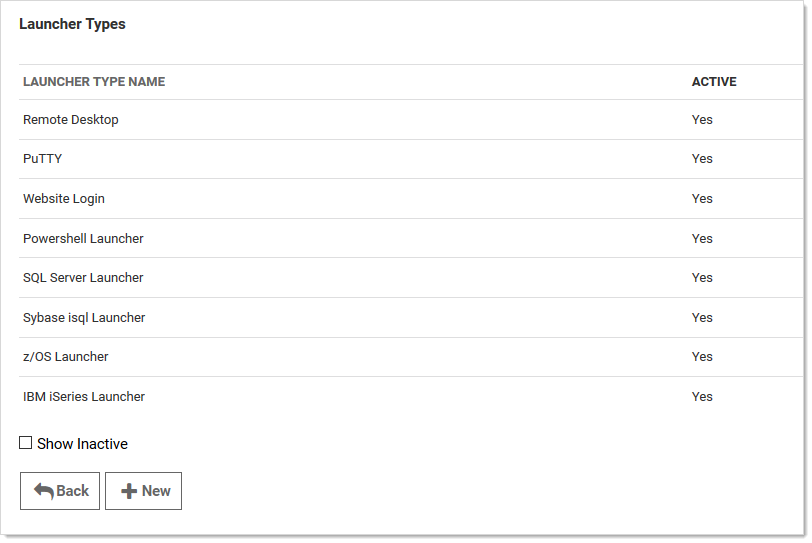
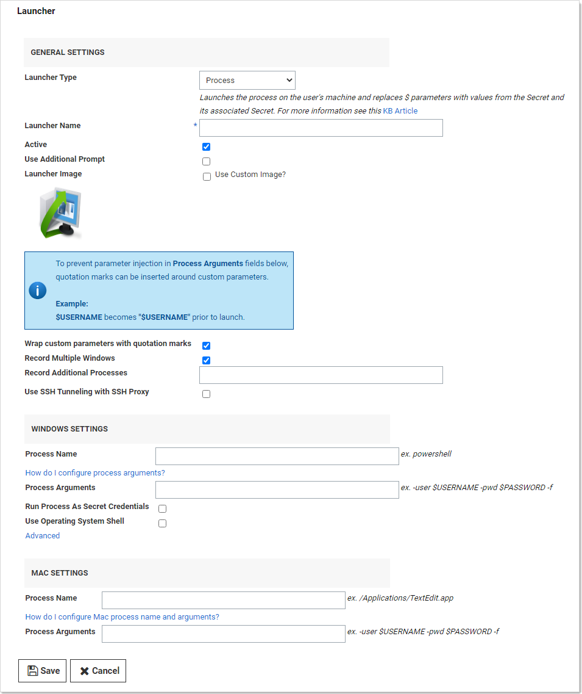

[title]: # (Creating Custom Launchers)
[tags]: # (Launcher)
[priority]: # (1000)

# Creating Custom Launchers

## Procedure

> **Note:** See [Custom Launcher Errors](../custom-launcher-errors/index.md) if errors arise.

To create a new custom launcher:

1. Select **Secret Templates** from the **Admin** main menu item. The Manage Secret Templates page appears:

   

1. Click the **Configure Launchers** button. The Launcher Types page appears:

   

1. Click the **New** button.  The Launcher page appears:

   

1. Configure the page. See the following section for details on the settings.

1. Click the **Save** button.

## Settings

> **Note:** Not all of the following are available for all types of launchers.

### General Settings

The following settings are available in the General Settings section:

- **Active:** Whether the launcher is active for use.

- **Additional Prompt Field Name:** Name of the text field that is prompted for when the user uses the launcher. This value can be referenced in the process arguments with a `$` prefix.

- **Launcher Image:** Upload a custom image for the launcher.

- **Launcher Name:** Name of the launcher that is displayed to the user.

- **Launcher Type:** Select Process, Proxied SSH Process, or Batch File.

- **Record Additional Processes:** Add a comma-separated list of additional process names to record if they are running. When a launcher is in progress and recording, any visible windows from the listed processes are also recorded. This only applies to processes running in your session—other users running the same process are not recorded. The processes themselves are not affected—they remain running after the launch is finished. This setting is only active if Record Multiple Windows is enabled too.

- **Record Multiple Windows:** Records all visible windows of the primary process, not just the primary window of the primary process. This helps record applications with multiple windows or dialog boxes. In addition, if the primary process (or one of its children) spawns child processes, any visible windows are recorded too. For example, if you run the cmd.exe process (the command prompt and then run notepad.exe (Notepad) from the command prompt (cmd.exe), notepad is recorded along with the command prompt. This check box is enabled by default. Enabling this setting is a prerequisite for Record Additional Processes.

- **Use Additional Prompt:** User is prompted for additional information when using the launcher. When selected, the "Additional Prompt Field Name" text box appears. This option is mutually exclusive with "Use SSH Tunneling with SSH Proxy."

- **Use SSH Tunneling with SSH Proxy:** When enabled and the launcher is mapped to a secret template, the user can select host and port fields, and you can provide a default port, which can be referenced using $HOST and $PORT in the process arguments. If the launching secret has proxying enabled and a Secret Server SSH proxy is available, those process arguments are replaced with with SSH tunnel values (localhost [127.0.0.1] and a random port). 

  This causes the launched process to connect to the local tunnel, and traffic then flows from the client to the SS SSH proxy, which connects to the real endpoint. This is useful when users are not allowed to directly connect to the endpoint but SS or distributed engines can. The check box is disabled by default. This option is mutually exclusive with "Use Additional Prompt." 

  > **Note:** To use this feature, you must first map the host and port fields when you map the launcher to a template. To do so, edit the secret template and click Configure Launcher.

- **User Secret Server RDP Client:** Use the RDP client.

- **Wrap Custom Parameters with Quotation Marks:** Wraps the variables in the process arguments fields with quotation marks. This is a security and disambiguation feature.  For example:

  Given these process arguments:

  `--host=$HOST --port=$PORT --username=$USERNAME --password=$PASSWORD`

  With no quotation mark wrap, the process arguments for a launcher mapped to a secret might look like this:

  `--host=xyz --port=123 --username=user --password=x x x`

  The final parameter would be ambiguous—the last three characters might be misinterpreted with the process thinking a single "x" is the password. Also, text could be injected, causing the value to be interpreted as another parameter, causing a security issue. Wrapping the parameter values fixes these potential problems:

  `--host="xyz" --port="123" --username="user" --password="x x x"`

  The check box is selected by default.

### Windows Settings

The following setting are available in the Windows Settings section:

- **Batch File:** As an alternative to opening a process, upload a `.bat` file that is downloaded and executed on the client when the user runs a launcher. The file is deleted from the client after execution.
- **Process Arguments:** Process arguments depend on the process that is being launched. View the built-in SQL Server launcher for examples on how the text-entry fields are substituted. For greater flexibility, other secrets can be linked on the Launcher tab on the secret. The text-entry field values from those secrets can also be used in the process arguments using the same prefix `$[1][FieldName]` syntax as the SSH custom commands. There is a launcher specific token `$SESSIONKEY` that can be passed to the command line. This passes an identifier to the customer launcher that can be used to anonymously check in the secret using the CheckInSecretByKey Web service method. Example: `-user $USERNAME -pwd $PASSWORD -f`. See [Custom Launcher Process Arguments](../custom-launcher-process-arguments/index.md) for details.
- **Process Name:** Name of the process that is launched. Example: `powershell`
- **Run Process as Secret Credentials:** The process authenticates with the secret credentials (username, domain, and password) instead of the client user that is using the launcher. This can be overridden at the secret level to use a privileged account to run the process.
- **Use Operating System Shell**: Use the OS shell for the launcher. Useful for processes requiring UAC confirmation.

The following settings are available in the **Advanced Windows Settings** section, which is accessible by clicking the **Advanced** link:

- **Escape Character:** The character to use as an escape character in passwords. Escape characters are required to allow the use of characters that are otherwise not allowed in passwords because they have special meaning to the launcher's target application.
- **Characters to Escape:** The characters that require escaping for the target application.

### Mac Settings

The following setting are available in the Mac Settings section:

- **Process Name:** Name of the process that is launched. Example: `/Applications/TextEdit.app/Contents/MacOS/TextEdit`
- **Process Arguments:** Process arguments depend on the process that is being launched. View the built-in SQL Server launcher for examples on how the text-entry fields are substituted. For greater flexibility, other secrets can be linked on the Launcher tab on the secret. The text-entry field values from those secrets can also be used in the process arguments using the same prefix `$[1]$[FieldName]` syntax as the SSH custom commands. There is a launcher specific token `$SESSIONKEY` that can be passed to the command line. This passes an identifier to the customer launcher that can be used to anonymously check in the secret using the CheckInSecretByKey Web service method. Example: `-user $USERNAME -pwd $PASSWORD -f`. See [Custom Launcher Process Arguments](../../custom-launchers/custom-launcher-process-arguments/index.md) for details.
