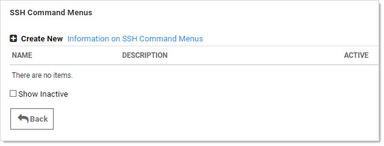
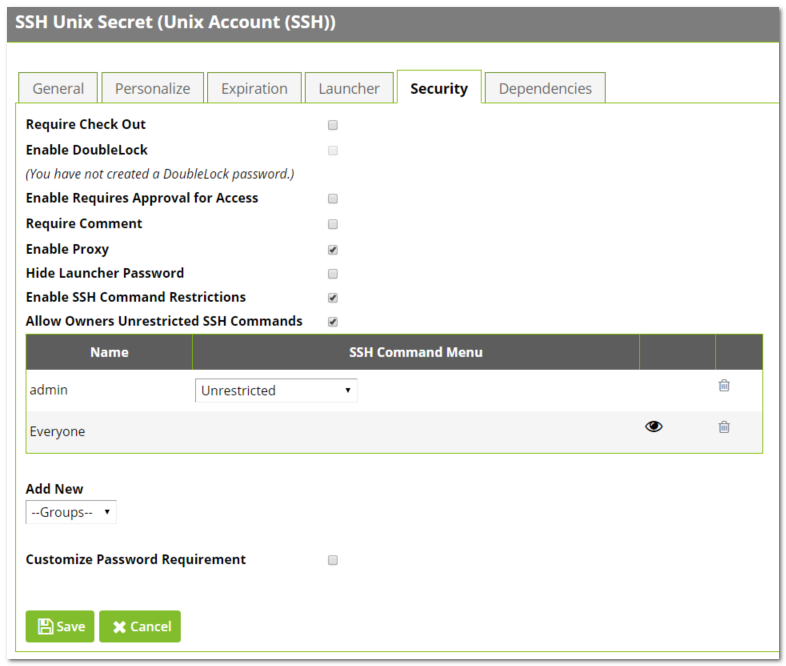
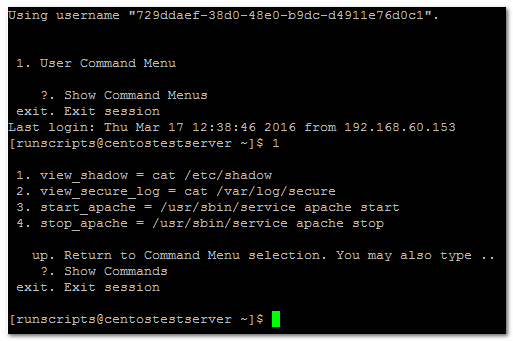

[title]: # (Managing Superuser Privilege)
[tags]: # (Launcher)
[priority]: # (60)

# Managing Superuser Privilege

Administrators can create command menus for use with a proxied SSH connection to restrict what commands can be run by users or groups on the connected server. This feature requires an additional license. To add a command menu:

> **Note:** For details, see [SSH Command Menus](https://thycotic.force.com/support/s/article/SSH-Command-Menus).

1. Navigate to **Admin \> All**.

1. Click the **SSH Command Menus** button.

   

1. Click the **Create New** button.

1. Type a name, description and the SSH commands:

   

Once one or more command menus have been created, access can be controlled to individual Unix SSH secrets.

On the **Security** tab of a secret that can use a proxied PuTTY session, proxy must be enabled as well as command menu restrictions. If **Allow Owners Unrestricted SSH Commands** is enabled, any user who is an owner of the secret has unrestricted use of the PuTTY session, that is, that user is able to type in commands as in a normal session. Additionally, other groups can be assigned the Unrestricted role as well.

In the following example, the "admin" group is unrestricted, while everyone who is not in the admin group is restricted to only being able to run the commands that are enumerated in the user command menu, created above.

A user who is subject to SSH Command Restrictions are presented with a screen similar to the following when connecting to an SSH session:

The user simply enters the number of the command menu to see available commands, or types "?" to display the options again.

Only the commands listed can be run by this user. The user can either enter the number of the command to be run, or the name of the command, which is the word to the left of the equal (=) sign. Other options are available (as shown) to navigate through the available command menus, display help, or exit the session.
