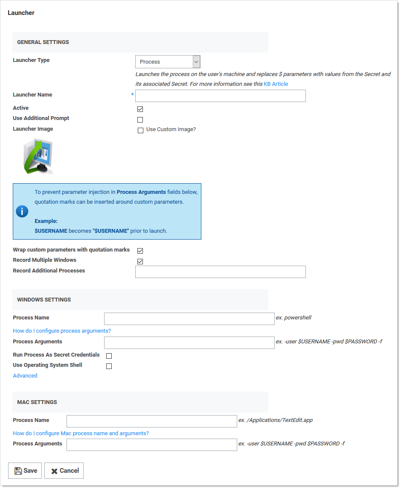
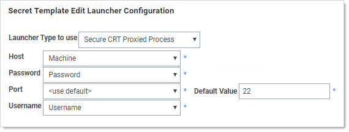

[title]: # (Custom Launcher for SecureCRT)
[tags]: # (Launcher, custom launcher, SecureCRT)
[priority]: # (1000)

# Custom Launcher for SecureCRT (SSH)

The following instructions describe how to set up a custom launcher using SecureCRT:

## Step 1: Creating the Custom Launcher

1. Navigate to **Administration \> Secret Templates**.

2. Click **Configure Launchers**. The Launcher Types page appears.

3. Click the **New** button. The Launcher page appears:

   

4. Click the **Launcher Type** list box and select one of the following:

   - **Process:** If you would like to use secret credentials to connect directly to the remote host.

   - **Proxied SSH Process:** If you have SSH Proxy enabled. This will prevent Secret credentials from being passed to the client by connecting to Secret Server's proxy to interact with the remote host.

5. Type the name `Secure CRT Proxied Process` in the **Launcher Name** text box.

6. Type the location and filename of the executable (`C:\program files\acme software\clients\securecrt.exe`) in the **Process Name** text box in the **Windows** section. The location must be on the client machine (the machine that will run the launcher).

7. Type the following custom command-line parameters in the **Process Arguments** text box:

   `/ssh2 /AUTH keyboard-interactive /PASSWORD $PASSWORD /P $PORT /L $USERNAME $HOST`

8. Click the **Save** button. The new launcher appears:

   

## Step 2: Creating a Custom Secret Template (optional)

See [Creating and Editing Secret Templates](../../secret-templates/managing-secret-templates/creating-or-editing-secret-templates/index.md) for details on creating a custom secret template.

## Step 3: Associating the Launcher with a Secret Template

1. Navigate to **Administration > Secret Templates**.

2. Select the desired template from the drop-down menu.

3. Click **Edit**. The Secret Template Designer appears.

4. Click **Configure Launcher**. The **Secret Template Edit Launcher Configuration** page appears.

5. Click the **Add New Launcher** button.

6. For **Launcher Type to Use**, select your custom launcher.

7. Leave **Domain** set to **\<blank\>**.

8. For **Password** and **Username**, select **Password** and **Username**, respectively. The result should look like this:

   

9. Click the **Save** button. You can now launch SecureCRT whenever you use the launcher for secrets based off of this template.
