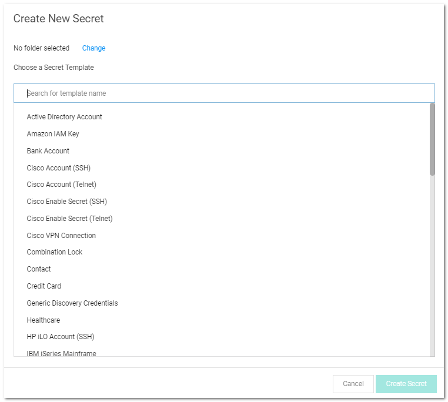
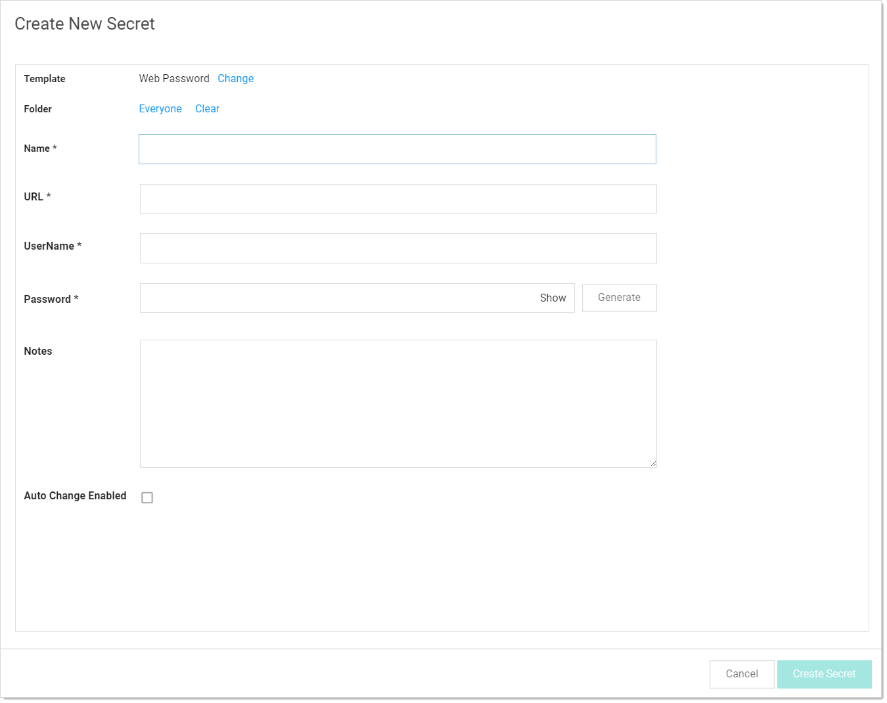
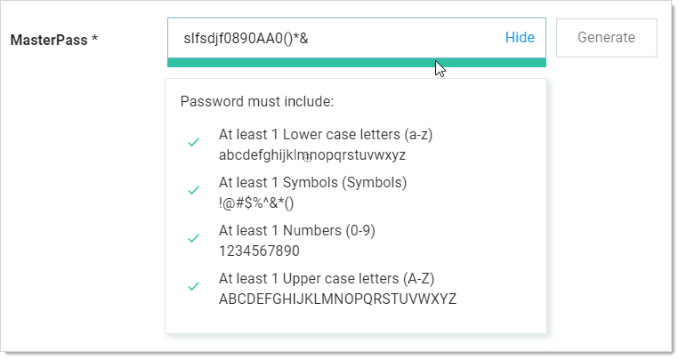

[title]: # (Creating Secrets)
[tags]: # (Secret)
[priority]: # (10)

# Creating Secrets

To create a secret:

1. Click the **+** on the Secrets item on the main menu:

   

   or click the icon and select **New Secret**. The Create New Secret page appears:

   

1. Click the **Chose a Secret Template** list to choose a template from which to create the secret .

   > **Note:** If you do not find a suitable template available, you can create a custom template.

1. Click the **Create Secret** button. A Create New Secret page appears.

   > **Note:** These pages differ significantly, based on the secret template you chose. For this instruction, we chose the frequently used Web Password template.

   

1. Complete the text boxes and selection controls on the page.

   > **Note:** The password generator is governed by a password requirement, which is usually set via the secret template. However, you can override the template for this secret and set the requirement to something different in the Password Requirements section of the Security tab, after you create the secret.

1. Click the **Generate** button to create a strong password that meets the requirements for that type of secret. You can also add your own. If you do, the password box will remain red until you enter a password that meets the requirements.

   > **Note:** The maximum password length is 1024.

   The bar below the text box indicates the strength of the password you enter:

   
   When you type one that qualifies, the box and bar turn green:

   

   If you want to see what requirements are governing the password, hover the mouse over the password strength bar:

   

1. Click the **Sites** list to select a site the secret belongs to.

1. (Optional) Click to select the **Auto Change Enabled** check box to enable automatic remote password changing (RPC) for the secret.

1. Click the **Create Secret** button.

> **Note:** It is possible to import data as secrets. See [Importing Secrets](../../../secret-import-and-export/importing-secrets/index.md).
