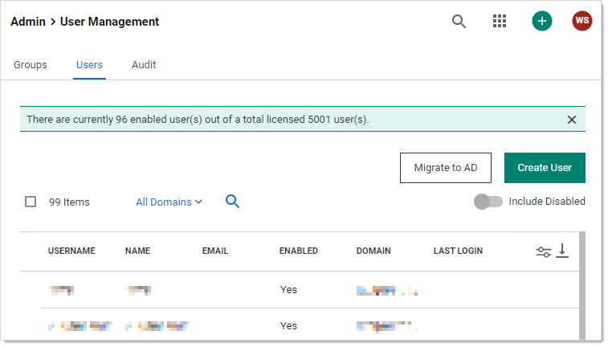
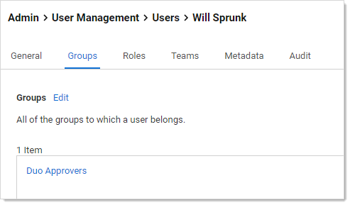

[title]: # "Erasing Secrets"
[tags]: # "secret, deleting secrets, erasing secrets"
[priority]: # "1000"

# Erasing Secrets

> **Note:** Deactivating (previously called "deleting") a secret is *not* the same as erasing one—the former hides it but it can still be viewed or reactivated by administrators—the latter is a permanent removal of data and requires more effort, including an access request. Deactivating secrets is common. Erasing them is rare, only needed in special circumstances. See [Deactivating and Reactivating Secrets](../deactivating-and-reactivating-secrets/index.md) for details.

> **Note:** This instructions assumes you know the basics of groups, roles, and permissions. We also suggest reading the introductory material for [Workflows](../../../secret-workflow-templates/index.md) if you are not familiar with it.

## Task 1: Configuring Secret Erasure

> **Note:** If secret erasure is already configured on this server and you are in the Secret Erasers group, you can skip to Task 2.

1. Ensure that you have the ==Blah Blah== license for Secret Server. 

1. Go to **Admin \> Roles** in Secret Server:

   

1. Create a new role named "Secret Eraser" (see [Creating Roles](../../../roles/creating-roles/index.md) for details), assigning it the "Erase Secret" permission:

   

1. Go to **Admin \> Groups**. The Groups tab of the User Management page appears:

   

1. Create a group named "Secret Erasers" and give it the "Secret Eraser" role:

   

1. Go to **Admin \> Users**:

   

1. Click the magnifying glass icon to find your username.

1. Click your username link to open your User Details page.

1. Click the **Groups** tab.

   

1. Click the **Edit** link to add your username to the **Secret Erasers Group**.

1. Go to **Admin \> Workflows**:

   

1. Create a "Secret Erase Request" workflow template, assigning it the type with the same name. The Designer tab for the new workflow appears:

   

1. Assign the **Secret Erasers Group** in the **Approvers** list of **Step 1** by typing `Secret Erasers` in the search text box in the **Add Groups / Users** section.

1. Click the **Save** button. The result looks like this:

   

1. Go to **Admin \> Configuration**:

   

1. Click the **Security** tab.

1. Click the **Edit** button at the bottom of the page. The page becomes editable.

1. Click to select the **Enable Secret Erase** check box in the **Secret Erase** section. The Secret erase Workflow dropdown list appears:

   

1. Click the **Secret Erase Workflow** dropdown list and select **Secret Erase Request**.

1. Click the **Save** button.

## Task 2: Erasing a Secret

1. Ensure the following requirements are met for the secret you intend to erase—the secret:
    - Is inactive
    - Is owned by you
    - Does not have a pending secret erase request
    - Is not double-locked
    - Is not checked out by another user
    - Is not a discovery secret
    - Is not a domain sync secret
    
1. For purposes of this instruction, create a secret for testing in your personal folder. For now, do not use an existing one to ensure all the requirements are met. 

    > **Note:** Secret erasure uses secret bulk operations, even if you want to erase only one. If you click the Options button for a secret, erase is not an option.

1. You erase the secret via a dashboard bulk operation. Erase is accessed by the **More Bulk Options** button. Erase Secrets is in the **Security** section of the **More Bulk Options** popup. See [Running Dashboard Bulk Operations](../../../application-administration/application-dashboard/index.md#running-dashboard-bulk-operations).

    > **Note:** If the Erase Secrets link does not appear in the Security section, you may have not properly configured secret erasure (see Task 1) or the secret might not meet one of the requirements above. ==Is that right, or do you still see it and get a "that's a no-no" popup?==

1. When you click the **Erase Secrets** link, the Erase Secrets popup appears:

    

    Here, you are essentially setting up an access request for erasing the secret. The access request is sent to the users in the Secret Erasers user group you created earlier. In this instruction, you are both the requester and the granter of the access request.

1. 

