[title]: # (Erasing Secrets)
[tags]: # (secret, deleting secrets, erasing secrets)
[priority]: # (1000)

# Erasing Secrets

> **Note:** Deactivating (previously called "deleting") a secret is *not* the same as erasing one—the former hides it but it can still be viewed or reactivated by administrators—the latter is a permanent removal of data and requires more effort, including a secret erase request. Deactivating secrets is common. Erasing them is rare, only needed in special circumstances. See [Deactivating and Reactivating Secrets](../deactivating-and-reactivating-secrets/index.md) for related information.

> **Note:** This instructions assumes you know the basics of access requests, groups, roles, and permissions. We also suggest reading the introductory material for [Workflows](../../../secret-workflow-templates/index.md) if you are not familiar with it.

## Task 1: Configuring Secret Erase

> **Note:** If secret erasure is already configured on this server and you are in the Secret Erasers group, you can skip to Task 2.

1. Ensure that you have a workflow license for Secret Server. 

1. Go to **Admin \> Roles** in Secret Server:

   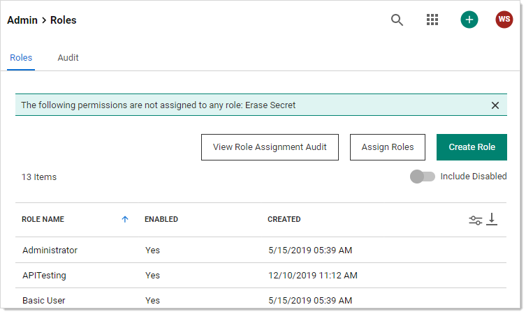

1. Create a new role named "Secret Erase Requester" or "Secret Erase Administrator" (see [Creating Roles](../../../roles/creating-roles/index.md) for details), assigning it the "Erase Secret" permission:

   > **Note:** You can name the role anything you desire, but we recommend the above for clarity.

   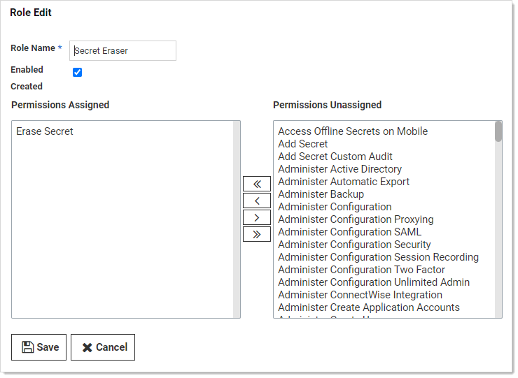

   The "Erase Secret" role permission allows users with the role to create secret erase requests and view secret erase administration pages.

1. Go to **Admin \> Groups**. The Groups tab of the User Management page appears:

   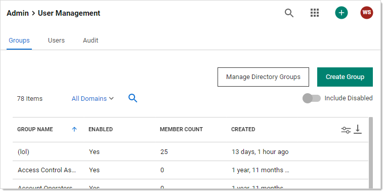

1. Create a group named "Secret Erasers" and give it the "Secret Eraser" role:

   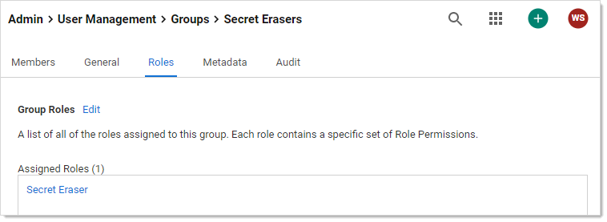

1. Click the **Members** tab to add yourself to the **Secret Erasers** group.

1. Go to **Admin \> Workflows**:

   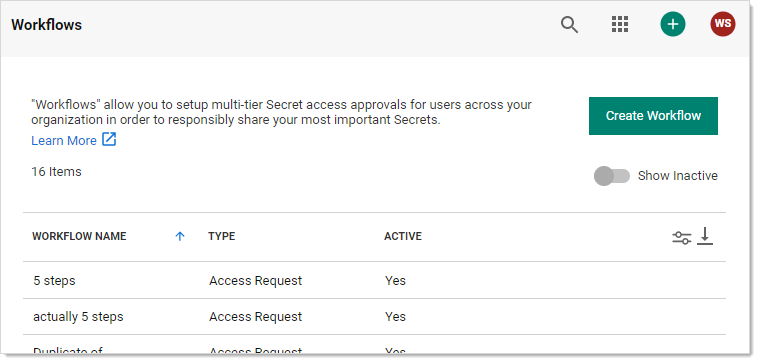

1. Create a "Secret Erase Requests" workflow template, assigning it the Secret Erase Request type. The Designer tab for the new workflow appears:

   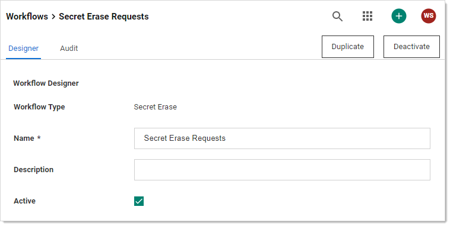

1. Assign one or more users or groups as approvers by typing each in the search text box in the **Add Groups / Users** section and then clicking your choice when it appears. It then appears in the Approvers list box.

   > **Note:** We chose to have the approvers be the same group as those that can make the requests, but you can choose any groups or users you like or make a group just for approvals. The important thing is the same *user* cannot both make the request and approve it—that way, a single person cannot make an irreversible, potentially very harmful, mistake.

1. Click the **Save** button. The result looks like this:

   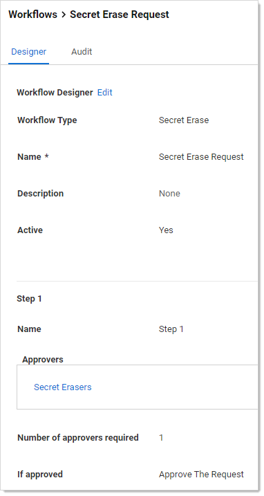

1. Go to **Admin \> Configuration**:

   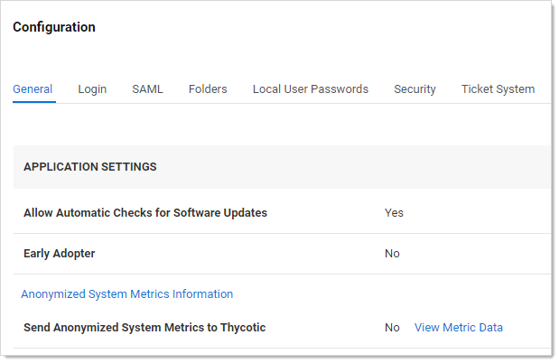

1. Click the **Security** tab.

1. Click the **Edit** button at the bottom of the page. The page becomes editable.

1. Click to select the **Enable Secret Erase** check box in the **Secret Erase** section. The Secret erase Workflow dropdown list appears:

   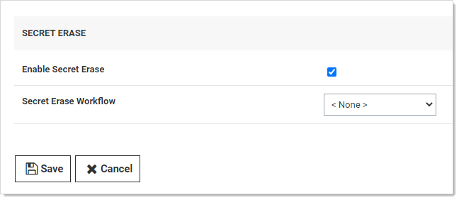

1. Click the **Secret Erase Workflow** dropdown list and select **Secret Erase Request**.

1. Click the **Save** button. Secret Erase is now set up. 

## Task 2: Erasing a Secret

1. Ensure the following requirements are met for the secret you intend to erase—ensure the secret:
    - Is inactive
    - Is owned by you
    - Does not have a pending secret erase request
    - Is not double-locked
    - Is not checked out by another user
    - Is not a discovery secret
    - Is not a domain sync secret

1. For purposes of this instruction, create a secret for testing in your personal folder. For now, do not use an existing one to ensure all the requirements are met. 

1. You can erase the secret via a dashboard bulk operation or from the **Options** button on the **General** tab of the secret itself. For a bulk operation, erase is accessed by the **More Bulk Options** button. **Erase Secrets** is in the **Security** section of the **More Bulk Options** popup. See [Running Dashboard Bulk Operations](../../../admin/application-dashboard/running-dashboard-bulk-operations/index.md#running-dashboard-bulk-operations).

    > **Note:** If the "Erase Secrets" link does not appear in the Security section (when erasing from the dashboard) or "Erase" is not available on the Option button (when erasing from the General tab) you may have not properly configured secret erase (see Task 1) or the secret might not meet one of the requirements above.

1. When you click the **Erase Secrets** link, the Erase Secrets popup appears:

    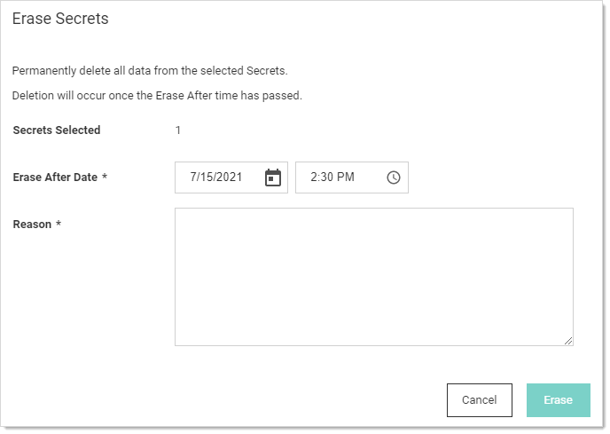

    Here, you are essentially setting up a erase secrets request. The access request is sent to the users or  user group you designated earlier.

1. Use the calendar and time widgets to set the **Erase After Date**. It must be minimum of 24 hours away to give the erase secrets request time to process. If you set it to less than that, you cannot continue the process.

1. Type your reasoning for permanently erasing the secret or secrets in the **Reason** text box. This is not tedium—the granter will need this to decide whether to let you take this irreversible, destructive action. Specifically, explain why a deactivation is not sufficient.

1. Click the **Erase** button. A confirmation popup appears:

    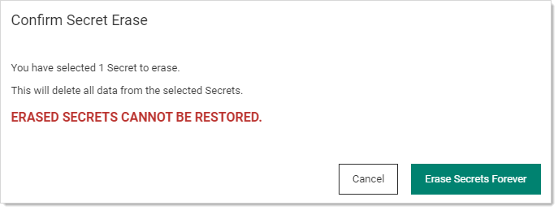

1. Pause a second, and make sure you are sure.

1. Click the **Erase Secrets Forever** button.

1. When the erase request is approved, the secret or secrets will be erased by an automated process after the "erase after" date and time arrives. 
