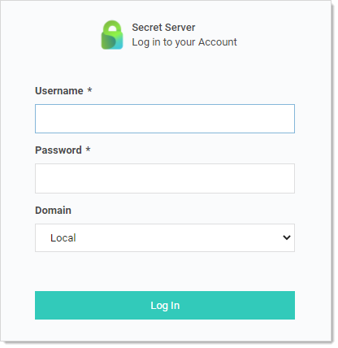
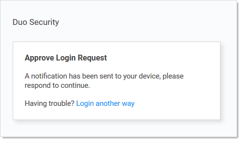

[title]: # (Secret Server End User Guide)
[tags]: # (Getting Started, Help)
[priority]: # (1000)

# Secret Server End User Guide

This guide is for regular, non-administrative, users of Secret Server (SS). It is mostly a set of links to a subset of the greater corpus of SS documentation. For Secret Server Cloud, see the [Secret Server Cloud Quick Start](../secret-server-cloud/quick-start/index.md).

## What Is Secret Server?

Secret Server is a privileged access management (PAM) system. Essentially that means it manages who can access what, when, and under whose authority—all without introducing weak points, such as weak passwords or stale user accounts, and discovering those that potentially exist. For large organizations, this is a huge undertaking. It only takes one security breach to cause huge problems, and there are seemingly countless ways for those breaches to occur. PAM systems, such as SS, are invaluable in getting this situation under control. Better still, SS can make your day-to-day work environment safer and easier to manage too.

## What Is the Purpose of the End User Guide?

Secret Server is a powerful, advanced product with a wide range of capabilities. Even so, it is very easy to use for regular day-to-day operations for non-technical people. The key to this is knowing what to ignore and understanding the bits you do need to know. This guide is designed to help you do just that. It provides links to only what you need to know. You can add other topics later as needed.

## Getting Help

* Technical Support: Please contact your organization's help desk.

* [Self-Help Resources](../help/self-help-resources/index.md)

* [Secret Server Glossary](../help/secret-server-glossary/index.md)

* [Document Conventions](../help/document-conventions/index.md)

> **Important:** When using this User Guide, it is easy to get lost in the ocean of SS documentation. To avoid that, we recommend using **\<Ctrl \>** + click to access the links here. That way, the page you are going to will open to a new browser window, leaving this one as is, making it much easier to get back to. You can also simply use the browser back button to return, but that can get tiresome because many pages link to others.

## Logging on Secret Server

Depending on how your administrators configured SS, you can log on with either your Active Directory account or a local account.

1. In your browser, go to the URL for your organization's SS.

   

2. On the login screen, enter your:

   - Active Directory username (or local one if you do not have one)
   - Active Directory password (or local one if you do not have one)

3. Select the your domain from the **Domain** dropdown list. If you do not have an AD domain, select **Local** instead.

4. Click the **Log In** button. If you have Duo two-factor authentication, this appears:

   

   Your cell phone receives a notification you have to approve to access SS.

   > **Note:** SS also supports other two-factor authentication methods (depending on what your organization configured), such as text or email codes that SS prompts you for.

   > **Note:** After you log on with your local account for the first time, you are immediately prompted to change your password .

6. Click the **Login** button. The SS Dashboard appears.

## Secrets

_Secrets_ are individually named packets of sensitive information, such as passwords. Secrets address a broad spectrum of secure data, each type represented and created by a _secret template_ that defines the parameters of all secrets based on it. Secrets are very powerful and provide many ways of controlling and protecting their data, such as:

- Ensuring passwords are long, complex, and frequently changed.
- Relieving users of having to remember numerous complex passwords or when to change them. You only need to remember your password to access SS. All of your secret passwords are managed for you.
- Automatically changing passwords at set intervals with no user intervention.
- Relieving users of having to remember numerous complex passwords or when to change them. You only need to remember your password to access SS. All of your secret passwords are managed for you.
- Ensuring the person accessing SS or a secret is indeed you.
- Recording who actually accessed a secret.

All secret text-entry field information is securely encrypted before being stored in the database, including a detailed audit trail for access and history.

Some important basic information about secrets:

- [Viewing Secrets](../secret-management/procedures/viewing-secrets/index.md) (includes checking expiration and history)
- [Creating Secrets](../secret-management/procedures/creating-secrets/index.md)
- [Secret Configuration Options](../secret-management/secret-configuration-options/index.md)
- [Creating Secrets](../secret-management/procedures/creating-secrets/index.md)
- [Deleting and Undeleting Secrets](../secret-management/procedures/deleting-and-undeleting-secrets/index.md)

## Secret Folders

*Secret folders* allow you to create containers of secrets based on your needs. They help organize your customers, computers, regions, and branch offices, to name a few. Folders can be nested within other folders to create sub-categories for each set of classifications. Secrets can be assigned to these folders and sub-folders. Folders allow you to customize permissions at the folder level, and all secrets within can inherit the folder's permissions. Setting permissions at the folder level ensures future secrets placed in that folder have the same permissions, simplifying management across users and groups.

- [Creating Folders](../secret-folders/managing-folders/creating-folders/index.md)
- [Adding and Moving Secrets Between Folders](../secret-folders/managing-folders/adding-and-moving-secrets-between-folders/index.md)

## Using Secrets on Websites (Web Password Filler)

Please set up Web Password Filler (WPF) in the following order:

1. Ensure you can log in to SS the conventional way.

1. If necessary, create a folder in SS where the WPF secrets will reside.

1. [Install the WPF browser extension](https://docs.thycotic.com/wpf/2.0.0/getting-started/install.md).

1. [Configure WPF to point to SS](https://docs.thycotic.com/wpf/2.0.0/getting-started/connect.md).

1. [Login to SS via WPF](https://docs.thycotic.com/wpf/2.0.0/getting-started/login-ss.md).

## Checking out Secrets

The SS _check-out_ feature grants exclusive access to a single user. If a secret is configured for check out, a user can then access it. No other user can access a secret while it is checked out, except unlimited administrators. This guarantees that if the remote machine is accessed using the secret, the user who had it checked out was the only one with proper credentials at that time. See [Secret Checkout](../secret-checkout/index.md) for details.

## Getting Notified of Secret Events

Secret Server records specific events, including expired secrets, and optionally sends you alerts when they happen. See the [Alert Notification Center](../events-and-alerts/alert-notification-center-inbox/index.md) and [Creating Event Subscriptions](../events-and-alerts/event-subscription-page/creating-event-subscriptions/index.md) for details.

## Learning More About Secret Server—the Getting Started Tutorial

We created a [Getting Started Tutorial](../getting-started-tutorial/index.md) for technical users. While it covers many things you do *not* need to know right now, you may later find it helpful if you want to get a deeper understanding of SS.
