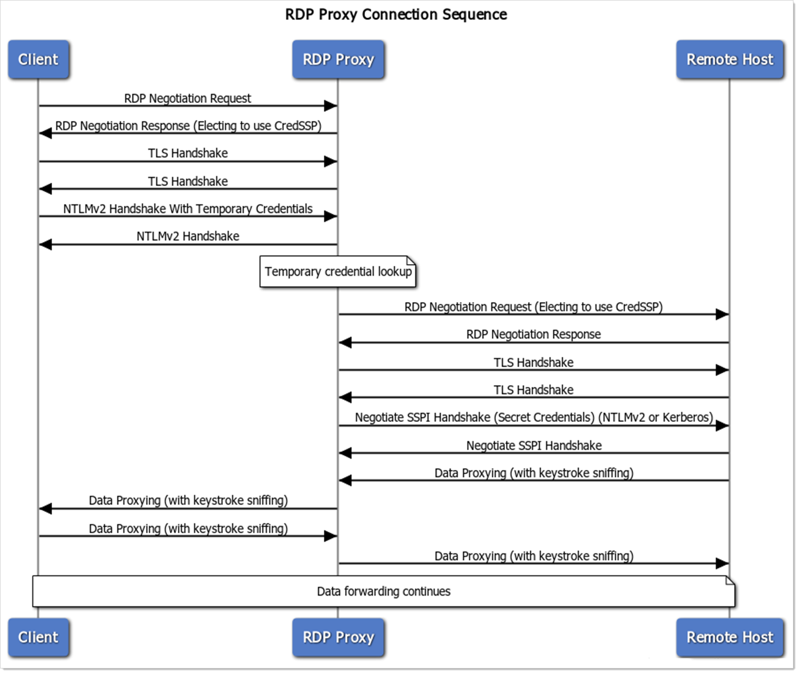

[title]: # (RDP Proxy Technical Notes)
[tags]: # (RDP Proxy,Networking)
[priority]: #

# RDP Proxy Technical Notes

## Overview

Thycotic's RDP Proxy is a feature of SS that allows protection of secret credentials when launching or connecting to remote servers with privileged credentials. The RDP Proxy simulates the RDP connection handshake process when a client connects to retrieve the short-lived temporary credentials that are generated by SS. When it retrieves these credentials, it then queries SS to find the mapped to real secret or privileged credentials to connect to the remote host and begin proxying the data back and forth between the remote host and the client machine.

## Requirements

Because of the way in which the RDP proxy expects to retrieve the temporary credentials, there are a few requirements which must be met in order to use the RDP proxy:

- The RDP Proxy only supports TCP as a transport, not UDP.

- Client machines must be able to negotiate using the CredSSP external security provider in the RDP protocol. They must have enabled network-level authentication, Microsoft recommends the NLA.

- Client machines must be able to use NTLMv2 to connect to the RDP proxy. The RDP proxy needs to retrieve the temporary credentials from the client machine in order to validate them, which is only possible using the NTLMv2 protocol and not Kerberos.

- Because the RDP Proxy is pretending to be an RDP host, the certificate that is served from the actual remote host must be trusted. Otherwise, the configuration setting "Validate Remote Certificates" must be disabled. The certificate that is served to the client is the configured "RDP Server Certificate."

- The RDP Proxy is currently unable to support certain niche protocol features. These include: Extended Client Data, DYVNC Graphics Pipeline, Restricted Administrative Mode, and Redirected Authentication.

- The RDP Proxy does not support Windows XP.

## Connection Sequence

**Figure:** RDP Proxy Connection Sequence

## Performance Testing

The RDP Proxy has undergone performance testing with the following results:

**Infrastructure**: We ran the proxy on one SS Web node with 4 vCPUs, 16 GB RAM, Azure D4s_v3 VMs with CPU Intel Xeon 8171M at 2.1GHz. 

**Concurrent sessions**: 50 sessions. There was no degradation of performance as the session count rose.

**Session activity**: Medium to high. Simulation watched videos and windows screensavers, both of which are graphically intensive and require large amounts of data transfer.

**CPU results**: 15-25% CPU usage fluctuation during the 50 concurrent sessions with no observed large spikes.

**Bandwidth results**: All sessions collectively used 100-125 Mbps. This will vary wildly based on the type of connecting client and in-session activity.

