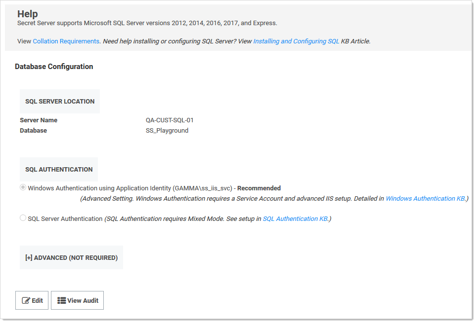
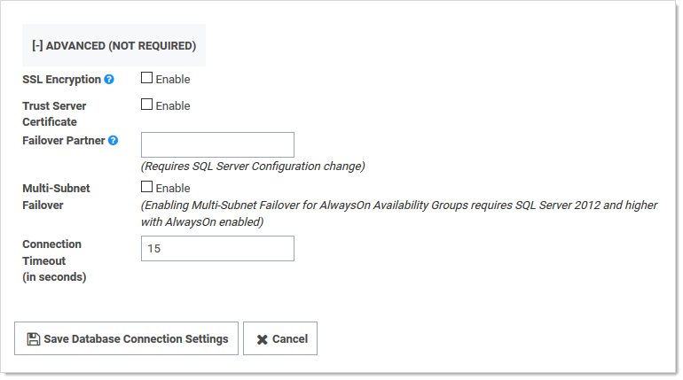

# Enabling SQL Server Encryption

Administrators can enable end-to-end encryption with the SQL database by using an  Encrypted connection. This is a feature that is built into Microsoft SQL Server and Secret Server supports. To enable encryption:

1.  Go to **Admin > See All**. The admin panel appears.
   
2.  Type Database in the **Search** text box and select **Database**. The Database Configuration page appears:
   
       
    
3. Click the **Edit** button.

4. Click the **Advanced (Not Required)** link. A new section appears:

   

5. Click to select the **SSL Encryption** check box.

6. Click the **Save Database Connection Settings** button.

> **Note:** SQL Server must be pre-configured to support encryption. This [Microsoft TechNet article](http://technet.microsoft.com/en-us/library/ms191192.aspx ) explains how to configure the SQL Server environment for encryption. The SSL encryption used for communicating with SQL Server is either 40 or 128 bit, depending on the Windows operating system used.   
>
> **Note:** Using this setting can adversely affect [performance](http://support.thycotic.com/KB/a293/microsoft-sql-server-2012-alwayson-support.aspx) (KBA).  See this [TechNet article](http://technet.microsoft.com/en-us/library/ms189067.aspx) for additional information.