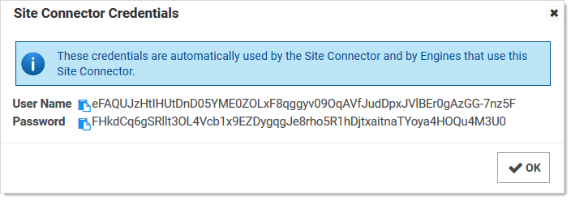

[title]: # (Installing RabbitMQ)
[tags]: # (RabbitMQ,Setup,Install)
[priority]: #

# Installing RabbitMQ

## Overview 

### What is RabbitMQ?

RabbitMQ is a robust message queuing software package that Secret Server uses to communicate with its distributed engines. For detailed information about RabbitMQ go to https://www.rabbitmq.com/ 

### Why do you need to install it?

RabbitMQ is an enterprise-ready alternative to MemoryMQ. While MemoryMQ is sufficient for basic and prototyping installations, RabbitMQ is the preferred messaging framework when the need for greater reliability and clustering arises. 

### RabbitMQ and Encryption

All data sent from or read by Secret Server from RabbitMQ is encrypted. If you would like to add SSL despite the data already being encrypted, please follow the "Advanced installation of RabbitMQwith TLS" use case. Please note that Thycotic Support can help with non-SSL installations. For SSL installation, configuration, troubleshooting, and RabbitMQ clustering, please contact **[Thycotic Professional Services](mailto:psengagements@thycotic.com)** to learn more about our Professional Services rates.

## Prerequisites

> **Important:** Secret Server only supports RabbitMQ on Windows operating systems.

RabbitMQ requires:

### General

- Windows Server 2008 or higher with PowerShell v3 support

- Nodes hosting RabbitMQ need a minimum of 2 GB RAM

- Windows Server 2008 or higher with PowerShell v3 support

- Disk space is not an issue, but it should not go below 50 MB (default value), especially if you host RabbitMQ on the same server as SS

- Windows Server 2008 or higher with PowerShell v3 support

- Ports 5672 (non-SSL) or 5671 (SSL) opened on the machine and firewall

### SSL Certificate

- A server certificate PFX type and a root certificate authority certificate CER type.

- The PFX certificate should have: 
  - A name that matches the RabbitMQ Fully qualified machine name
  - If you plan on making a RabbitMQ cluster, add DNS names (SANs) to your certificate
  - Your certificate must be an RSA certificate. CNG is not supported and will cause the installation to fail.
- If you do not have an internal PKI and prefer not to use a public certificate, you can use a self-signed certificate. 

> **Note:** Thycotic will not assist with creating or troubleshooting self-signed certificates.

 

## Installation

### Task 1: Secret Server

In Secret Server UI
$1
$2$1
$2
   
$1
$2
   
$1
$2$1
$2$1
$2$1
$2
   > **Note:** The Engines need to be able to resolve this host name or the connection will fail. Also, inbound firewall rules must be created on the machine that is hosting the connector.
$1
$2$1
$2$1
$2
   
$1
$2
   
$1
$2$1
$2
###  Task 2: RabbitMQ Host
$1
$21. Install the Thycotic RabbitMQ helper by running the downloaded MSI.
$1
$21. Navigate to the installation folder in `%PROGRAMFILES%\Thycotic Software Ltd\RabbitMq Helper`
$1
$21. Then, issue a `cmdlet` command from the scenario that applies to your need.
$1
$21. Return to SS, and go to the site connector you created in the previous section.
$1
$21. Click the **Validate Connectivity** button.
$1
$21. If you see "Validation Failed," do the following: 
   1. Ensure the RabbitMQ Windows service is running.
   1. Check the logs found under `C:\Program Files\Thycotic Software Ltd\RabbitMq Site Connector\log`.
   1. Check the SS system log for a full error report.

## Troubleshooting

Please refer to [RabbitMQ Helper](https://thycotic.github.io/rabbitmq-helper/#troubleshooting-and-maintenance).
